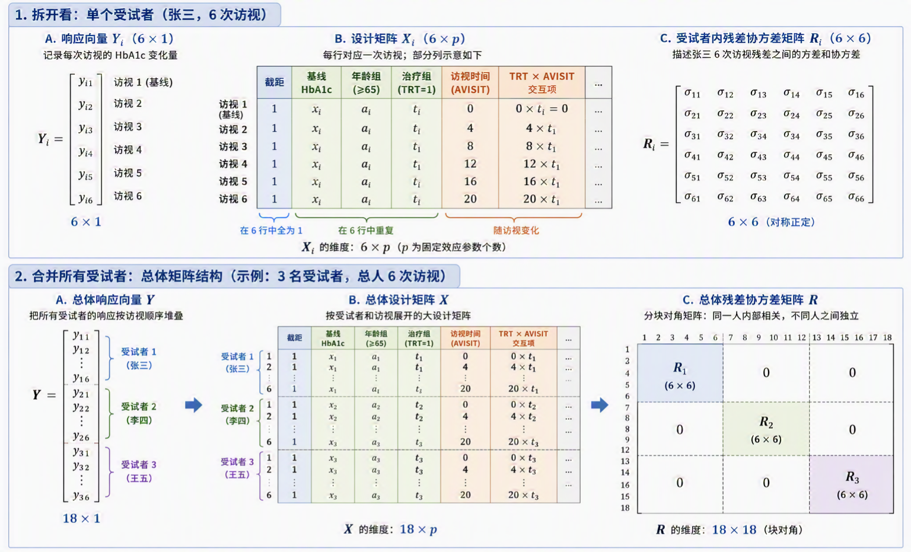

# 从混合效应模型到 MMRM：临床纵向数据分析

## 一、为什么普通线性回归在纵向数据中容易出问题

理解混合效应模型，最好的起点不是公式，而是先看普通线性回归在什么情况下会给出误导性结论。

普通线性回归通常默认观测值之间相互独立。也就是说，每一个数据点都被当成来自不同个体、互不影响的独立证据。但在临床纵向研究中，这个前提经常不成立：同一名受试者在多个访视中的观测值往往相互相关，因为它们共享同一个人的基线状态、疾病严重程度、治疗依从性和其他未观测特征。

需要区分两个层面的问题。第一，若忽略同一受试者内的相关性，模型的标准误、置信区间和 p 值通常会受到影响，因为模型会把相关的观测误当作彼此独立的信息。第二，如果模型还把个体间差异和个体内变化混在一起，或者遗漏了关键混杂因素，固定效应估计本身也可能产生偏倚。

例如在一项降压药真实世界研究或纵向观察性研究中，我们可能收集多名患者在多次随访中的用药剂量和收缩压。如果完全忽略“多次观测嵌套在同一位患者内部”这个结构，把所有数据点混在一起做普通线性回归，模型可能得到一个看似荒唐的结论：用药剂量越大，血压反而越高。

原因并不难理解。真实临床实践中，基础血压更高、病情更重的患者，医生通常会给更大剂量。这些患者的数据点集中在“大剂量、高血压”的区域；病情较轻的患者则可能集中在“小剂量、较低血压”的区域。整体混合后，回归线可能呈现正相关。但如果只看同一位患者自己的纵向变化，增加剂量通常会使血压下降。也就是说，整体的个体间差异掩盖了真正关心的个体内效应。

这可以理解为辛普森悖论在纵向数据中的一种表现：当忽略分组、嵌套结构或关键混杂因素时，组间差异会污染我们真正关心的组内规律。

## 二、固定效应和随机效应：模型要同时处理两类信息

混合效应模型之所以有用，是因为它允许我们在同一个模型里同时描述两类信息。

第一类是固定效应（Fixed Effects）。固定效应描述的是研究者真正关心的总体平均规律。例如，在降压药研究中，剂量增加后收缩压平均下降多少；在糖尿病临床试验中，试验组相对于安慰剂组在第 24 周 HbA1c 下降多少。这些是我们希望直接估计、解释和报告的效应。

第二类是随机效应（Random Effects）。随机效应用来描述个体或更高层级单位的异质性。例如，不同患者入组时的基础血压不同，不同患者对药物的敏感程度不同，不同医院中心可能有不同的诊疗习惯或测量系统差异。这些差异本身通常不是主要研究目的，但如果不处理，就会影响固定效应的估计、标准误或推断解释。

在最简单的随机截距模型中，我们可以把普通线性回归

$$
y_{ij} = \beta_0 + \beta_1 x_{ij} + \epsilon_{ij}
$$

改写为

$$
y_{ij} = (\beta_0 + u_i) + \beta_1 x_{ij} + \epsilon_{ij}
$$

其中，$y_{ij}$ 表示患者 $i$ 在第 $j$ 次随访时的结局，$x_{ij}$ 是解释变量，例如剂量；$\beta_0$ 是人群平均截距，$\beta_1$ 是人群平均斜率，$u_i$ 是患者 $i$ 自己相对于人群平均截距的偏差。通常假设 $u_i \sim N(0,\sigma_u^2)$。

这个模型的含义是：每位患者可以有不同的基线水平，但所有患者共享同一个平均剂量效应。图形上看，每位患者都有一条自己的回归线，但这些线彼此平行。

如果进一步认为患者对药物的反应强弱也不同，就可以引入随机斜率：

$$
y_{ij} = (\beta_0 + u_{0i}) + (\beta_1 + u_{1i})x_{ij} + \epsilon_{ij}
$$

这里 $u_{0i}$ 表示患者 $i$ 的随机截距，$u_{1i}$ 表示患者 $i$ 的随机斜率。此时，每位患者不仅可以有不同的基线水平，也可以有不同的治疗反应斜率。图形上看，患者之间的回归线不再平行。

随机截距和随机斜率之间也可能有关。例如，基线血压更高的患者，治疗后下降空间可能更大。模型可以通过随机效应的协方差矩阵来表达这种关系：

$$
\begin{bmatrix}
\sigma_{u_0}^2 & \sigma_{u_{01}} \\
\sigma_{u_{01}} & \sigma_{u_1}^2
\end{bmatrix}
$$

其中，$\sigma_{u_0}^2$ 是截距方差，衡量患者基线差异；$\sigma_{u_1}^2$ 是斜率方差，衡量患者治疗反应的异质性；$\sigma_{u_{01}}$ 是截距和斜率的协方差。如果协方差为负，在降压药例子中可解释为基线越高者，血压下降斜率越负，治疗后下降幅度更大。

到这里为止，我们已经看到混合模型有两项核心任务：一是用固定效应估计总体平均规律，二是处理同一受试者内、同一中心内或其他层级内的相关性。MMRM 接下来要做的，是在访视时间较固定的临床试验中，用一种偏边际模型的方式处理受试者内重复测量相关性。

## 三、MMRM 是什么：它和一般混合效应模型的关系

MMRM（Mixed-Effects Model for Repeated Measures，重复测量混合效应模型）属于混合效应模型家族，但它是严格设计的纵向临床试验中特别常用的一种模型形式。

一个典型 MMRM 可以概括为：

$$
CHG = BASE + STRATA + TRT + AVISIT + TRT \times AVISIT
$$

其中，响应变量通常是相对基线变化量（CHG），访视时间（AVISIT）作为分类变量，主要疗效比较通常来自主要访视点的治疗组间 LS Means 差异。受试者内重复测量的相关性则通过残差协方差矩阵处理，例如使用 UN、AR(1)、CS 或其他预先规定的结构。

MMRM 和一般混合效应模型的联系在于：二者都用于处理同一受试者多次测量带来的相关性，都能在随机缺失（Missing at Random, MAR）假设和模型设定合理时利用所有可用数据，而不需要像 LOCF 那样进行简单结转填补。

但 MMRM 与常见随机截距/随机斜率模型有两个重要区别。

第一，MMRM 通常把访视时间作为分类变量，而不是连续变量。一般随机斜率模型常把时间看作连续变量，关注随时间变化的线性或曲线轨迹；MMRM 不强迫疗效随时间呈现某种特定形状，而是允许每个访视点都有自己的均值结构。因此，它尤其适合方案规定访视时间较固定的 III 期随机对照试验，例如第 4、8、12、16、20、24 周测量 HbA1c。

第二，标准 MMRM 通常不显式设置受试者随机效应，而是把同一受试者内多次测量的相关性放到残差协方差矩阵中处理。也就是说，一般混合效应模型常写为

$$
Y_i = X_i\beta + Z_i u_i + \epsilon_i
$$

而标准 MMRM 常写为

$$
Y_i = X_i\beta + \epsilon_i,\quad \epsilon_i \sim MVN(0, R_i)
$$

这里 $Y_i$ 是第 $i$ 位受试者的响应向量，$X_i$ 是固定效应设计矩阵，$\beta$ 是固定效应参数向量，$\epsilon_i$ 是残差向量，$R_i$ 是同一受试者内各访视点之间的残差协方差矩阵。

这并不是说 MMRM 忽略了受试者内相关性。相反，它是用 R 侧（残差协方差结构）建模直接表达这种相关性，而不是通过 G 侧（随机效应产生的协方差结构）随机效应间接表达。

## 四、为什么 MMRM 通常不再设置受试者随机效应

这一点是理解 MMRM 的关键。混合效应模型中处理同一受试者内相关性有两条路径。

第一条是 G 侧建模，也就是显式加入随机效应 $Z_i u_i$。例如加入受试者随机截距后，同一受试者所有访视值都共享同一个 $u_i$，因此它们天然相关。

第二条是 R 侧建模，也就是不显式给每位受试者分配随机截距或随机斜率，而是直接规定残差向量 $\epsilon_i$ 的协方差矩阵 $R_i$。标准 MMRM 主要采用第二条路径。

为什么要这样做？一个重要原因是随机截距会对协方差结构施加固定形态。若模型只有受试者随机截距，并且假设不同访视点的残差 $\epsilon_{it}$ 相互独立且方差相同，则某位受试者在时间点 $t$ 的误差结构可理解为：

$$
\text{总残差} = u_i + \epsilon_{it}
$$

其中 $u_i$ 是受试者固有偏差，方差为 $\sigma_u^2$；$\epsilon_{it}$ 是当前访视点的随机误差，方差为 $\sigma_e^2$。

此时任意时间点的总方差为：

$$
Var(u_i + \epsilon_{it}) = \sigma_u^2 + \sigma_e^2
$$

任意两个不同时间点 $t$ 和 $s$ 的协方差为：

$$
Cov(u_i + \epsilon_{it}, u_i + \epsilon_{is}) = \sigma_u^2
$$

这意味着所有时间点的方差相同，任意两个时间点之间的协方差也相同。换句话说，第 4 周和第 8 周的相关性，被强制设定为和第 4 周与第 24 周的相关性一样。这种结构就是复合对称（Compound Symmetry, CS）。

但在临床纵向数据中，这个假设往往过于僵硬。相邻访视通常更相关，间隔较远的访视相关性可能降低；不同时间点的方差也可能不同。MMRM 为了使用更灵活的残差协方差结构，通常不再加入受试者随机截距或随机斜率，而是把相关性主要交给 $R_i$ 矩阵。

需要强调的是，R 侧建模并不是“没有假设”。它只是把假设放在残差协方差结构上。同样，$Z_i u_i$ 并不只代表随机截距。$Z_i$ 是随机效应设计矩阵，如果只有一列 1，则对应随机截距；如果包含一列 1 和一列时间变量，则可对应随机截距加随机斜率。只要使用 G 侧随机效应，就会对协方差结构施加某种预设公式；而标准 MMRM 的常见目标，是在固定访视的临床试验中尽量用 R 侧协方差结构灵活表达受试者内相关性。

## 五、MMRM 的 R 矩阵：处理重复测量相关性的核心

假设一项糖尿病临床试验中，受试者在用药后第 4、8、12、16、20、24 周共有 6 次访视，响应变量是每次访视 HbA1c 相对基线的变化量。对于第 $i$ 位受试者，响应向量可以写为：

$$
Y_i =
\begin{bmatrix}
Y_{i1}\\
Y_{i2}\\
Y_{i3}\\
Y_{i4}\\
Y_{i5}\\
Y_{i6}
\end{bmatrix}
$$

对应的残差向量为：

$$
\epsilon_i =
\begin{bmatrix}
\epsilon_{i1}\\
\epsilon_{i2}\\
\epsilon_{i3}\\
\epsilon_{i4}\\
\epsilon_{i5}\\
\epsilon_{i6}
\end{bmatrix}
$$

MMRM 假设该残差向量服从多元正态分布：

$$
\epsilon_i \sim MVN(0, R_i)
$$

如果使用非结构化协方差矩阵（Unstructured, UN），则单个受试者的 $R_i$ 是一个 $6 \times 6$ 矩阵：

$$
R_i =
\begin{bmatrix}
\sigma_1^2 & \sigma_{12} & \sigma_{13} & \sigma_{14} & \sigma_{15} & \sigma_{16}\\
\sigma_{21} & \sigma_2^2 & \sigma_{23} & \sigma_{24} & \sigma_{25} & \sigma_{26}\\
\sigma_{31} & \sigma_{32} & \sigma_3^2 & \sigma_{34} & \sigma_{35} & \sigma_{36}\\
\sigma_{41} & \sigma_{42} & \sigma_{43} & \sigma_4^2 & \sigma_{45} & \sigma_{46}\\
\sigma_{51} & \sigma_{52} & \sigma_{53} & \sigma_{54} & \sigma_5^2 & \sigma_{56}\\
\sigma_{61} & \sigma_{62} & \sigma_{63} & \sigma_{64} & \sigma_{65} & \sigma_6^2
\end{bmatrix}
$$

对角线元素是各访视点的残差方差，非对角线元素是任意两个访视点之间的残差协方差。由于协方差矩阵对称，6 次访视的 UN 结构需要估计 6 个方差和 15 个协方差，共 21 个协方差参数。

把所有受试者拼接起来后，总体 $R$ 矩阵呈分块对角结构。每个对角块是某一受试者自己的 $6 \times 6$ 残差协方差矩阵；不同受试者之间的交叉块为 0。这表达了两个假设：同一受试者内的多次测量可以相关，不同受试者之间相互独立。

如果某位受试者只有部分访视被观测到，软件在似然计算中会使用实际观测访视对应的子向量和子矩阵。例如只观测到第 4 周和第 8 周时，就使用这两个时间点对应的 $Y_i$ 子向量和 $R_i$ 子矩阵，而不是先人为填补缺失值。

## 六、协方差结构选择：UN、AR(1) 与 CS

在 MMRM 中，选择 $R_i$ 的结构是统计分析计划（SAP）中的关键内容。

UN 是最灵活的结构。它不预设不同访视间相关性的形式，也不要求各访视点方差相同，适合证实性临床试验中“尽量让数据自己决定相关结构”的原则。因此，UN 常作为主要分析的首选。但 UN 的代价是参数量大。6 次访视需要估计 21 个协方差参数；如果访视次数更多、样本量有限、某些时间点数据稀疏，就可能出现模型不收敛或协方差矩阵非正定等问题。

因此，SAP 中通常需要预先写明备选策略。常见示例可以是：

$$
UN \rightarrow AR(1) \rightarrow CS
$$

但这只是示例，不是所有试验都必须遵循的通用顺序。实际选择应结合访视间隔、样本量、缺失模式和临床机制。

AR(1)（一阶自回归）假设相邻访视相关性最强，时间间隔越远，相关性按 $\rho, \rho^2, \rho^3$ 等形式递减。它通常只需估计方差和相关系数两个参数，计算稳定性远高于 UN，同时保留了“距离越近相关性越强”的临床直觉。不过，标准 AR(1) 通常隐含等间隔访视和同方差假设；如果访视间隔不等或各访视方差差异明显，可能需要考虑 heterogeneous AR(1)、spatial power、Toeplitz、ANTE(1) 等其他结构。

CS（复合对称）则假设所有时间点方差相同，任意两个访视点之间协方差相同。它参数最少，但假设最强，往往不作为首选。

重要的是，协方差结构和备选策略应在 SAP 中预先规定，而不是在看到分析结果后临时选择。否则容易被质疑为为了得到显著结果而选择协方差结构。

## 七、缺失值：MMRM 如何避免 LOCF 的偏倚

纵向临床试验中，受试者中途脱落很常见。传统 LOCF（Last Observation Carried Forward，末次观测结转）会把最后一次观测值复制到后续缺失访视。例如某位试验组受试者在第 12 周因药物无效退出，LOCF 会把第 12 周 HbA1c 变化量当作第 16、20、24 周结果。

这种做法可能带来偏倚，而且偏倚方向并不固定，取决于疾病自然进程、脱落原因、治疗组差异和结局定义。在上述例子中，如果患者因疗效差而退出，其后续 HbA1c 很可能继续恶化；LOCF 把曲线冻结在第 12 周，就可能高估疗效。

MMRM 的思路不是显式填补一个具体缺失值，而是在 MAR 假设下，利用所有可用数据通过最大似然或受限最大似然估计模型参数。MAR 的含义是：在给定已经观测到的信息后，缺失概率不再依赖未观测结局本身。例如，缺失概率可以由受试者前几次 HbA1c 变化、基线特征、治疗组别等已观测信息解释。

如果某位受试者只完成了第 4 周和第 8 周，其后访视缺失，模型并不会简单复制第 8 周结果。它会利用该受试者已有观测，以及其他受试者中类似早期轨迹与后续结果之间的统计关系，通过均值结构和协方差结构共同参与参数估计。

严格地说，软件在实际似然计算中会根据该受试者实际观测到的时间点使用对应的子向量和子矩阵；但模型层面仍然由完整访视结构定义各时间点之间的协方差模式。因此，MMRM 是“基于模型和似然的缺失处理”，不是人工填补。

需要注意的是，MMRM 并不会自动解决所有缺失问题。其有效性依赖于 MAR 假设、均值模型设定和协方差模型设定的合理性。如果 MAR 假设本身受到质疑，例如怀疑脱落属于 MNAR（Missing Not at Random，非随机缺失），则通常需要进一步通过多重填补、模式混合模型（Pattern-Mixture Model, PMM）、tipping point 分析等方法做敏感性分析。

## 八、固定效应设计矩阵 X：临床试验中应该放什么

以 24 周、6 次访视、两组平行对照糖尿病试验为例，响应变量是各访视 HbA1c 相对基线变化量（CHG），治疗组为试验组和安慰剂组，随机化分层因素为年龄组。

标准 MMRM 的固定效应部分通常包括：

1. 截距。
2. 基线 HbA1c（BASE），作为连续协变量。
3. 年龄组（AGEGRP），作为随机化分层因素。
4. 治疗组别（TRT）。
5. 访视时间（AVISIT），作为分类变量。
6. 治疗组别与访视时间交互项（TRT × AVISIT）。

基线 HbA1c 应放入 $X$ 矩阵作为固定效应协变量，而不是放入 R 矩阵。原因与 ANCOVA 一致：基线越高，后续下降空间往往越大；把基线作为连续协变量纳入模型，可以控制各组基线水平微小不平衡对疗效估计的影响，并提高估计效率。

访视时间在 MMRM 中通常作为分类变量，而不是连续变量。这样模型不假设 HbA1c 随时间线性下降，也不强迫轨迹符合某种曲线，而是分别估计不同访视点的均值结构。

治疗组别与访视时间交互项非常关键。如果只放 TRT 和 AVISIT 主效应，模型会强制两组纵向轨迹保持平行，即试验组和安慰剂组在第 4、8、12、16、20、24 周的差异都相同。这通常不符合药物逐渐起效、组间差异随时间变化的临床现实。

加入 TRT × AVISIT 后，模型可以独立估计每个访视点的组间差异。若主要终点定义为第 24 周 HbA1c 变化量的组间差异，则最终应提取 Week 24 对应的治疗组间 LS Means 差异、95% 置信区间和 p 值，而不是简单查看 TRT 主效应的 p 值。

对于包含 TRT × AVISIT 的 MMRM，主要疗效比较通常是特定访视点的线性对比。例如第 24 周试验组与安慰剂组的 LS Means 差异，才对应方案中定义的主要终点。该差异及其标准误、置信区间和 p 值，是临床研究报告和监管沟通中最核心的结果。

## 九、SAS PROC MIXED 中的实现

以前述糖尿病试验为例，假设 ADaM 数据集 `ADVS` 包含：

1. `USUBJID`：受试者编号。
2. `TRT`：治疗组别。
3. `AVISIT`：访视时间，Week 4 至 Week 24。
4. `AGEGRP`：随机化分层因素。
5. `BASE`：基线 HbA1c。
6. `CHG`：各访视 HbA1c 相对基线变化量。

标准 SAS 代码可写为：

```sas
PROC MIXED DATA=ADVS CL METHOD=REML;
    CLASS USUBJID TRT AVISIT AGEGRP;

    MODEL CHG = BASE AGEGRP TRT AVISIT TRT*AVISIT
          / DDFM=KENWARDROGER SOLUTION;

    REPEATED AVISIT / SUBJECT=USUBJID TYPE=UN;

    LSMEANS TRT*AVISIT / CL DIFF SLICE=AVISIT;
RUN;
```

这段代码与模型结构一一对应。

`CLASS` 声明分类变量。`BASE` 不应放入 `CLASS`，因为它是连续基线协变量。

`MODEL` 语句构建 $X_i\beta$。左侧 `CHG` 是响应变量，右侧包含基线、年龄组、治疗组、访视时间以及治疗组和访视时间交互项。`DDFM=KENWARDROGER` 用于复杂协方差结构下的自由度近似，是临床试验中常用的设置。

`REPEATED AVISIT / SUBJECT=USUBJID TYPE=UN;` 是构建 R 矩阵的核心。`SUBJECT=USUBJID` 告诉 SAS 按受试者划分独立数据块；`AVISIT` 决定每个受试者内重复测量的时间维度；`TYPE=UN` 指定单个受试者内部使用非结构化残差协方差矩阵。

如果 UN 不收敛，且 SAP 预先规定第一备选为 AR(1)，则可将语句改为：

```sas
REPEATED AVISIT / SUBJECT=USUBJID TYPE=AR(1);
```

`LSMEANS TRT*AVISIT / CL DIFF SLICE=AVISIT;` 用于计算每个治疗组在每个访视点的 LS Means，并输出组间差异、置信区间和 p 值。实际报告主要终点时，应定位到主要访视点，例如 Week 24。

## 十、从个体矩阵到总体矩阵

为了理解软件后台在做什么，可以把单个受试者的矩阵拆开看。

对于某位受试者张三，若有 6 次访视，则 $Y_i$ 是 $6 \times 1$ 响应向量，记录每次访视的 HbA1c 变化量。$X_i$ 有 6 行，每行对应一次访视；截距列全为 1，基线 HbA1c 在 6 行中重复，年龄组在 6 行中重复，治疗组别在 6 行中重复；而访视时间和 TRT × AVISIT 交互项会随行变化。

单个受试者的 $R_i$ 是 $6 \times 6$ 矩阵，描述这个人 6 次访视残差之间的方差和协方差。

当把所有受试者合并时，总体 $Y$ 变成一个很长的列向量，总体 $X$ 变成一个按受试者和访视展开的大设计矩阵，总体 $R$ 则是分块对角矩阵。对角线上每个 $6 \times 6$ 小块对应一名受试者，非对角区域为 0，表示不同受试者之间独立。

如果研究中只有 3 名受试者，每人 6 次访视，那么总体 $Y$ 是 $18 \times 1$，总体 $R$ 是 $18 \times 18$，主对角线上有 3 个 $6 \times 6$ 的受试者内协方差块。这个矩阵形式正是 MMRM 的核心：同一人内部允许相关，不同人之间保持独立。



## 十一、小结

混合效应模型的核心问题是：当数据具有嵌套结构或重复测量结构时，不能再把所有观测值简单当成相互独立的数据点。固定效应用来估计总体平均规律，随机效应或残差协方差结构用来处理个体、中心或访视内的相关性。

MMRM 是混合效应模型在临床纵向重复测量数据中的重要应用形式。它通常将访视时间作为分类变量，不显式加入受试者随机效应，而是通过 R 侧残差协方差矩阵处理同一受试者内多次测量的相关性。UN 结构最灵活，AR(1)、CS 等结构可作为预先规定的备选，但具体选择应服从研究设计、数据特征和 SAP。

在实际临床试验中，一个规范的 MMRM 通常需要明确：响应变量是相对基线变化量；固定效应包括基线、分层因素、治疗组、访视时间和治疗组与访视时间交互项；协方差结构及其备选策略在 SAP 中预先规定；疗效结论通过主要终点访视的 LS Means 差异、置信区间和 p 值进行报告。

这样理解 MMRM，就不只是记住一段 SAS 代码，而是能看清它背后的统计逻辑：用固定效应回答研究问题，用残差协方差矩阵处理重复测量相关性，用似然框架利用所有可用数据，并在 MAR 假设和模型设定合理时避免 LOCF 这类简单填补带来的偏倚。
