# 生存分析基本概念

## 1. 什么是生存分析？

通常，生存分析是针对**结果变量是事件发生时间**的一类数据分析统计方法的集合。

> 所谓**时间**，指的是从个体开始随访直到事件发生所经过的年、月、周或天数；或者，时间也可以指个体发生事件时的年龄。
>
> 所谓**事件**，指的是死亡、疾病发生、缓解后复发、康复（例如，重返工作岗位）或个体可能发生的任何指定感兴趣的经历。

虽然在同一次分析中可以考虑多个事件，但我们将假设只有一个指定的事件是感兴趣的。

当考虑多个事件时（例如，由多种原因导致的死亡），统计问题可以被描述为复发事件问题或竞争风险问题。

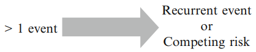

在生存分析中，我们通常将时间变量称为**生存时间**，因为它给出了个体在某个随访期内“存活”的时间。我们通常也将事件称为**失败**，因为感兴趣的事件通常是死亡、疾病发生或其他一些负面的个体经历。

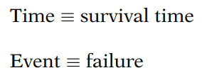

## 2. 删失数据

**<u>删失</u>**：我们拥有个体生存时间的部分信息，但并不知道其确切的生存时间。

**<u>为什么会出现删失？</u>**

*   个体在研究结束前未发生事件；
*   个体在研究期间失访；
*   个体因死亡（如果死亡不是感兴趣的事件）或其他原因（例如，药物不良反应或其他竞争风险）退出研究。

**<u>右删失</u>**：真实的生存时间大于或等于观察到的生存时间。

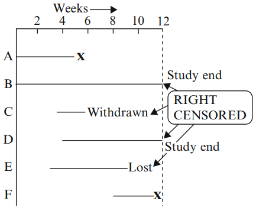

**<u>左删失</u>**：真实的生存时间小于或等于观察到的生存时间。

**<u>区间删失</u>**：真实的生存时间在一个已知的时间区间内。

**<u>我们如何处理删失数据？</u>**

生存分析**使用直到删失时间为止的所有信息**；不会丢弃信息。

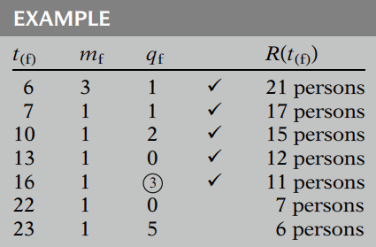

对于在第16周和第22周之间被删失的三个人，我们不想丢失他们每个人至少16周的生存信息。

这三个人被包含在第16周之前（包括第16周）的所有风险集中；也就是说，他们每个人在第16周之前都有发生事件的风险。任何在16周之前（包括16周）确定的生存概率都应该使用这三个人以及其他在前16周内处于风险中的人的数据。

## 3. 生存函数和风险函数

> **关键符号：**
>
> *   **T** 表示生存时间变量
> *   **t** 表示 **T** 的某个指定值
> *   **d** 表示指示事件发生(1)或删失(0)的二值变量

### 3.1 生存函数：S(t)

生存函数 S(t) 给出了一个人存活时间超过某个指定时间 t 的概率：也就是说，S(t) 给出了**随机变量 T 超过指定时间 t 的概率**。
$$
S(t)=P(T>t)
$$
理论上，当 $t$ 从 0 变化到无穷大时，生存函数可以绘制成一条平滑的曲线。

在实践中，使用实际数据时，我们通常得到的是**阶梯函数**的图形，如图所示，而不是平滑曲线。此外，由于研究期限并非无限长，并且可能存在导致失败的竞争风险，研究中并非每个人都会发生事件。因此，估计的生存函数在研究结束时可能不会完全下降到零。

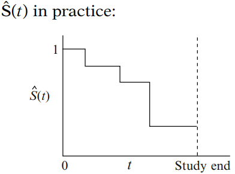

### 3.2 风险函数：h(t)

风险函数 h(t) 给出了在个体已存活到时间 t 的条件下，事件在单位时间内发生的瞬时可能性。
$$
h(t)=\lim_{\Delta t \to 0} \frac{P(t \le T < t+\Delta t|T\ge t)}{\Delta t}
$$
风险函数（有时称为**条件事件率**）是**一个比率，而不是概率**。

此外需注意，风险的大小会受时间的度量单位（日、周、月、年等）影响。

风险函数总是非负的，即大于或等于零，并且没有上限。

**<u>不同类型的风险函数</u>**

*   当风险函数为常数时，我们称该生存模型为**指数**模型。

    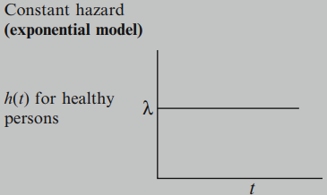

*   当风险函数随时间增加时，我们称之为**递增Weibull**模型。

    

*   当风险函数随时间减少时，我们称之为**递减Weibull**模型。

    

*   当风险函数先增加后减少时，我们称之为**对数正态生存**模型。

    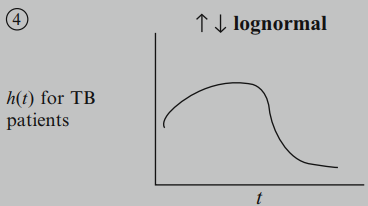

### 3.3 S(t) 和 h(t) 的关系

> S(t): 直接描述生存情况
>
> h(t):
>
> *   瞬时可能性的度量
> *   识别特定的模型形式
> *   生存分析的数学模型

如果你知道两者之一，就可以确定另一个。一般公式：
$$
S(t)=\exp \left[-\int_0^t h(u)du \right] \\
h(t)=-\left[\frac{dS(t)/dt}{S(t)}\right]
$$

## 4. 生存分析的目标

**目标1：** 从生存数据中估计并解释生存函数和/或风险函数。

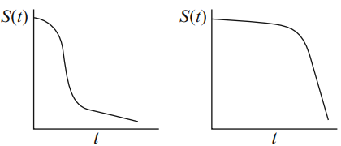

**目标2：** 比较生存函数和/或风险函数。

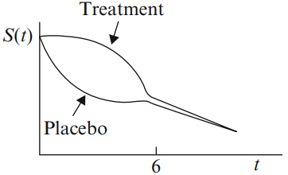

**目标3：** 评估解释变量与生存时间的关系。

目标3通常需要使用某种形式的数学模型，例如Cox比例风险模型。

## 5. 生存时间的描述性度量

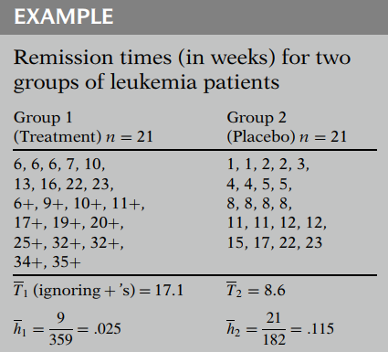

$\bar T$: (**平均生存时间**) 忽略表示删失的加号(+)，简单地计算每组所有生存时间的平均值。

$\bar h$: (**平均风险率**) 定义为总事件数除以观察到的生存时间之和。
$$
\bar h=\frac{事件数}{\sum\limits_{i=1}^n t_i}
$$
描述性度量（$\bar T$ 和 $\bar h$）提供了**总体比较**；它们不提供随时间变化的比较（这由生存曲线图提供）。

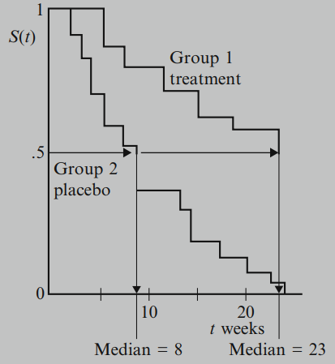

## 6. 删失假设

> 对于生存数据，通常考虑三种关于删失的假设：
>
> *   **独立**（相对于非独立）删失
> *   **随机**（相对于非随机）删失
> *   **非信息**（相对于信息）删失

### 6.1 独立删失

在任何感兴趣的亚组内，在时间 t 被删失的个体，其生存情况能代表该亚组中所有在时间 t 仍处于风险的个体。

独立删失假设是最有用的一个，且会影响效应估计的有效性。

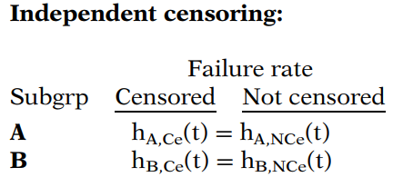

### 6.2 随机删失

在时间 t 被删失的个体，其生存情况能代表所有在时间 t 仍处于风险的研究对象。

**<u>一个例子</u>**

在独立或随机删失的假设下，我们假设被删失的40个个体与仍处于风险的40个个体在生存经验上是相似的：我们估计被删失的40人中也有5人在相同时间段内患病。

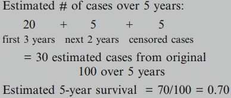

独立和随机删失背后的思想是，在时间 t 被删失的个体，就好像是从时间 t 风险集中的个体中随机选择出来被删失的一样。

### 6.3 非信息删失

删失是**非信息性**还是信息性的，取决于两个分布：

*   事件发生时间的分布
*   删失发生时间的分布

如果**生存时间(T)的分布不提供关于删失时间(C)分布的任何信息**，反之亦然，则发生非信息删失。否则，删失是信息性的。

**<u>一个例子</u>**

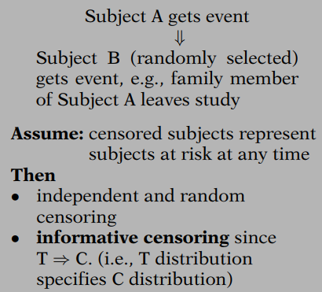

### 6.4 总结

许多分析技术，例如对数秩检验和Cox模型，**依赖于独立删失的假设，以便在存在右删失数据的情况下进行有效推断**。