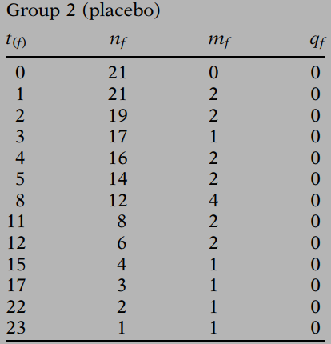
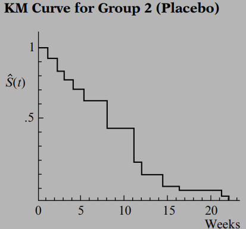
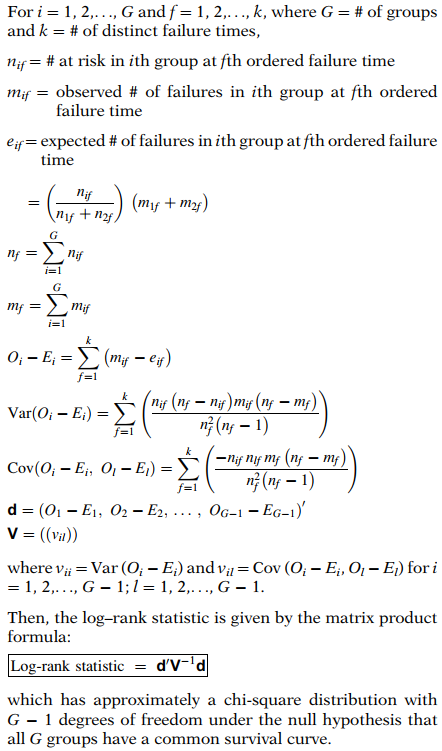
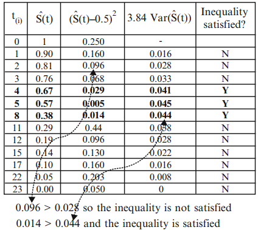

# Kaplan-Meier 生存曲线与 Log-Rank 检验

> 为了估计在给定时间上的生存概率，我们利用该时间点的风险集（risk set）来包含删失个体（censored person）截至删失时的信息，而不是简单地丢弃关于删失个体的所有信息。这种生存概率的实际计算可以使用 Kaplan-Meier (KM) 方法进行。

## 1. KM 估计量的公式

失效时间 $t_{(f)}$ 的 KM 生存概率的计算公式为：
$$
\hat S(t_{(f)})=\hat S(t_{(f-1)}) \times \hat Pr(T>t_{(f)}|T \ge t_{(f)})
$$
上述 KM 公式也可以表示为**乘积限（product limit）**，如果我们用估计失效时间 $t_{(f-1)}$ 及更早时间的条件概率的分数乘积来代替生存概率 $\hat S(t_{(f-1)})$：

$$
\hat S(t_{(f)})=\displaystyle \prod_{i=1}^f \hat Pr(T>t_{(i)}|T \ge t_{(i)})
$$

我们将在下一节给出一个例子来演示如何计算 $\hat Pr(T>t_{(f)}|T \ge t_{(f)})$。

## 2. KM 方法示例

**<u>示例数据</u>**


1. 将每组内的生存时间按升序排列，并生成如下汇总表：




- $t_{(f)}$: 生存时间
- $n_f$: 区间开始时风险集中的受试者数量
- $m_f$: 失效数量
- $q_f$: 删失数量

2. $\hat Pr(T>t_{(f)}|T \ge t_{(f)}) = 1-m_f/n_f$，且处于风险中的受试者数量 $n_f=n_{f-1}-m_{f-1}-q_{f-1}$，计算 $\hat S(t_{(f)})$ 如下：


3. 将对应每个排序后失效时间的估计生存概率绘制成阶梯函数，该函数从生存概率为 1 的水平线开始，随着我们从一个排序后的失效时间移动到另一个，逐步下降到其他的生存概率。



**<u>用于 KM 分析的 SAS 示例代码</u>**

```SAS
proc lifetest data=<mydata> plots=S;
    time <time>*<censor(0)>;
    strata <group>;
run;
```

## 3. 两组的 Log-Rank 检验

评估**两组或多组 KM 曲线在统计上是否相等**的最常用检验方法称为 Log-Rank 检验（对数秩检验）。

> 当我们要说明两条 KM 曲线“统计等效”时，我们的意思是，基于某种在“整体意义”上比较这两条曲线的检验过程，我们没有证据表明真实（总体）生存曲线存在差异。

Log-Rank 检验是一种大样本**卡方检验**，它：

- 提供 KM 曲线的整体比较
- 利用观察到的与预期的单元格计数
- 类别由每个排序后的失效时间定义

**<u>Log-Rank 检验所需信息的示例</u>**


预期单元格数值计算过程如下：


$$
e_{1f}=\left(\frac{n_{1f}}{n_{1f}+n_{2f}}\right) \times (m_{1f}+m_{2f})
$$

$$
e_{2f}=\left(\frac{n_{2f}}{n_{1f}+n_{2f}}\right) \times (m_{1f}+m_{2f})
$$

下一步，我们需要计算 $O_i-E_i$，如下所示：
$$
O_i-E_i=\sum_{f=1}^k(m_{if}-e_{if})
$$
其中 $k$ 是排序后的失效时间数量，$i$ 标识组别。


对于两组的情况，Log-Rank 统计量为：
$$
\frac{(O_i-E_i)^2}{Var(O_i-E_i)} \sim \chi^2(1) \quad 在 \quad H_0 \quad 下
$$
$i$ 可以是 1 或 2，选择其中任何一个总是给出相同的结果。$Var(O_i-E_i)$ 是估计方差，其表达式为：
$$
Var(O_i-E_i)=\sum_f \frac{n_{1f}n_{2f}(m_{1f}+m_{2f})(n_{1f}+n_{2f}-m_{1f}-m_{2f})}{(n_{1f}+n_{2f})^2(n_{1f}+n_{2f}-1)}
$$
原假设是：**$H_0:$ *两条生存曲线之间没有差异***。

可以使用 Log-Rank 统计量的近似值来快速执行检验：
$$
\chi^2 \approx \sum_i^{组数}\frac{(O_i-E_i)^2}{E_i}
$$

## 4. 多组的 Log-Rank 检验

Log-Rank 检验也可用于比较三条或更多生存曲线。这种更一般情况下的原假设是**所有生存曲线都相同**。

如果比较的组数为 $G(\ge 2)$，则 Log-Rank 统计量近似服从自由度为 $G-1$ 的大样本卡方分布。并且 > 2 组的 Log-Rank 统计量涉及 $O_i-E_i$ 的方差和协方差，如下所示：



上述提到的 Log-Rank 统计量的近似值也适用于组数大于 2 的情况。

## 5. Log-Rank 检验的替代方法

有几种 Log-Rank 检验的替代方法，如：`Wilcoxon`、`Tarone-Ware`、`Peto` 和 `Flemington-Harrington` 检验。所有这些检验都是 Log-Rank 检验的变体。

在描述这些检验之间的差异时，回想一下 Log-Rank 检验使用每组中观察值减去期望值的分数 $O-E$ 的总和来构成检验统计量。**这种简单的求和赋予了每个失效时间相同的权重——即 1——当组合每组中观察值减去期望值的失效时。**

`Wilcoxon`、`Tarone-Ware`、`Peto` 和 `Flemington-Harrington` 检验统计量是 Log-Rank 检验统计量的变体，是通过**在第 f 个失效时间应用不同的权重**推导出来的：
$$
\frac{\left(\sum_f w(t_{(f)})(m_{if}-e_{if})\right)^2}{Var \left(\sum_f w(t_{(f)})(m_{if}-e_{if})\right)}
$$
下表列出了每种检验应用的权重：
| 检验统计量 (Test Statistic) | $w(t_{(f)})$                                         | 备注 (Note)                                                  |
| --------------------------- | ---------------------------------------------------- | ------------------------------------------------------------ |
| Log rank                    | 1                                                    |                                                              |
| Wilcoxon                    | $n_f$                                                | $n_f$ 是所有组中的风险人数。                                 |
| Tarone-Ware                 | $\sqrt{n_f}$                                         |                                                              |
| Peto                        | $\tilde s(t_{(f)})$                                  | $\tilde s(t_{(f)})$ 是在所有组合组上计算的生存估计值，它与 KM 估计值相似但不完全相等。 |
| Flemington-Harrington       | $\hat S(t_{(f-1)})^p \times [1-\hat S(t_{(f-1)})]^q$ | $\hat s(t_{(f)})$ 是所有组的 KM 估计值。它允许在权重选择方面具有最大的灵活性，因为用户可以提供 p 和 q 的值。 |

**<u>选择检验方法</u>**

- 不同权重的加权结果通常导致相似的结论。
- 最好的选择是功效（power）最大的检验。
- 功效取决于原假设如何被违背。
- 可能有临床原因去选择特定的加权。

## 6. 分层 Log-Rank 检验

分层 Log-Rank 检验是 Log-Rank 检验的另一种变体。对于这种检验，观察值减去期望值的 $O-E$ 是**在每组的分层内计算，然后在各层之间求和**。

非分层和分层方法的唯一区别是：对于非分层方法，$O_i-E_i=\sum_f(m_{if}-e_{if})$，其中 i = 组号，f = 第 f 个失效时间；而对于分层方法，$O_i-E_i=\sum_s\sum_f(m_{ifs}-e_{ifs})$，其中 s = 层号。

无论哪种方式，零假设下的分布都是自由度为 $G-1$ 的卡方分布，其中 $G$ 代表被比较的组数（**而不是层数**）。

分层方法也可以应用于 Log-Rank 检验的任何加权变体（例如 Wilcoxon）。分层方法的一个局限性是**每个层内的样本量减少**。

## 7. KM 曲线的置信区间

### 7.1 经典方法

后续随访中任意时间点的估计 KM 概率的 CI 公式具有如下所示的一般大样本形式：
$$
\hat S_{KM}(t) \pm z_{\alpha/2} \sqrt{V\hat ar[\hat S_{KM}(t)]}
$$
其中 $\hat S_{KM}(t)$ 表示时间 t 的 KM 估计值，$Var[\hat S_{KM}(t)]$ 表示 $\hat S_{KM}(t)$ 的方差。

计算此方差最常用的方法是 **Greenwood 公式**：
$$
V\hat ar[\hat S_{KM}(t)]=(\hat S_{KM}(t))^2 \sum_{f:t_{(f)}\le t}\left[\frac{m_f}{n_f(n_f-m_f)}\right]
$$
其中 $t_{(f)}$ = 第 f 个排序后的失效时间，$m_f$ = $t_{(f)}$ 时的失效数，$n_f$ = $t_{(f)}$ 时的风险集人数。


<u>证明</u>：我们回想 **Delta 方法**，即，对于随机变量 *x*，*g*(*x*) 的方差可以近似为 $[g'(x)]^2 \cdot var(x)$ 。

我们注意到
$$
S(t_f)=\prod_{f=1}^k p_f
$$
其中 $p_f=1-m_f/n_f$ 是受试者存活至 $t_f$ 之前的概率。取自然对数，
$$
\ln S(t_f)=\sum_{f=1}^k \ln p_f
$$
因此
$$
var(\ln S(t_f))=\sum_{f=1}^k var(\ln p_f)
$$
我们要假设在区间 $[t_f, t_{(f+1)})$ 内生存的受试者数量服从二项分布 $B(n_f, \pi_f)$，其中 $p_f$ 是 $\pi_f$ 的估计值。由于观察到的在该区间内生存的受试者数量是 $n_f-m_f$，由此可得（基于二项随机变量的方差）：
$$
var(n_f-m_f) \approx n_fp_f(1-p_f)
$$
因此
$$
var(p_f)=var\left(\frac{n_f-m_f}{n_f}\right)=\frac{var(n_f-m_f)}{n_f^2}\approx \frac{n_fp_f(1-p_f)}{n_f^2}=\frac{p_f(1-p_f)}{n_f}
$$
基于 Delta 方法，
$$
var(\ln p_f)\approx \frac{var(p_f)}{p_f^2} \approx \frac{p_f(1-p_f)}{p_f^2n_f}=\frac{m_f}{n_f(n_f-m_f)}
$$
因此
$$
var(\ln S(t_f))=\sum_{f=1}^k var(\ln p_f) \approx \sum_{f=1}^k \frac{m_f}{n_f(n_f-m_f)}
$$
但再次使用 Delta 方法，我们也有：
$$
var(\ln S(t_f))\approx \frac{var(S(t_f))}{S^2(t_f)}
$$
这意味着：
$$
\sum_{f=1}^k \frac{m_f}{n_f(n_f-m_f)}\approx \frac{var(S(t_f))}{S^2(t_f)}
$$
因此
$$
var(S(t_f)) \approx S^2(t_f)\sum_{f=1}^k \frac{m_f}{n_f(n_f-m_f)}
$$

### 7.2 变换方法

经典方法有一个缺陷，即它可能导致结果超出 *S*(*t*) 的范围，即 0 到 1。此外，经典方法计算的 CI 往往比下面提到的其他方法更宽。

因此，最好使用一种变换将 *S*(*t*) 变换到范围 $(-\infty, \infty)$，然后进行逆变换。例如，我们可以使用变换 $\ln(-\ln x)$ 来实现这一点，这也称为 `log-log` 变换：
$$
g(x)=\ln (-ln (x))
$$
在这种情况下，$S(t_f)$ 的近似 $1-\alpha$ 置信区间由以下公式给出：
$$
S(t_f)^{\exp \left[\pm \frac{z_{\alpha/2}}{\ln S(t_f)}\cdot \sqrt{\sum_{f=1}^k\frac{m_f}{n_f(n_f-m_f)}} \right]}
$$
<u>证明</u>：通过 $\delta$ 方法
$$
var(\ln (-x))\approx \frac{var(x)}{x^2}
$$
然后
$$
var(\ln (-\ln S(t_f)))\approx \frac{var(-\ln S(t_f))}{[\ln S(t_f)]^2}=\frac{var(\ln S(t_f))}{[\ln S(t_f)]^2} \approx \frac{S^2(t_f)}{[\ln S(t_f)]^2 \cdot S^2(t_f)} \sum_{f=1}^k\frac{m_f}{n_f(n_f-m_f)}\\=\frac{1}{[\ln S(t_f)]^2 } \sum_{f=1}^k\frac{m_f}{n_f(n_f-m_f)}
$$
现在通过取逆变换即可得出结果。

除了 `log-log` 变换（最常用的）外，还有其他变换方法：

- 反正弦平方根变换 (Arcsine-square root)：$g(x)=sin^{-1}(\sqrt{x})$
- 恒等（线性）变换 (Identity/linear)：$g(x)=x$，即经典方法
- 对数变换 (Logarithmic)：$g(x)=\ln (x)$
- Logit 变换：$g(x)=\ln (\frac{x}{1-x})$

## 8. 中位生存时间的置信区间

中位生存时间计算为生存函数小于或等于 0.5 的最小生存时间（与其他四分位生存时间类似）。

### 8.1 Brookmeyer 和 Crowley 方法

Brookmeyer 和 Crowley (1982) 提出了一种计算中位生存时间 CI 的简单方法，基于这样一个事实：**在真实（未知）中位数值 (M) 周围的标准化生存曲线函数的平方渐近服从 $\chi^2$ 分布**。
$$
\frac{(\hat S_{KM}(M)-0.5)^2}{V\hat ar[\hat S_{KM} (M)]} \sim \chi^2(1)
$$
其中 M = 真实（未知）中位生存时间，即 $S_{KM}(M)=0.5$，KM 估计值的方差将使用 Greenwood 公式计算。

使用上述关于标准化生存曲线的结果，中位生存期的 $1-\alpha$ CI 的通式由不等式表达式提供：$(\hat S_{KM}(t)-0.5)^2 < \chi^2_{(1-\alpha)}V\hat ar[\hat S_{KM}(t)]$。

使该不等式成立的时间是真实中位数的可能值，而边界代表中位数 CI 的上限和下限时间。下限可能为 0，上限可能并不总是存在。

<u>示例</u>：中位生存时间的 95% CI 为 [4,8]



Brookmeyer 和 Crowley (B&C) 提醒，这些估计的上限应进行调整以反映删失情况。他们建议**报告半开区间，该区间延伸到满足不等式的事件之后的下一个事件**。

一些软件包（如 SAS、R）结合了这一建议。在上述示例中，从 SAS 输出获得的中位生存时间的 95% CI 为[4, 11) ，上限现在会超过 8 周，但不包括第 11 个月的事件。

### 8.2 Andersen 方法

另一种中位生存时间的置信区间是使用生存估计的密度函数的大样本估计构建的。**如果存在许多并列（tied）的生存时间，则不应使用 Brookmeyer-Crowley 置信区间**。

### 8.3 关于平均生存时间

平均生存时间估计为**生存曲线下的面积**。该估计量基于数据的整个范围。请注意，某些软件仅使用截至最后一个已观察到的事件的数据；Hosmer 和 Lemeshow (1999) 指出这会使平均值的估计产生向下偏差，他们建议使用数据的整个范围。使用大样本方法来估计平均生存时间的方差，从而构建置信区间（Andersen 方法）。

<u>生存时间的样本通常高度偏态，因此，在生存分析中，中位数通常是比平均值更好的中心位置度量</u>。