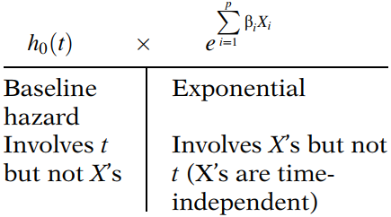
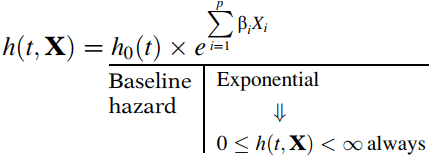
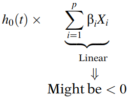
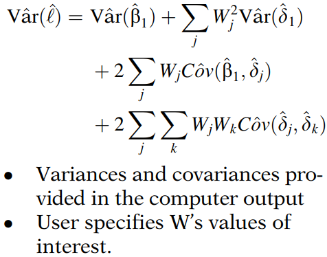
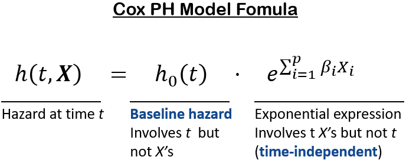
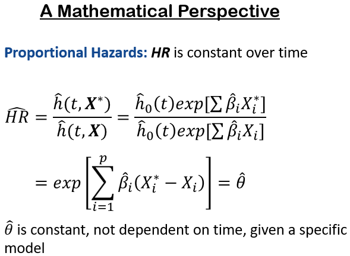
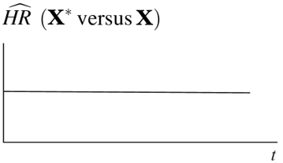
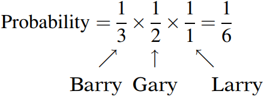
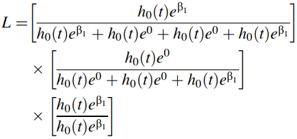
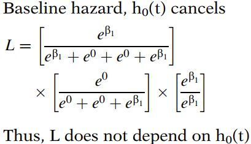

# Cox比例风险模型及其特征

> **Cox比例风险模型**（Cox, 1972）本质上是一种回归模型，常用于研究患者生存时间与一个或多个预测变量之间的关系。

## 1. Cox PH 模型公式

Cox PH 模型通常以下述风险模型公式表示：
$$
h(t,\bold X)=h_0(t)e^{\sum_{i=1}^p \beta_iX_i}
$$
该模型给出了在时间 t 处，具有一组特定解释变量（记为 $\bold X$）的个体的风险表达式。也就是说，$\bold X$ 代表了一组（有时称为“向量”）用于预测个体风险的预测变量。

Cox 模型公式表明，时间 t 的风险是两个量的乘积。第一个量 $h_0(t)$ 称为 **基线风险函数**。第二个量是指数表达式 $e$ 的 $\beta_iX_i$ 线性求和次幂，其中求和遍及 p 个解释性 X 变量。

该公式的一个重要特征（与比例风险（PH）假设相关）是：基线风险是时间 t 的函数，但不涉及 X 变量。相反，这里展示的指数表达式涉及 X 变量，但不涉及时间 t。这里的 X 变量称为 **时间无关变量**。

> **时间无关变量：**
>
> <u>给定个体的取值不随时间变化；例如，性别（SEX）。</u>
>
> 然而，也可以考虑涉及时间 t 的 X 变量。这类变量称为时间相关变量。如果考虑时间相关变量，Cox 模型形式仍可使用，但这样的模型不再满足 PH 假设，称为 **扩展 Cox 模型**。
>
> 还需注意，尽管年龄（AGE）和体重（WGT）等变量随时间变化，**如果它们的值随时间变化不大** 或者 **如果这些变量对生存风险的影响主要取决于某一次测量时的取值**，那么在分析中将其视为时间无关变量可能是合适的。

**<u>Cox 模型：半参数模型</u>**

Cox 模型的另一个重要特性是基线风险 $h_0(t)$ 是一个未指定的函数。正是这一特性使得 Cox 模型成为一种 **半参数模型**。

相比之下，参数模型是其函数形式完全指定的模型（除了未知参数的值）。

## 2. 为什么 Cox PH 模型如此流行

**<u>(1) Cox PH 模型具有"稳健性"</u>**

即使基线风险未指定，对于各种数据情况，仍能获得回归系数、感兴趣的风险比和调整后的生存曲线的相当好的估计。

另一种说法是，Cox PH 模型是一个“稳健”的模型，因此 **使用 Cox 模型得到的结果将非常接近正确参数模型的结果**。

**<u>(2) 吸引人的公式</u>**

该乘积的指数部分很吸引人，因为它确保拟合模型给出的估计风险始终为非负值。

如果模型中的 X 部分不是指数表达式，而是例如 X 的线性表达式，我们可能会得到负的风险估计，而这是不允许的。

**<u>(3) 在未知基线风险情况下的估计</u>**

Cox 模型的另一个吸引人的特性是，即使模型中基线风险部分未指定，仍然可以估计模型中指数部分的 $\beta$ 值。称为风险比的效应度量，可以在不必估计基线风险函数的情况下计算。

**<u>(4) 对统计假设依赖性低</u>**

请注意，即使基线风险函数未指定，也可以为 Cox 模型估计风险函数 $h(t,\bold X)$ 及其对应的生存曲线 $S(t,\bold X)$。因此，使用 Cox 模型，只需最少的假设，我们就可以获得生存分析所需的主要信息，即风险比和生存曲线。

**<u>(5) Cox 模型优于逻辑回归模型</u>**

当可获得生存时间信息且存在删失时，Cox PH 模型优于逻辑回归模型。也就是说，与逻辑回归模型（考虑（0，1）结局并忽略生存时间和删失）相比，Cox 模型使用了更多信息——生存时间。

## 3. Cox PH 模型的最大似然估计

待估计的参数在Cox 模型中通常是公式中的 $\beta$ 值。这些参数的相应估计称为 **最大似然（ML）估计**，记为 $\hat \beta_i$。

似然函数是一个数学表达式，它描述了 **实际观察到的研究对象的联合概率** 作为模型中未知参数（$\beta$ 值）的函数。

Cox 模型似然函数的公式实际上被称为 **“部分”** 似然函数，而不是（完全）似然函数，因为它：
- 仅考虑发生事件的受试者的概率；
- 不考虑删失受试者的概率。

$$
L(\beta)=L_1 \times L_2 \times L_3 \times \cdots \times L_k = \prod_{j=1}^k L_j
$$

其中 $k$ 是事件发生次数，$L_j$ 是给定风险集 $R(t_{(j)})$ 下，第 $j$ 次事件时间对应的 $L(\beta)$ 部分。

尽管部分似然关注的是发生事件的受试者，**但对于那些被删失的受试者，也会使用删失前的生存时间信息**。也就是说，在第 f 次事件时间之后被删失的人，即使稍后被删失，仍属于用于计算 $L_f$ 的风险集。

**<u>获取 ML 估计的步骤</u>**

- 根据模型构造 $L(\beta)$
- 通过求解 $\frac{\partial \ln L}{\partial \beta_i}=0$ 来最大化 $\ln L$，其中 $i=1, \dots,p$（参数个数）
- 迭代求解：
  - 猜测一个解
  - 在连续步骤中修改猜测
  - 当获得解时停止

一旦我们估计出回归系数（即 $\beta$ 值），模型中每个变量（无乘积项）调整了其他变量后的效应估计 **风险比（HR）** 由 $e^\beta$ 给出。

## 4. 计算风险比

**<u>公式</u>**
$$
\widehat {HR}=\frac{\hat h(t,\bold X^*)}{\hat h(t,\bold X)}=\frac{\hat h_0(t)e^{\sum_{i=1}^p \hat \beta_iX_i^*}}{\hat h_0(t)e^{\sum_{i=1}^p \hat \beta_iX_i}}=\exp \left[\sum_{i=1}^p\hat \beta_i(X_i^*-X_i)\right]
$$
其中 $\bold X^*=(X_1^*,X_2^*,\cdots,X_p^*)$ 和 $X=(X_1,X_2,\cdots,X_p)$ 表示两个个体的 $X$ 变量集合。

为了解释 $\widehat{HR}$，我们希望 $\widehat{HR}>1$，即 $\hat h(t,\bold X^*) >\hat h(t,\bold X)$。所以典型的编码是：
- $\bold X^*$ ：风险较高的组
- $\bold X$ ：风险较低的组

**<u>包含乘积项模型的风险比估计</u>**

考虑以下包含 3 个因变量（其中一个是乘积项）的模型，现在我们需要调整了 log WBC 后，$Rx$（治疗组）效应的 HR。

对于安慰剂组 ($Rx=1$)：$\bold X^*=(X_1^*=1,X_2^*=\log WBC, X_3^*=1 \times \log WBC)$。

对于治疗组 ($Rx=0$)：$\bold X=(X_1=0,X_2=\log WBC, X_3=0 \times \log WBC)$。
$$
\widehat {HR}=\exp \left[\sum_{i=1}^3\hat \beta_i(X_i^*-X_i)\right]\\=\exp [2.355(1-0)+1.803(\log WBC-\log WBC)-0.342(1 \times \log WBC-0 \times \log WBC)]\\=\exp[2.355-0.342 \log WBC]
$$

## 5. 系数显著性检验

### 5.1 Wald 检验

在 <u>大样本情况</u> 下，Wald 统计量 $\frac{\beta_i}{S_{\beta_i}}$ 近似服从标准正态分布，即：
$$
\frac{\beta_i}{S_{\beta_i}} \sim N(0,1)
$$
或者，下式同样成立：
$$
(\frac{\beta_i}{S_{\beta_i}})^2 \sim \chi^2(1)
$$
$\beta_i$ 和 $S_{\beta_i}$ 的估计值可以很容易地从许多统计软件中获得。

### 5.2 似然比检验

对数似然（LR）统计量通过将“对数似然”乘以 -2 得到 $-2 \ln L$。

要使用 LR 统计量检验某个变量系数的显著性，我们需要计算不包含该变量的简化模型的 LR 统计量与包含该变量的模型的 LR 统计量之间的差值。
$$
LR= -2 \ln L_R-(-2 \ln L_F) \sim \chi^2(1)
$$
其中 $R$ 表示简化模型（不包含待检验变量），$F$ 表示完整模型（包含该变量）。注意 **卡方分布的自由度是两个模型中变量数量的差值**（本例中为 1）。

### 5.3 Score 检验 / Lagrange 乘子（LM）检验

至于 Score 检验，由于需要矩阵运算，此处不作介绍。

### 5.4 小结

一般来说，**如果可用，似然比检验总是优于 Wald 检验**。在小样本情况下，Score 统计量比 LR 统计量更接近卡方分布，因此更可能犯较小的 I 类错误。

## 6. 风险比的区间估计

### 6.1 Wald 置信区间

通常用于获得参数 <u>大样本</u> 95% 置信区间（CI）的方法是：计算参数估计值的指数，加上或减去正态分布的某个百分位数乘以估计值的标准误。
$$
\exp[\hat \beta_i \pm z_{\alpha/2}\sqrt{V\hat ar\hat \beta_i }]
$$
其中 $\sqrt{V\hat ar\hat \beta_i }=S_{\beta_i}$。

### 6.2 轮廓似然置信区间

同样，由于轮廓似然（PL）方法需要大量计算，此处不作详细介绍，将在合适的地方介绍。

在进行最大似然估计时，**假设最大似然估计服从正态分布**。然而，<u>在小样本或稀疏数据情况下</u>，这可能不成立。特别是，Wald 置信区间可能表现不佳。**只有当似然函数关于 MLE 对称时，才应使用 Wald 置信区间**。

在似然函数关于 MLE 不对称的情况下，基于轮廓似然的置信区间效果更好。这是因为基于轮廓似然的置信区间基于对数似然比检验统计量的渐近卡方分布。

### 6.3 涉及交互效应的置信区间

计算涉及交互效应的 HR 的 CI 时，困难的部分在于估计方差的计算。

例如，考虑以下模型：
$$
h(t,\bold X)=h_0(t)\exp [\beta_1Rx+\beta_2\log WBC+\beta_3(Rx \times \log WBC)]
$$
$Rx$ 效应的 $HR=\exp [\beta_1+\beta_3\log WBC]$，并且
$$
\widehat {HR}=\exp [\hat \ell]\ \text{其中}\ \ell=\beta_1+\beta_3\log WBC
$$
那么 HR 的 CI 可以通过 $exp[\hat \ell+z_{\alpha/2}\sqrt{Var \hat \ell}]$ 计算。

在一般形式中，我们可以考虑任何 $\ell$，其中 $X_1=(0,1)$ 是感兴趣的变量，$\beta_1$ 是 $X_1$ 的系数：
$$
\ell=\beta_1+\delta_1W_1+\delta_2W_2+\dots+\delta_kW_k
$$
估计 $\hat \ell$ 方差的公式如下所示：

## 7. 使用 Cox PH 模型的调整生存曲线

当使用 Cox 模型拟合生存数据时，可以获得针对用作预测变量的解释变量进行调整的生存曲线。这些称为 **调整生存曲线**，并且像 KM 曲线一样，它们也以阶梯函数形式绘制。

**<u>调整生存曲线的公式</u>**

Cox 模型风险函数：
$$
h(t,\bold X)=h_0(t)e^{\sum_{i=1}^p\beta_iX_i}
$$
已知：
$$
S(t)=\exp \left[-\int_0^t h(u)\ du\right]
$$
那么：
$$
S(t,\bold X)=\exp \left[-\int_0^t h_0(u)e^{\sum_{i=1}^p\beta_iX_i}\ du\right]=[S_0(t)]^{\exp [\sum_{i=1}^p\beta_iX_i]}
$$
估计的生存函数：
$$
\hat S(t,\bold X)=[\hat S_0(t)]^{\exp [\sum_{i=1}^p\hat \beta_iX_i]}
$$
$\hat S_0(t)$ 和 $\hat \beta_i$ 的估计值由拟合 Cox 模型的计算机程序提供。然而，在计算机程序计算估计生存曲线之前，必须先由研究者指定 X 的值。

**<u>示例</u>**

参见此 Cox 模型生存函数：
$$
\hat S(t,\bold X)=[\hat S_0(t)]^{\exp (1.294\ Rx+1.604\ \log WBC)}
$$
要获得调整后的生存函数，我们必须指定 $\bold X=(Rx,\log WBC)$ 的值，例如：
- $Rx$ = 1, $\log WBC$ = 2.93
  $$
  \hat S(t,\bold X)=[\hat S_0(t)]^{\exp (1.294(1)+1.604(2.93))}=[\hat S_0(t)]^{400.9}
  $$
- $Rx$ = 0, $\log WBC$ = 2.93
  $$
  \hat S(t,\bold X)=[\hat S_0(t)]^{\exp (1.294(0)+1.604(2.93))}=[\hat S_0(t)]^{109.9}
  $$

刚刚得到的两个公式允许我们比较不同治疗组的生存曲线（调整了协变量 log WBC）。两条曲线描述了在假设 log WBC 取值相同（本例中为 2.93）的情况下，随时间推移的估计生存概率。

通常，在计算调整生存曲线时，**为被调整的协变量选择的取值是一个平均值，如算术平均值（$\bar X$）或中位数（$X_{median}$）**。事实上，大多数 Cox 模型计算机程序自动使用所有受试者每个被调整协变量的平均值。

>问题：如何估计基线生存函数？

## 8. PH 假设的含义

PH 假设要求 **风险比不随时间变化**，或者等价地，一个个体的风险与任何其他个体的风险成比例，且 **比例常数与时间无关**。

我们使用 Cox 模型的前提是 PH 假设必须成立。

## 9. Cox 似然

通常，似然函数的构建基于结局变量的分布。然而，Cox 模型的关键特征之一是没有为结局变量（即事件发生时间）假设分布。因此，与参数模型相比，无法为 Cox PH 模型基于结局分布构建完整的似然函数。相反，**Cox 似然的构建基于观察到的事件顺序，而不是事件的联合分布**。因此 Cox 似然被称为“部分”似然。

为了说明 Cox 模型构建背后的思想，考虑以下场景：
- Gary, Larry, Barry 有彩票
- 中奖彩票在时间 $t_1,t_2,\dots$ 被选出
- 每个人最终都会被选中
- 每个人只能被选中一次

问题是：<u>中选顺序如下：1. Barry; 2. Gary; 3. Larry 的概率是多少？</u>

答案是：

现在考虑对先前场景的修改，假设他们拥有的彩票数量不同：
- Barry 有 4 张票
- Gary 有 1 张票
- Larry 有 2 张票

现在答案变为：
$$
\text{Probability}=\frac{4}{7} \times \frac{1}{3} \times \frac{2}{2}=\frac{4}{21}
$$
对于这个场景，特定顺序的概率受到每个受试者持有彩票数量的影响。对于 Cox 模型，**观察到的事件顺序的似然受到每个受试者协变量模式的影响**。

为了说明这种联系，考虑如下数据集：

| ID    | TIME | STATUS | SMOKE |
| ----- | ---- | ------ | ----- |
| Barry | 2    | 1      | 1     |
| Gary  | 3    | 1      | 0     |
| Harry | 5    | 0      | 0     |
| Larry | 8    | 1      | 1     |

- `TIME`：生存时间（年）
- `STATUS`：1 表示事件发生，0 表示删失
- `SMOKE`：1 表示吸烟者，0 表示非吸烟者

考虑具有一个预测变量 SMOKE 的 Cox 比例风险模型。在该模型下，Barry, Gary, Harry, 和 Larry 的风险可以表示如下：
$$
h(t)=h_0(t)e^{\beta_1SMOKE}
$$
- Barry: $h_0(t)e^{\beta_1}$
- Gary: $h_0(t)e^0$
- Harry: $h_0(t)e^0$
- Larry: $h_0(t)e^{\beta_1}$

个体层面的风险在构建 Cox 似然中的作用，类似于每个受试者持有的彩票数量在彩票场景概率计算中的作用。

因此 Cox 似然：

它是三项的乘积，对应于三个事件时间。

- $t_1$ : time = 2, 4 人在风险中 ($L_1$)
- $t_2$ : time = 3, 3 人在风险中 ($L_2$)
- $t_3$ : time = 8, 1 人在风险中 ($L_3$)

对应于时间 $t_j$ ($j=1,2,3$) 的分母是那些在时间 $t_j$ 仍然处于风险中的受试者的风险之和，分子是在 $t_j$ 发生事件的受试者的风险。

**<u>性质</u>**

Cox 似然的一个关键特性是基线风险在每一项中都抵消了。因此，在 Cox 模型中不需要指定基线风险的形式，因为它在回归参数的估计中不起作用。

正如我们前面提到的，Cox 似然由事件和删失的顺序决定，而不是由结局变量的分布决定。因此，**尽管两个数据集中变量 TIME 的值不同，但如果结局（TIME）的顺序保持不变，使用任一数据集的 Cox 似然将是相同的**。