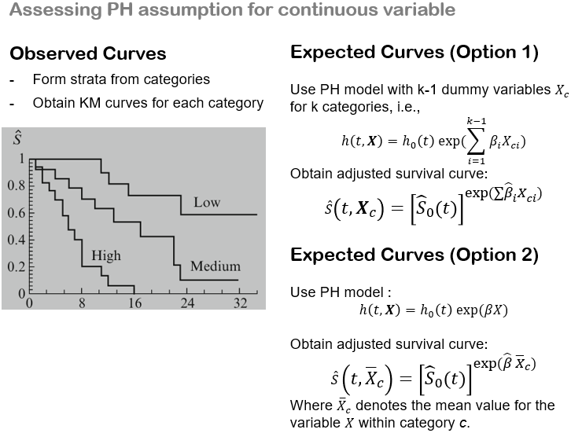
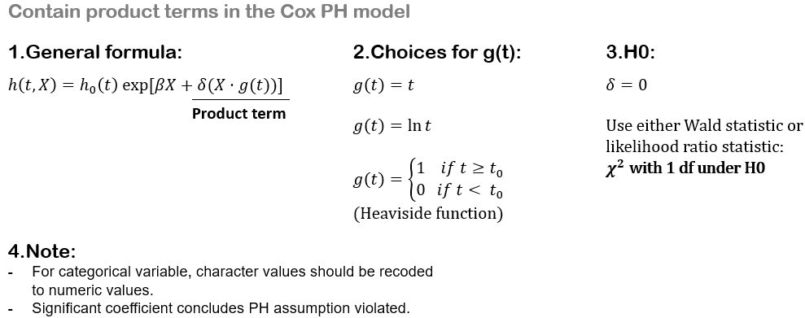
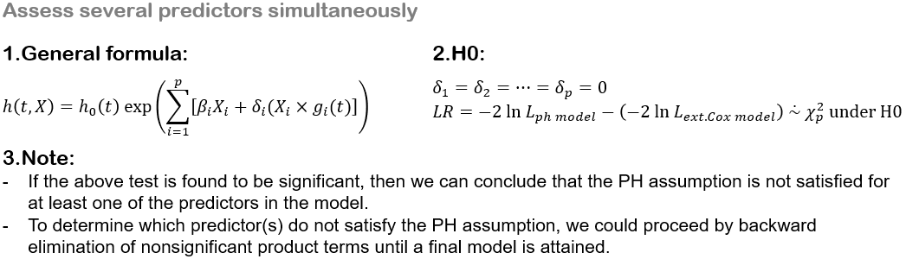
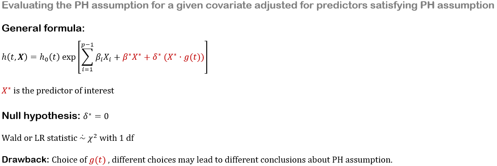

# 评估比例风险假设

> 评估 Cox 模型 PH 假设的三种方法：
>
> - 图形法
>   - 对数-对数生存曲线
>   - 观测值与期望生存曲线对比图
> - 拟合优度检验法
> - 时间相关协变量法

## 1. 图形法 1：对数-对数图


对于 Cox PH 模型，对数-对数生存图的平行性为我们提供了一种评估 PH 假设的图形方法。也就是说，如果 PH 模型适用于一组给定的预测变量，那么对于不同个体，**经验性的对数-对数生存曲线图** 应该大致平行。

这里的经验性绘图，指的是基于 **Kaplan–Meier (KM) 估计** 绘制对数-对数生存曲线，该方法不假设底层的 Cox 模型。或者，也可以绘制 **已针对假定满足 PH 假设的预测变量进行调整**，但尚未将待评估的预测变量纳入 PH 模型的对数-对数生存曲线。

此外，还存在一个疑虑：如何判断“多平行才算平行”？对于给定的数据集，尤其是在研究规模相对较小的情况下，这个判断可能相当主观。我们建议采取一种保守策略：**除非有强有力的证据表明对数-对数曲线不平行，否则应假定 PH 假设成立**。

## 2. 图形法 2：观测值与期望值对比图

使用观测值与期望值对比图来评估 PH 假设，是下文将介绍的拟合优度（GOF）检验方法的图形类比，因此是作为对数-对数生存曲线法的一种合理替代方案。


当使用观测值与期望值对比图来评估连续变量的 PH 假设时，与分类变量类似，观测图是通过将连续变量按类别分层，然后获取每个类别的 KM 曲线来得到的。
然而，对于连续预测变量，计算期望图有两种选择。



## 3. 拟合优度（GOF）检验法

GOF 检验法很吸引人，因为它为评估特定感兴趣预测变量的 PH 假设提供了检验统计量和 p 值。因此，与通常使用上述两种图形方法相比，研究者可以利用统计检验做出更客观的决策。


<u>**使用 SAS 实现**</u>

```SAS
proc phreg data=mydata;
    class group(ref="Placebo");
    model time*status(0) = group wbc;
    output out=resid ressch=r_group r_wbc; /* output Schoenfeld residuals for each covariate */
quit;

proc rank data=resid(where=(status=1)) out=ranked_r ties=mean;
    var time;
    ranks timerank;
run;

proc corr data=ranked_r nosimple;
    var r_group r_wbc;
    with timerank;
run;
```

或者，更简单的方法是使用 `proc phreg` 语句中的 `zph` 选项，这是一种基于 **加权 Schoenfeld 残差** 的类似统计检验：

```SAS
proc phreg data=mydata zph(transform=rank);
    class group(ref="Placebo");
    model time*status(0)=group wbc;
run;
```

如果你想从这两种方式获得相同的输出，你应该在第一种方式的 `output` 语句中使用 `wtressch=` 选项，而不是 `ressch=` 选项。

## 4. 使用时间相关协变量评估 PH 假设





