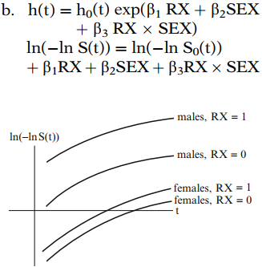
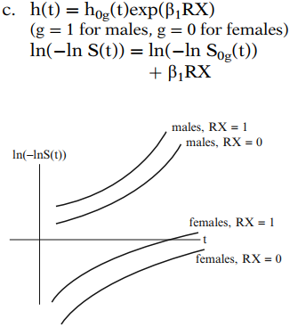
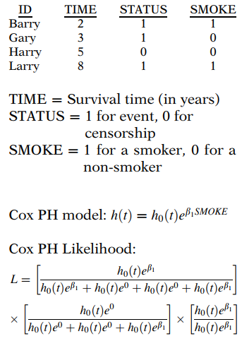
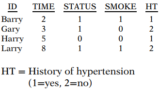
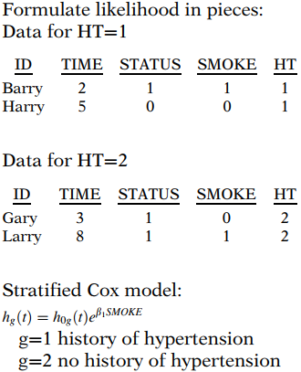

# 分层 Cox 模型

“分层 Cox 模型”是 Cox 比例风险（PH）模型的一种修改，它允许通过对不满足 PH 假设的预测变量进行“分层”来控制。
**假定满足 PH 假设的预测变量被包含在模型中，而被分层的预测变量则不包含在内。**

> 由于分层变量未包含在模型中，因此无法获得针对其他已包含变量调整后的分层变量效应的风险比值。这是对分层变量进行分层所付出的代价。

## 1. 一般分层 Cox (SC) 模型

假设我们有 $k$ 个不满足 PH 假设的变量，记为 $Z_1,Z_2,\dots,Z_k$，以及 $p$ 个满足 PH 假设的变量，记为 $X_1,X_2,\dots,X_p$。

要执行分层 Cox 方法，我们定义一个单一的新变量，称为 $Z^*$：

- 对每个 $Z_i$ 进行分类
- 形成各类别的组合（层）
- 这些层就是 $Z^*$ 的类别

例如，假设 $k$ 为 2，两个 $Z$ 变量分别是年龄（一个区间变量）和治疗状态（一个二分类变量）。那么我们将年龄分为三个年龄组——青年、中年和老年。然后我们形成六个年龄组-治疗状态的组合，如下所示。

这六个组合代表了一个单一新变量的不同类别，我们在分层 Cox 模型中将对此变量进行分层。我们称这个新变量为 $Z^*$。

一般来说，分层变量 $Z^*$ 将有 $k^*$ 个类别，其中 $k^*$ 是对每个 $Z$ 变量进行分类后形成的组合（或层）的总数。

一般 SC 模型：
$$
h_g(t,\bold X)=h_{0g}(t)exp[\beta_1X_1+\beta_2X_2+\dots+\beta_pX_p],\ g=1,2,\dots,k^*
$$
请注意，基线风险函数 $h_{0g}(t)$ 允许在不同层之间不同。然而，系数 $\beta_1,\beta_2,\dots,\beta_p$ 在每一层都是相同的，因此风险比的估计值在每一层也都相同，我们称此为 **“无交互作用”** 假设。

为了获得回归系数 $\beta_1,\beta_2,\dots,\beta_p$ 的估计值，我们最大化一个（部分）似然函数 $L$，该函数是通过将每一层的似然函数相乘而得到的。

## 2. 无交互作用假设及其检验方法

我们之前指出，SC 模型包含不随层变化的回归系数，记为 $\beta$。我们将模型的这一性质称为“无交互作用假设”。

无交互作用模型：
$$
h_g(t,\bold X)=h_{0g}(t)exp[\beta_1X_1+\beta_2X_2+\dots+\beta_pX_p]
$$
但是，如果我们允许交互作用，那么模型将是：
$$
h_g(t,\bold X)=h_{0g}(t)exp[\beta_{1g}X_1+\beta_{2g}X_2+\dots+\beta_{pg}X_p]
$$
注意在这个交互作用模型中，每个回归系数都有下标 $g$，它表示第 g 层，表明回归系数在 $Z^*$ 的不同层中是不同的。

交互作用模型的另一种写法是：
- 使用涉及 $Z^*$ 的乘积项
- 由 $Z^*$ 定义 $k^*-1$ 个哑变量 $Z_1^*,Z_2^*,\dots,Z^*_{K^*-1}$
- 形式为 $Z_i^* \times X_j$ 的乘积项，其中 $i=1,\dots,K^*-1$ 且 $j=1,\dots,p$。

$$
h_g(t,\bold X)=h_{0g}(t)exp[\beta_1X_1+\cdots+\beta_pX_p\\+\beta_{11}(Z_1^* \times X_1)+\cdots+\beta_{p1} (Z_1^* \times X_p)\\+\beta_{12}(Z_2^* \times X_1)+\cdots+\beta_{p2} (Z_2^* \times X_p)\\+\cdots\\+\beta_{1,k^*-1}(Z^*_{k^*-1}\times X_1)+\cdots+\beta_{p,k^*-1}(Z_{k^*-1}^*\times X_p)]
$$

**这个替代公式实际上等价于上面的那个**。我们将使用该替代模型来描述对无交互作用假设的检验。

该检验是一个 **似然比（LR）检验**，比较交互作用模型和无交互作用模型的对数似然统计量。

也就是说，LR 检验统计量的形式为 $-2 \ln L_R$ 减去 $-2 \ln L_F$，其中 $R$ 表示简化模型，在本例中是无交互作用模型，而 $F$ 表示完整模型，即交互作用模型。

在零假设下，LR 检验统计量近似服从自由度为 $p(k^*-1)$ 的 $\chi^2$ 分布。这里的自由度是 $p(k^*-1)$，因为该值给出了交互作用模型中待检验的乘积项的数量。
$$
LR \  \dot\sim \  \chi^2(p(k^*-1))
$$

## 3. 分层 Cox 方法的图形化视图

在本节中，我们检查四个对数-对数生存图，说明带有或不带有交互作用的分层 Cox 模型的假设。四个模型均考虑两个二分类预测变量：治疗（安慰剂组编码为 $RX=1$，新治疗组编码为 $RX=0$）和性别（女性编码为 0，男性编码为 1）。

**<u>模型 1</u>**

该模型假设 RX 和 SEX 均满足 PH 假设，并且假设 RX 和 SEX 之间无交互作用。注意所有四条对数-对数曲线都是平行的（PH 假设），并且治疗效果对女性和男性是相同的（无交互作用）。治疗的效果（控制 SEX 后）可以解释为，分别对男性和女性，从 $RX=1$ 到 $RX=0$ 的对数-对数曲线之间的距离。

**<u>模型 2</u>**

该模型假设 RX 和 SEX 均满足 PH 假设，但允许这两个变量之间存在交互作用。所有四条对数-对数曲线都是平行的（PH 假设），但治疗的效果对男性大于女性，因为从 $RX=1$ 到 $RX=0$ 的距离对男性更大。

**<u>模型 3</u>**

这是一个分层 Cox 模型，其中假设 SEX 不满足 PH 假设。注意男性和女性的曲线不平行。然而，在 SEX 的每个层内，RX 的曲线是平行的，表明 RX 满足 PH 假设。从 $RX=1$ 到 $RX=0$ 的对数-对数曲线之间的距离对男性和女性是相同的，表明 RX 和 SEX 之间无交互作用。

**<u>模型 4</u>**

这是一个允许 RX 和 SEX 交互作用的分层 Cox 模型。尽管在 SEX 的每个层内 RX 满足 PH 假设，但男性和女性的曲线不平行。从 $RX=1$ 到 $RX=0$ 的对数-对数曲线之间的距离对男性大于女性，表明 RX 和 SEX 之间存在交互作用。

## 4. 分层 Cox 似然

在第 3 章（Cox 比例风险模型及其特征）中，我们使用下面显示的数据集说明了 Cox 似然。在本节中，我们将扩展该讨论来说明分层 Cox 模型的似然。

现在考虑一个分层 Cox 模型，其中分层变量是一个二分类指标，指示受试者是否有高血压病史。预测变量 SMOKE 仍保留在模型中。
$$
h_g(t)=h_{0g}(t)e^{\beta_1SMOKE}\\
\text{g=1 有高血压病史}\\
\text{g=2 无高血压病史}
$$
该模型允许违反 PH 假设。然而，在高血压的每个类别内，假定 PH 假设成立。

数据如下所示。新增变量是 HT，它是我们希望分层的变量。Barry 和 Harry 有高血压病史（编码为 $HT=1$），而 Gary 和 Larry 没有（编码为 $HT=2$）。

分层 Cox 似然是分段构建的。每一段代表一个分层类别。在每一段内，似然的构建方式与为 Cox PH 模型构建似然的方式类似。

对于第一层 ($HT=1$)，Barry 在 $TIME=2$ 时发生事件。当 Barry 发生事件时，Barry 和 Harry 处于风险集中。Barry 是这一层唯一发生事件的个体，因为 Harry 在 $TIME=5$ 时被删失。因此，这一段的似然 $L1$ 只包含一项。
$$
L_1=\frac{h_{01}e^{\beta_1}}{h_{01}e^{\beta_1}+h_{01}e^0}
$$
对于第二层 ($HT=2$)，Gary 在 $TIME=3$ 时发生事件。当 Gary 发生事件时，Gary 和 Larry 处于风险集中。Larry 在 $TIME=8$ 时发生事件，并且在其事件发生时是风险集中唯一的个体。因此，这一段的似然 $L2$ 是两个因子的乘积。
$$
L_2=\frac{h_{02}e^0}{h_{02}e^0+h_{02}e^{\beta_1}}\times \frac{h_{02}e^{\beta_1}}{h_{02}e^{\beta_1}}
$$
分层 Cox 似然可以通过取每一段（$L1$ 和 $L2$）的乘积来构建。每一段都是在一个层内构建的。
$$
L=L_1 \times L_2=\left[\frac{h_{01}e^{\beta_1}}{h_{01}e^{\beta_1}+h_{01}e^0}\right]\left[\frac{h_{02}e^0}{h_{02}e^0+h_{02}e^{\beta_1}}\times \frac{h_{02}e^{\beta_1}}{h_{02}e^{\beta_1}}\right]\\
=\left[\frac{e^{\beta_1}}{e^{\beta_1}+e^0}\right]\left[\frac{e^0}{e^0+e^{\beta_1}}\times \frac{e^{\beta_1}}{e^{\beta_1}}\right]
$$
关于这个模型还有一点是，似然第一段 ($L1$) 中的 $\beta_1$ 与似然第二段 ($L2$) 中的 $\beta_1$ 是相同的。换句话说，这是一个无交互作用模型。吸烟的效应（表示为 $\beta_1$）不依赖于高血压状态。