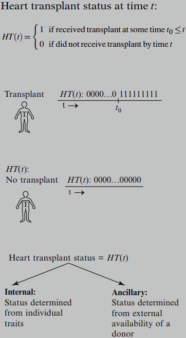
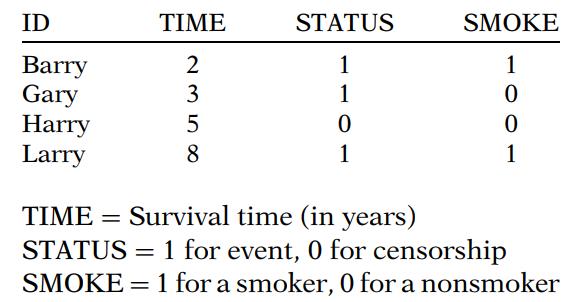
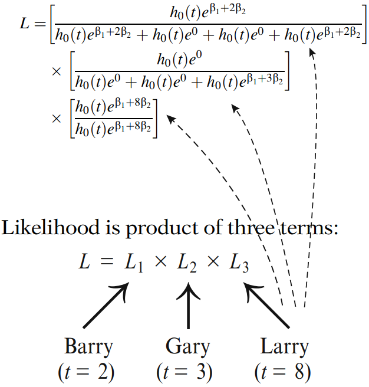
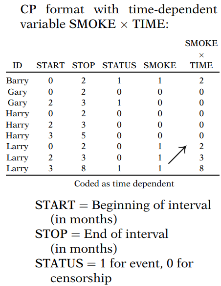

# 针对时间相关变量的 Cox 比例风险模型扩展

## 1. 时间相关变量的定义与示例

时间相关变量定义为：对于给定受试者，其值可能随时间 ($t$) 而变化的任何变量。相反，时间无关变量是其值对于给定受试者随时间保持不变的变量。

**<u>定义型变量</u>**

一个简单的例子，变量 $RACE$ 是一个时间无关变量，而变量 $RACE \times time$ 是一个时间相关变量。

变量 $RACE \times time$ 是一个所谓“定义型”时间相关变量的例子。大多数定义型变量都具有一个时间无关变量（例如 $RACE$）乘以时间或某个时间函数的形式。

第二个定义型变量的例子是 $E\times(\log t-3)$，其中 $E$ 表示，比如说，在研究入组时确定的（0,1）暴露状态变量。注意这里我们使用了时间函数 $\log t-3$，而不是单独的时间 $t$。

**<u>内部变量</u>**

另一种类型的时间相关变量称为“内部”变量。这类变量的例子包括：时间 $t$ 的暴露水平 $E$、时间 $t$ 的就业状态 ($EMP$)、时间 $t$ 的吸烟状态 ($SMK$)，以及时间 $t$ 的肥胖水平 ($OBS$)。

所有这些例子考虑的变量，其值对于所研究的任何受试者都可能随时间变化；此外，对于内部变量，数值变化的原因取决于个体特定的“内部”特征或行为。

**<u>辅助变量</u>**

相比之下，如果一个变量的值发生变化，主要是因为环境中可能同时影响多个个体的“外部”特征，则该变量称为“辅助”变量。

辅助变量的一个例子是特定地理区域在时间 t 的空气污染指数。另一个例子是时间 $t$ 的就业状态 ($EMP$)，如果某人是否就业的主要原因更多地取决于总体经济环境而非个人特征。

**<u>部分内部且部分辅助</u>**

作为另一个可能部分内部、部分辅助的例子，我们考虑对于一名被确诊患有严重心脏病（使其有资格接受移植）的患者，其在时间 $t$ 的心脏移植状态 ($HT$)。如果在某个时间点（例如 $t_0$，早于时间 $t$）该患者已经接受了移植，则此变量 $HT$ 在时间 $t$ 的值为 1。如果在时间 $t$ 该患者尚未接受移植，则 $HT$ 在时间 $t$ 的值为 0。

**<u>区分变量类型的原因</u>**

区分定义型、内部或辅助变量的主要原因是，根据所使用的计算机程序，在扩展 Cox 模型中定义这些变量所需的计算机命令因变量类型而异。

<u>然而，无论变量类型如何，扩展 Cox 模型的形式都是相同的，并且获得回归系数和其他参数估计值以及进行统计推断的程序也是相同的。</u>

## 2. 针对时间相关变量的扩展 Cox 模型

**<u>一般公式</u>**
$$
h(t,\bold X(t))=h_0(t)\exp\left[\sum_{i=1}^{p_1}\beta_iX_i+\sum_{j=1}^{p_2}\delta_jX_j(t)\right]
$$
其中 $X_1,X_2,\dots,X_{p_1}$ 是时间无关变量，$X_1(t),X_2(t),\dots,X_{p_2}(t)$ 是时间相关变量。

与简单的 Cox PH 模型一样，扩展 Cox 模型中的回归系数使用最大似然 (ML) 程序进行估计。ML 估计通过最大化（部分）似然函数 $L$ 获得。然而，扩展 Cox 模型的计算比 Cox PH 模型更复杂，因为用于形成似然函数的风险集在包含时间相关变量时变得更复杂。

进行统计推断的方法与 PH 模型基本相同。也就是说，可以使用 Wald 检验 和/或 似然比 (LR) 检验以及大样本置信区间方法。

**<u>模型假设与滞后时间效应</u>**

扩展 Cox 模型的一个重要假设是：时间相关变量 $X_j(t)$ 对时间 $t$ 生存概率的影响取决于该变量在同一时间 $t$ 的值，而不是取决于更早或更晚时间的值。

请注意，即使变量 $X_j(t)$ 的值可能随时间变化，但风险模型为模型中的每个时间相关变量仅提供一个系数。因此，在时间 $t$，只有一个变量 $X_j(t)$ 的值对风险有影响，该值是在时间 $t$ 测量的。

然而，可以修改时间相关变量的定义，以允许存在 **“滞后时间”** 效应。

为了说明滞后时间效应的概念，例如，假设每周测量的就业状态，记为 $EMP(t)$，是被考虑的时间相关变量。那么，不考虑滞后时间的扩展 Cox 模型假定，就业状态对第 t 周生存概率的影响取决于该变量在同一周 $t$ 的观测值，而不是例如前一周的观测值。

但是，为了允许一周的时滞，可以修改就业状态变量，使得时间 t 的风险模型由第 $t-1$ 周的就业状态预测。因此，模型中的变量 $EMP(t)$ 被变量 $EMP(t-1)$ 替换。

**<u>一般滞后时间扩展模型</u>**
$$
h(t,\bold X(t))=h_0(t)\exp\left[\sum_{i=1}^{p_1}\beta_iX_i+\sum_{j=1}^{p_2}\delta_jX_j(t-L_j)\right]
$$
其中 $L_j$ 表示为时间相关变量 $j$ 指定的滞后时间。

## 3. 扩展 Cox 模型的风险比公式

HR 公式最重要的特征是，当使用扩展 Cox 模型时，比例风险假设不再成立。
$$
\widehat {HR}(t)=\frac{\hat h(t,\bold X^*(t))}{\hat h(t,\bold X(t))}=\exp\left[\sum_{i=1}^{p_1}\hat\beta_i[X_i^*-X_i]+\sum_{j=1}^{p_2}\delta_j[X_j^*(t)-X_j(t)]\right]
$$
两组预测变量 $\bold X^*(t)$ 和 $\bold X(t)$，标识了在时间 t 对包含时间无关变量和时间相关变量的组合预测变量集的两种设定。

请注意，在风险比公式中，第 $j$ 个时间相关变量值之差的系数 $\hat\delta_j$ 本身不是时间相关的。因此，该系数代表了相应时间相关变量的 **“整体”效应**，考虑了研究中测量该变量的所有时间。

## 4. 扩展 Cox 似然

我们仍然使用以下数据来说明如何计算扩展 Cox 似然：

现在考虑一个扩展 Cox 模型，它包含预测变量 $SMOKE$ 和一个时间相关变量 $SMOKE \times TIME$。对于该模型，不仅是基线风险可能随时间变化，预测变量的值也可能变化。
$$
h(t)=h_0(t)e^{\beta_1SMOKE+\beta_2SMOKE\times TIME}
$$
这些数据的扩展 Cox 似然 ($L$) 如下所示。

与 Cox PH 似然一样，基线风险在扩展 Cox 似然中抵消了。因此，无需指定基线风险的形式，因为它在回归参数的估计中不起作用。
$$
L=\left[\frac{e^{\beta_1+2\beta_2}}{e^{\beta_1+2\beta_2}+e^0+e^0+e^{\beta_1+2\beta_2}}\right]\times\left[\frac{e^0}{e^0+e^0+e^{\beta_1+3\beta_2}}\right]\times\left[\frac{e^{\beta_1+8\beta_2}}{e^{\beta_1+8\beta_2}}\right]
$$
对于那些计划运行具有时变协变量模型的人，一个告诫是：**在数据步中通过将每个个体的 $SMOKE$ 值乘以其生存时间来创建与 $TIME$ 的乘积项是不正确的**。换句话说，$SMOKE\times TIME$ 不应像典型的交互项那样编码。事实上，如果 $SMOKE\times TIME$ 被编码如下，那么 $SMOKE\times TIME$ 将是一个时间无关变量。Larry 的 $SMOKE\times TIME$ 值被错误地编码为恒定值 8，即使 Larry 的 $SMOKE\times TIME$ 值在似然 $L1$, $L2$, 和 $L3$ 中发生了变化。

如果将错误编码的时间无关的 $SMOKE\times TIME$ 包含在 Cox 模型中，那么<u>即使 PH 假设未被违反，其系数估计值也可能高度显著</u>，这并不奇怪。可以预期，<u>与每个个体生存时间的乘积项会预测其结果（他们的生存时间），但这将没有意义</u>。然而，这是一个常见的错误。

为了获得正确定义的 $SMOKE\times TIME$ 时间相关变量，计算机软件包通常允许在分析过程中定义该变量。

或者，可以使用（开始，停止）或计数过程 (CP) 数据布局，在数据中显式定义时间相关变量。

