# 参数生存模型

参数生存模型是一种假设生存时间（结局）服从某种已知分布的模型。常用于生存时间的分布示例有：`Weibull` 分布、`指数` 分布（Weibull 分布的特例）、`对数逻辑` 分布、`对数正态` 分布和`广义伽马` 分布。

相比之下，Cox 比例风险模型不是完全参数模型。它是一个 <u>半参数</u> 模型，因为即使回归参数（β）已知，结局的分布仍然未知。Cox 模型中没有指定基线生存（或风险）函数。

## 1. 与风险函数和生存函数相关的概率密度函数

对于参数生存模型，假设时间服从某种分布，其概率密度函数 $f(t)$ 可以用未知参数表示。一旦为生存时间指定了概率密度函数，就可以确定相应的生存函数和风险函数。生存函数 $S(t)=P(T>t)$ 可以通过对概率密度函数从时间 t 到无穷大积分来从概率密度函数中确定。然后可以通过将生存函数的负导数除以生存函数来找到风险函数。
$$
f(t)=dF(t)/dt\ \ \text{其中}\ F(t)=Pr(T \le t)\\
$$

$$
S(t)=Pr(T\gt t)=\int_{t}^\infty f(u) du
$$

$$
h(t)=\frac{-d[S(t)]/dt}{S(t)}
$$

生存函数也可以通过风险函数表示为累积风险函数的负值的指数。累积风险函数是风险函数在积分限 0 到 t 之间的积分。
$$
S(t)=\exp\left(-\int_0^th(u)du\right)
$$
最后，概率密度函数可以表示为风险函数和生存函数的乘积，$f(t)=h(t)S(t)$。

关键在于，指定概率密度函数、生存函数或风险函数中的任何一个，都可以确定另外两个函数。

以下是一些选定分布的生存函数和风险函数：

这些分布的概率密度函数可以通过将 $h(t)$ 和 $S(t)$ 相乘得到。

通常对于参数生存模型，<u>参数 $\lambda$ 根据预测变量和回归参数进行重新参数化</u>，而 <u>参数 $p$（有时称为形状参数）保持固定</u>。

## 2. 指数分布示例

我们考虑的第一个例子是指数模型，它是最简单的参数生存模型，因为其风险随时间恒定：
$$
h(t)=\lambda
$$
为简单起见，我们演示一个仅以 TRT 作为预测变量的指数模型。我们通过对 $\lambda$ 重新参数化为 $\exp(\beta_0+\beta_1TRT)$ 来用风险函数表达该模型。

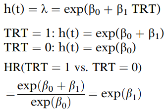

对于每个协变量模式，风险恒定的假设是 <u>比 PH 假设强得多的假设</u>。如果风险是恒定的，那么风险比当然也是恒定的。然而，<u>风险比恒定并不一定意味着每个风险都是恒定的</u>。在 Cox PH 模型中，不假设基线风险恒定。

## 3. 加速失效时间假设

**许多参数模型是加速失效时间 (AFT) 模型，而不是 PH 模型**。指数分布和 Weibull 分布可以同时适应 PH 和 AFT 假设。

AFT 模型的基本假设是协变量的效应相对于生存时间是 <u>乘性（成比例）的</u>，而对于 PH 模型，基本假设是协变量的效应相对于风险是 <u>乘性的</u>。

为了说明 AFT 假设背后的思想，考虑狗的寿命。常有人说狗变老的速度比人类快七倍。因此，10 岁的狗在某种程度上相当于 70 岁的人类。用 AFT 术语来说，我们可以说狗存活超过 10 年的概率等于人类存活超过 70 年的概率。

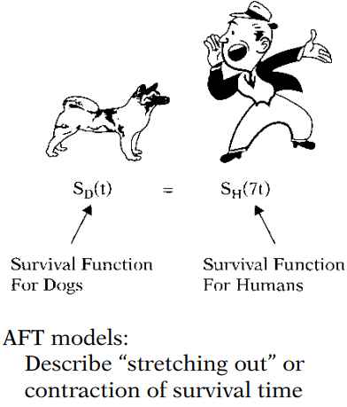

对于加速失效时间假设的第二个说明，考虑比较吸烟者 $S_1(t)$ 和非吸烟者 $S_2(t)$ 的生存函数。AFT 假设可以表示为 $S_2(t)=S_1(\lambda t)$，其中 $t\ge0$，$\lambda$ 是一个常数，称为比较吸烟者与非吸烟者的**加速因子**。

在回归框架中，加速因子 $\lambda$ 可以参数化为 $\exp(\alpha)$，其中 $\alpha$ 是从数据中估计的参数。通过这种参数化，AFT 假设可以表示为：
$$
S_2(t)=S_1([\exp(\alpha)]t) \ \ \text{或} \\
S_1(t)=S_2([\exp (-\alpha)]t)
$$
假设 $\exp (\alpha)=0.75$，那么非吸烟者存活 80 年的概率等于吸烟者存活 80(0.75) 即 60 年的概率。

AFT 假设也可以用生存时间的随机变量来表示，而不是用生存函数。如果 $T_2$ 是表示非吸烟者生存时间的随机变量（服从某种分布），$T_1$ 是表示吸烟者生存时间的随机变量，那么 AFT 假设可以表示为 $T_1=\lambda T_2$。

加速因子是 AFT 模型中获得的关键关联度量。它允许研究者评估预测变量对生存时间的影响，就像风险比允许评估预测变量对风险的影响一样。

加速因子是对应于任何固定 $S(t)$ 值的生存时间之比。

通过检查下面展示的组 1 ($G=1$) 和组 2 ($G=2$) 的生存曲线，可以图形化地说明这个思想。对于任何固定的 $S(t)$ 值，从 $S(t)$ 轴到 $G=2$ 生存曲线的水平线距离，是到 $G=1$ 生存曲线距离的两倍。

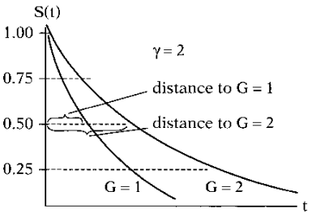

**对于 AFT 模型，对于所有固定的 $S(t)$ 值，这个生存时间比被假定为常数**。

## 4. 指数模型 (AFT)

指数分布的生存函数和风险函数为：$S(t)=\exp(-\lambda t)$ 和 $h(t)=\lambda$。指数风险是恒定的，并且可以重新参数化为 PH 模型，例如 $h(t)=\lambda=\exp(\beta_0+\beta_1 \times TRT)$。

在本节中，我们展示 $S(t)$ 如何被重新参数化为 AFT 模型：
$$
S(t)=\exp(-\lambda t)\\
t=[-\ln(S(t))]\times \frac{1}{\lambda}\\
\text{令}\ \frac{1}{\lambda}=\exp(\alpha_0+\alpha_1\text{TRT})\\
t=[-\ln(S(t))]\times \exp(\alpha_0+\alpha_1\text{TRT})\\
\text{令}\ S(t)=q\\
t=[-\ln(q)]\times \exp(\alpha_0+\alpha_1\text{TRT})\\
\text{则加速因子}\ \gamma(\text{TRT=1 vs. TRT=0}):\\
\gamma=\frac{[-\ln(q)]\exp(\alpha_0+\alpha_1)}{[-\ln(q)]\exp(\alpha_0)}=\exp(\alpha_1)
$$
因此，涉及单一 (0,1) TRT 预测变量的缓解期数据的指数风险函数满足 AFT 模型假设：
$$
S_{\text{TRT=0}}(t)=S_{\text{TRT=1}}(\gamma t),\ \text{其中}\ \gamma=\exp(\alpha_1)
$$
将 AFT 模型形式下 $\lambda$ 的公式与 PH 模型形式下（不同的）$\lambda$ 公式进行比较：
$$
\text{AFT:}\ \frac{1}{\lambda}=\exp(\alpha_0+\alpha_1\text{TRT})\\
\text{PH:}\ \lambda=\exp(\beta_0+\beta_1\text{TRT})
$$

## 5. Weibull 模型

Weibull 模型是最广泛使用的参数生存模型，其风险函数为：
$$
h(t)=\lambda pt^{p-1}\ \text{其中}\ p>0\ \text{且}\ \lambda>0
$$
与指数模型一样，$\lambda$ 将用回归系数重新参数化。附加参数 $p$ 称为**形状参数**，决定了风险函数的形状。

- 若 $p>1$，则风险随时间增加；
- 若 $p=1$，则风险恒定，Weibull 模型简化为指数模型；
- 若 $p<1$，则风险随时间减少。

**<u>性质</u>**

- 如果 AFT 假设成立，则 PH 假设也成立（反之亦然）。这个性质是 Weibull 模型独有的，且要求 $p$ 不随协变量的不同水平而变化。
- $S(t)$ 的对数负对数（log(-log)）与时间的对数呈线性关系。这允许通过绘制 Kaplan–Meier 生存估计值的对数负对数与时间的对数的关系图，来图形化评估 Weibull 模型的适当性。

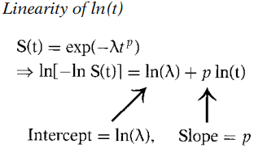

关键点在于，直线支持 Weibull 假设，平行曲线支持 PH 假设。

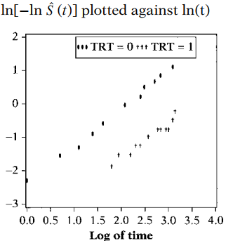

$\ln[-\ln \hat S(t)]$ 对 $\ln(t)$ 作图可能结果的总结：

1. 平行直线 $\Rightarrow$ Weibull、PH 和 AFT 假设成立；
2. 斜率为 1 的平行直线 $\Rightarrow$ 指数分布、PH 和 AFT 假设成立；
3. 平行但不为直线 $\Rightarrow$ PH 成立，但 Weibull 和 AFT 不成立，可以使用 Cox 模型；
4. 不平行且不为直线 $\Rightarrow$ Weibull、PH 和 AFT 假设均不成立；
5. 不平行但为直线 $\Rightarrow$ Weibull 成立，但 PH 和 AFT 假设不成立，$p$ 不同。

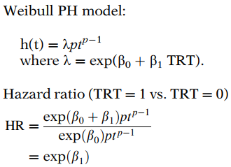

AFT 模型也可以用 Weibull 分布来构建：

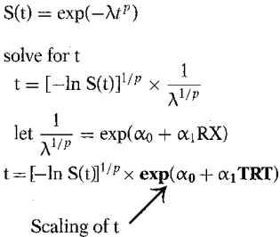

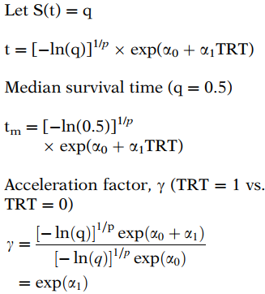

将 AFT 模型形式下 $\lambda$ 的公式与 PH 模型形式下（不同的）$\lambda$ 公式进行比较：
$$
\text{AFT:}\ \lambda^{1/p}=\exp(-(\alpha_0+\alpha_1\text{TRT}))\\
\text{PH:}\ \lambda=\exp(\beta_0+\beta_1\text{TRT})
$$

## 6. 对数逻辑模型

对数逻辑分布适应 AFT 模型，但不适应 PH 模型，其风险函数为：
$$
h(t)=\frac{\lambda pt^{p-1}}{1+\lambda t^p}\ \text{其中}\ p>0\ \text{且}\ \lambda>0
$$

- 若 $p\le 1$，则风险随时间减少；
- 若 $p>1$，则风险随时间先增加后减少（单峰）。

与 Weibull 模型不同，对数逻辑 AFT 模型不是 PH 模型。然而，对数逻辑 AFT 模型是一个**比例优势** (PO) 模型。比例优势生存模型是指生存优势比被假定为随时间保持不变的模型。

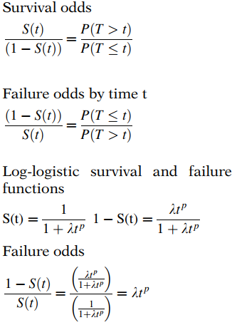

失效优势的对数是 $\ln(\lambda t^p)$，可以重写为 $\ln (\lambda)+p[\ln(t)]$。换句话说，失效的对数优势是时间对数的线性函数，斜率为 $p$，截距为 $\ln(\lambda)$。这是一个有用的结果，使得可以通过图形评估对数逻辑分布的适当性。

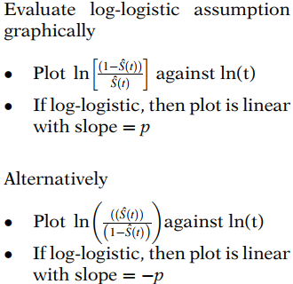

接下来，我们考虑缓解期数据中的一个不同变量：一个关于白细胞计数的二分类变量 (WBCCAT)，中等 = 1，高 = 2。

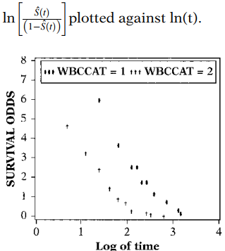

关键点：

- 直线支持对数逻辑假设；
- 平行曲线支持 PO 假设；
- 如果对数逻辑和 PO 假设成立，则 AFT 假设也成立。

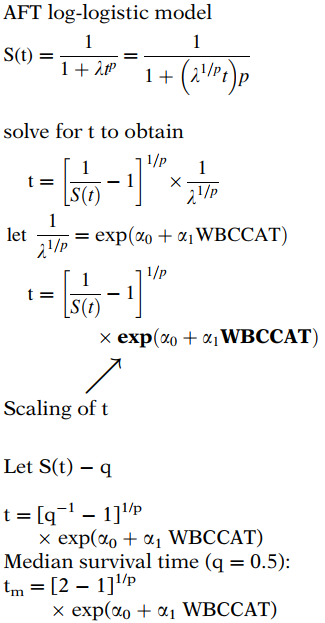

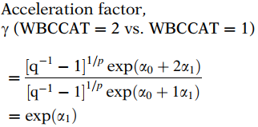

将 AFT 模型形式下 $\lambda$ 的公式与 PO 模型形式下（不同的）$\lambda$ 公式进行比较：
$$
\text{AFT:}\ \lambda^{1/p}=\exp(-(\alpha_0+\alpha_1\text{WBCCAT}))\\
\text{PO:}\ \lambda=\exp(\beta_0+\beta_1\text{WBCCAT})
$$