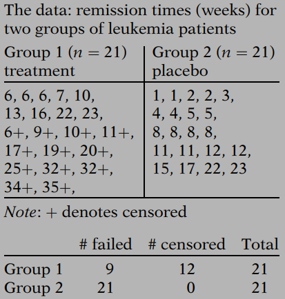
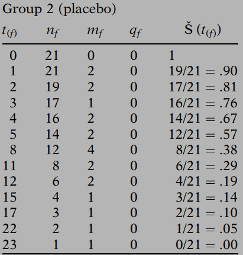
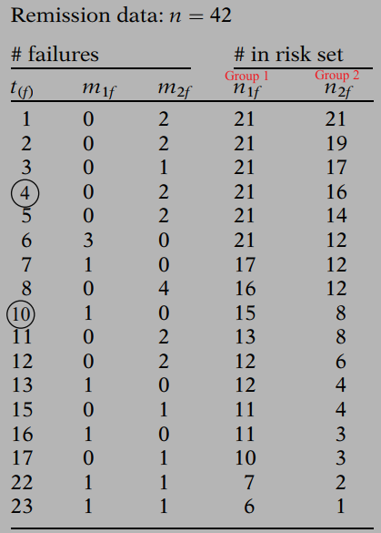
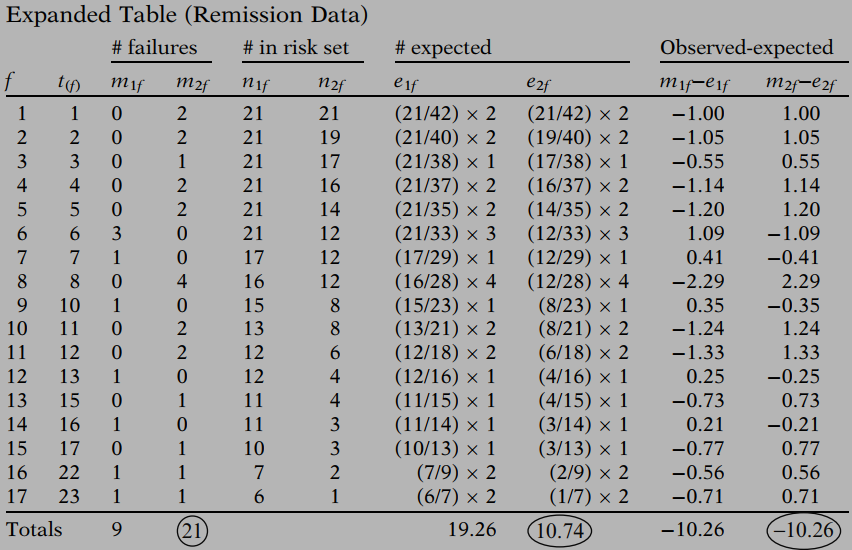

# Kaplan-Meier Survival Curves and the Log-Rank Test


> To estimate the survival probability at a given time, we make use of the risk set at that time to include the information we have on a censored person up to the time of censorship, rather than simply throw away all the information on a censored person. The actual computation of such a survival probability can be carried out using the Kaplan-Meier (KM) method. 

## 1. Formula of KM Estimator

The general formula for a KM survival probability at failure time $$t_{(f)}$$ is:
$$
\hat S(t_{(f)})=\hat S(t_{(f-1)}) \times \hat Pr(T>t_{(f)}|T \ge t_{(f)})
$$
The above KM formula can also be expressed as a **product limit** if we substitute for the survival probability $\hat S(t_{(f-1)})$, the product of all fractions that estimate the conditional probabilities for failure times $t_{(f-1)}$ and earlier:

$$
\hat S(t_{(f)})=\displaystyle \prod_{i=1}^f \hat Pr(T>t_{(i)}|T \ge t_{(i)})
$$

We will give an example in next section to demonstrate how to compute $\hat Pr(T>t_{(f)}|T \ge t_{(f)})$.

## 2. An Example Using KM method

**<u>Example Data</u>**



1. Order survival times in ascending order within each group, and generate summary tables like following:


- $t_{(f)}$: survival time
- $n_f$: the number of subjects in the risk set at the start of the interval 
- $m_f$: number of failures
- $q_f$: number of censoring

2. $\hat Pr(T>t_{(f)}|T \ge t_{(f)}) = 1-m_f/n_f$, and number of subjects at risk $n_f=n_{f-1}-m_{f-1}-q_{f-1}$, compute $\hat S(t_{(f)})$ as following:




3. Plot estimated survival probabilities corresponding to each ordered failure time as a step function that starts with a horizontal line at a survival probability of 1 and then steps down to the other survival probabilities as we move from one ordered failure time to another.


**<u>SAS Sample Code for KM Analysis</u>**

```SAS
proc lifetest data=<mydata> plots=S;
	time <time>*<censor(0)>;
	strata <group>;
run;
```

## 3. The Log-Rank Test for Two Groups

The most popular testing method  of evaluating **whether or not KM curves for two or more groups are statistically equivalent** is called the log-rank test.

>When we state that two KM curves are “statistically equivalent,” we mean that, based on a testing procedure that compares the two curves in some “overall sense,” we do not have evidence to indicate that the true (population) survival curves are different. 

The log–rank test is a large-sample **chi-square test** that :

- Provides an overall comparison of KM curves
- Makes use of observed versus expected cell counts
- Categories are defined by each of the ordered failure times

**<u>Example of the information required for the log-rank test</u>**



Expected cell counts can be calculated as:


$$
e_{1f}=\left(\frac{n_{1f}}{n_{1f}+n_{2f}}\right) \times (m_{1f}+m_{2f})
$$

$$
e_{2f}=\left(\frac{n_{2f}}{n_{1f}+n_{2f}}\right) \times (m_{1f}+m_{2f})
$$

Next step, we need to calculate $O_i-E_i$ as follows:
$$
O_i-E_i=\sum_{f=1}^k(m_{if}-e_{if})
$$
where $k$ is the number of ordered failure time, and $i$ identified groups.




For the two group case, the log-rank statistic is:
$$
\frac{(O_i-E_i)^2}{Var(O_i-E_i)} \sim \chi^2(1) \quad under \quad H_0
$$
$i$ can be 1 or 2, and the choice of these two will always gives the same result. $Var(O_i-E_i)$ is the estimated variance whose expression is:
$$
Var(O_i-E_i)=\sum_f \frac{n_{1f}n_{2f}(m_{1f}+m_{2f})(n_{1f}+n_{2f}-m_{1f}-m_{2f})}{(n_{1f}+n_{2f})^2(n_{1f}+n_{2f}-1)}
$$
The null hypothesis is: **$H_0:$ *no difference between the two survival curves***.

An approximation to the log-rank statistic can be used to quickly perform a test:
$$
\chi^2 \approx \sum_i^{number\ of\ groups}\frac{(O_i-E_i)^2}{E_i}
$$

## 4. The Log-Rank Test for Several Groups

The log–rank test can also be used to compare three or more survival curves. The null hypothesis for this more general situation is that **all survival curves are the same**. 

If the number of groups being compared is $G(\ge 2)$, then the log–rank statistic has approximately a large sample chi-square distribution with $G-1$ degrees of freedom.  And Log-rank statistics for > 2 groups involves variances and covariances of $O_i-E_i$, as presented below:


The approximation to the log-rank statistic mentioned above also applies if the number of groups is greater than 2.

## 5. Alternatives to the Log Rank Test 

There are several alternatives to the log rank test like: the `Wilcoxon`, the `Tarone-Ware`, the `Peto`, and the `Flemington-Harrington` test. All of these tests are variations of the log rank test.

In describing the differences among these tests, recall that the log rank test uses the summed observed minus expected score $O-E$ in each group to form the test statistic. **This simple sum gives the same weight – namely, unity – to each failure time when combining observed minus expected failures in each group.**

The `Wilcoxon`, `Tarone-Ware`, `Peto`, and `Flemington-Harrington` test statistics are variations of the log rank test statistic and are derived by **applying different weights at the f-th​ failure time**:
$$
\frac{\left(\sum_f w(t_{(f)})(m_{if}-e_{if})\right)^2}{Var \left(\sum_f w(t_{(f)})(m_{if}-e_{if})\right)}
$$
Weights applied by each test was presented in the below table:
| Test Statistic        | $w(t_{(f)})$                                         | Note                                                         |
| --------------------- | ---------------------------------------------------- | ------------------------------------------------------------ |
| Log rank              | 1                                                    |                                                              |
| Wilcoxon              | $n_f$                                                | $n_f$ is the number at risk over all groups.                 |
| Tarone-Ware           | $\sqrt{n_f}$                                         |                                                              |
| Peto                  | $\tilde s(t_{(f)})$                                  | $\tilde s(t_{(f)})$ is the survival estimate calculated over all groups combined, which is similar but not exactly equal to the KM estimate. |
| Flemington-Harrington | $\hat S(t_{(f-1)})^p \times [1-\hat S(t_{(f-1)})]^q$ | $\hat s(t_{(f)})$ is the KM estimate over all groups. It allows the most flexibility in terms of the choice of weights because the user provides the values of p and q. |

**<u>Choosing a Test</u>**

- Results of different weightings usually lead to similar conclusions.
- The best choice is test with most power.
- Power depends on how the null is violated.
- There may be a clinical reason to choose a particular weighting.

## 6. Stratified Log-Rank Test

The stratified log rank test is another variation of the log rank test. With this test the summed observed minus expected scores $O-E$ are calculated **within strata of each group and then summed across strata**.  

The only difference between the unstratified and stratified approaches is: for the unstratified approach, $O_i-E_i=\sum_f(m_{if}-e_{if})$, where i = group #, f =  fth failure time; while for stratified approach, $O_i-E_i=\sum_s\sum_f(m_{ifs}-e_{ifs})$, where s = stratum #.

Either way, the null distribution is chi-square with $G-1$ degrees of freedom, where $G$ represents the number of groups being compared (**not the number of strata**).  

The stratified approach can also be applied to any of the weighted variations of the log rank test (e.g., Wilcoxon). A limitation of the stratified approach is the **reduced sample size within each stratum**.

## 7. Confidence Intervals for KM Curves

### 7.1 Classical Method

The CI formula for estimated KM probability at any time point over follow-up has the general large sample form shown  below:
$$
\hat S_{KM}(t) \pm z_{\alpha/2} \sqrt{V\hat ar[\hat S_{KM}(t)]}
$$
where $\hat S_{KM}(t)$ denotes the KM estimate at time t and $Var[\hat S_{KM}(t)]$ denotes variance of $\hat S_{KM}(t)$.

The most common approach used to calculate this variance is the **Greenwood's Formula**:
$$
V\hat ar[\hat S_{KM}(t)]=(\hat S_{KM}(t))^2 \sum_{f:t_{(f)}\le t}\left[\frac{m_f}{n_f(n_f-m_f)}\right]
$$
where $t_{(f)}$ = f-ordered failure time, $m_f$ = # of failures at $t_{(f)}$ , $n_f$ = # in the risk set at $t_{(f)}$.


<u>Proof</u>: We recall the **Delta method**, i.e., for a random variable *x*, the variance of *g*(*x*) can be approximated by $[g'(x)]^2 \cdot var(x)$ .

We note that 
$$
S(t_f)=\prod_{f=1}^k p_f
$$
where $p_f=1-m_f/n_f$ is the probability that a subject survives to just before $t_f$ . Taking the natural logs, 
$$
\ln S(t_f)=\sum_{f=1}^k \ln p_f
$$
Thus
$$
var(\ln S(t_f))=\sum_{f=1}^k var(\ln p_f)
$$
We now assume that the number of subjects that survive in the interval $[t_f, t_{(f+1)})$ has a binomial distribution $B(n_f, \pi_f)$ where $p_f$ is an estimate for $\pi_f$. Since the observed number of subjects that survive in the interval is $n_f-m_f$, it follows (based on the variance of a binomial random variable) that:
$$
var(n_f-m_f) \approx n_fp_f(1-p_f)
$$
Thus
$$
var(p_f)=var\left(\frac{n_f-m_f}{n_f}\right)=\frac{var(n_f-m_f)}{n_f^2}\approx \frac{n_fp_f(1-p_f)}{n_f^2}=\frac{p_f(1-p_f)}{n_f}
$$
Based on the Delta method,
$$
var(\ln p_f)\approx \frac{var(p_f)}{p_f^2} \approx \frac{p_f(1-p_f)}{p_f^2n_f}=\frac{m_f}{n_f(n_f-m_f)}
$$
Thus
$$
var(\ln S(t_f))=\sum_{f=1}^k var(\ln p_f) \approx \sum_{f=1}^k \frac{m_f}{n_f(n_f-m_f)}
$$
But used Delta method again, we also have:
$$
var(\ln S(t_f))\approx \frac{var(S(t_f))}{S^2(t_f)}
$$
Which means:
$$
\sum_{f=1}^k \frac{m_f}{n_f(n_f-m_f)}\approx \frac{var(S(t_f))}{S^2(t_f)}
$$
Thus
$$
var(S(t_f)) \approx S^2(t_f)\sum_{f=1}^k \frac{m_f}{n_f(n_f-m_f)}
$$

### 7.2 Transformation Methods

The classical method has the defect that it can result in values outside the range of *S*(*t*), namely 0 to 1. Also, the CI calculated by the classical method is more likely wider than the other methods mentioned below.

Thus it is better to use a transformation that transforms *S*(*t*) to the range $(-\infty, \infty)$ and then take the inverse transformation. For example, we can use the transformation $\ln(-\ln x)$ to accomplish this, which also called the `log-log` transformation:
$$
g(x)=\ln (-ln (x))
$$
In this case, the approximate $1-\alpha$ confidence interval for $S(t_f)$ , is given by the formula:
$$
S(t_f)^{\exp \left[\pm \frac{z_{\alpha/2}}{\ln S(t_f)}\cdot \sqrt{\sum_{f=1}^k\frac{m_f}{n_f(n_f-m_f)}} \right]}
$$
<u>Proof</u>: by $\delta$ method
$$
var(\ln (-x))\approx \frac{var(x)}{x^2}
$$
Then
$$
var(\ln (-\ln S(t_f)))\approx \frac{var(-\ln S(t_f))}{[\ln S(t_f)]^2}=\frac{var(\ln S(t_f))}{[\ln S(t_f)]^2} \approx \frac{S^2(t_f)}{[\ln S(t_f)]^2 \cdot S^2(t_f)} \sum_{f=1}^k\frac{m_f}{n_f(n_f-m_f)}\\=\frac{1}{[\ln S(t_f)]^2 } \sum_{f=1}^k\frac{m_f}{n_f(n_f-m_f)}
$$
The result now follows by taking the inverse transformations.


Except for the `log-log` transformation (the most commonly used), there are other transform methods:

- The arcsine-square root transformation: $g(x)=sin^{-1}(\sqrt{x})$
- The identity (linear) transformation: $g(x)=x$, i.e., the classical method
- The logarithmic transformation: $g(x)=\ln (x)$ 
- The logit transformation: $g(x)=\ln (\frac{x}{1-x})$  

## 8. Confidence Intervals for the Median Survival Time

The median survival time is calculated as the smallest survival time for which the survivor function is less than or equal to 0.5 (similar as other quartile survival times).

### 8.1 Brookmeyer and Crowley's Method

Brookmeyer and Crowley (1982) proposed a simple way to calculate the CI for the median survival time based on the fact that **the square of a standardized function of the survival curve around the true (unknown) median value (M) is asymptotically $\chi^2$ distributed**. 
$$
\frac{(\hat S_{KM}(M)-0.5)^2}{V\hat ar[\hat S_{KM} (M)]} \sim \chi^2(1)
$$
where M = true (unknow) median survival time, i.e., $S_{KM}(M)=0.5$, the variance of KM estimate will be calculated using the Greenwood's formula.

Using the above result about the standardized survival curve, a general formula for the $1-\alpha$ CI for the median survival is provided by the inequality expression $(\hat S_{KM}(t)-0.5)^2 < \chi^2_{(1-\alpha)}V\hat ar[\hat S_{KM}(t)]$. 

The times for which this inequality holds are plausible values of the true median, while the boundaries represent upper and lower times for the CI for the median. The lower boundary may be 0 and the upper boundary may not always exist. 

<u>An example</u>: 95% CI for median survival time is [4,8]


Brookmeyer and Crowley (B&C) caution that the upper limit for these estimates should be adjusted to reflect censoring. They recommend **reporting semiopen intervals that extend one event beyond the event that satisfies the inequality**.

some packages (e.g., SAS, R) incorporate this recommendation. In above example, the 95% CI for the median survival time obtained from SAS output is given by the interval [4, 11), with the upper limit now extended beyond 8 weeks but not including the event at month 11.

### 8.2 Andersen's Method

Another confidence interval for the median survival time is constructed using a large sample estimate of the density function of the survival estimate. **If there are many tied survival times then the Brookmeyer-Crowley limits should not be used**.

### 8.3 About the Mean Survival Time

Mean survival time is estimated as **the area under the survival curve**. The estimator is based upon the entire range of data. Note that some software uses only the data up to the last observed event; Hosmer and Lemeshow (1999) point out that this biases the estimate of the mean downwards, and they recommend that the entire range of data is used. A large sample method is used to estimate the variance of the mean survival time and thus to construct a confidence interval (Andersen's Method).

<u>Samples of survival times are frequently highly skewed, therefore, in survival analysis, the median is generally a better measure of central location than the mean</u>.