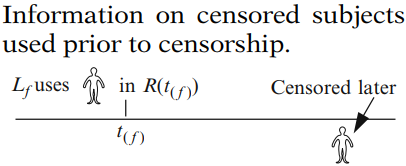
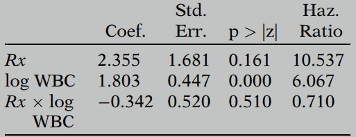
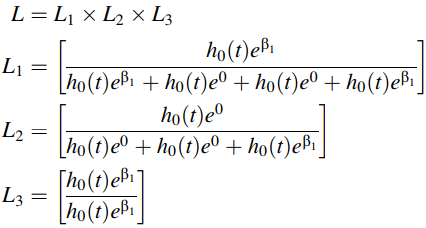

# The Cox Proportional Hazards Model and Its Characteristics

> The **Cox proportional-hazards model** (Cox, 1972) is essentially a regression model commonly used for investigating the association between the survival time of patients and one or more predictor variables.

## 1. The Formula for the Cox PH Model

The Cox PH model is usually written in terms of the hazard model formula as shown below:
$$
h(t,\bold X)=h_0(t)e^{\sum_{i=1}^p \beta_iX_i}
$$
This model gives an expression for the hazard at time t for an individual with a given specification of a set of explanatory variables denoted by the $\bold X$. That is, the $\bold X$ represents a collection (sometimes called a “vector”) of predictor variables that is being modeled to predict an individual’s hazard. 

The Cox model formula says that the hazard at time t is the product of two quantities. The first of these, $h_0(t)$, is called the **baseline hazard function**. The second quantity is the exponential expression e to the linear sum of $\beta_iX_i$, where the sum is over the p explanatory X variables. 

An important feature of this formula, which concerns the proportional hazards (PH) assumption, is that the baseline hazard is a function of t, but does not involve the X’s. In contrast, the exponential expression shown here, involves the X’s, but does not involve t. The X’s here are called **time-independent X’s**.

> **Time-independent variable:** 
>
> <u>Values for a given individual do not change over time; e.g., SEX .</u>
>
> It is possible, nevertheless, to consider X’s which do involve t. Such X’s are called time-dependent variables. If time-dependent variables are considered, the Cox model form may still be used, but such a model no longer satisfies the PH assumption, and is called the **extended Cox model**. 
>
> Also note that although variables like AGE and weight (WGT) change over time, it may be appropriate to treat such variables as time-independent in the analysis **if their values do not change much over time** or **if the effect of such variables on survival risk depends essentially on the value at only one measurement**.

**<u>Cox model: Semiparametric</u>**

Another important property of the Cox model is that the baseline hazard,$h_0(t)$, is an unspecified function. It is this property that makes the Cox model a **semiparametric model**. 

In contrast, a parametric model is one whose functional form is completely specified, except for the values of the unknown parameters. 

## 2. Why the Cox PH Model Is Popular

**<u>(1) The Cox PH model is "robust"</u>**

Even though the baseline hazard is not specified, reasonably good estimates of regression coefficients, hazard ratios of interest, and adjusted survival curves can be obtained for a wide variety of data situations. 

Another way of saying this is that the Cox PH model is a “robust” model, so that **the results from using the Cox model will closely approximate the results for the correct parametric model**. 

**<u>(2) Appealing formula</u>**

The exponential part of this product is appealing because it ensures that the fitted model will always give estimated hazards that are non-negative. 

If, instead of an exponential expression, the X part of the model were, for example, linear in the X’s, we might obtain negative hazard estimates, which are not allowed. 

**<u>(3) Estimation with unknow baseline hazard</u>**

Another appealing property of the Cox model is that, even though the baseline hazard part of the model is unspecified, it is still possible to estimate the $\beta's$ in the exponential part of the model.  The measure of effect, which is called a hazard ratio, is calculated without having to estimate the baseline hazard function. 

**<u>(4) Low dependence on statistical assumptions</u>**

Note that the hazard function $h(t,\bold X)$ and its corresponding survival curves $S(t,\bold X)$ can be estimated for the Cox model even though the baseline hazard function is not specified. Thus, with the Cox model, using a minimum of assumptions, we can obtain the primary information desired from a survival analysis, namely, a hazard ratio and a survival curve. 

**<u>(5) Cox model preferred to logistic model</u>** 

The Cox PH model is preferred over the logistic model when survival time information is available and there is censoring. That is, the Cox model uses more information, the survival times, than the logistic model, which considers a (0, 1) outcome and ignores survival times and censoring. 

## 3. ML Estimation of the Cox PH Model

The parameters to be estimated are the $\beta's$ in the general Cox model formula. The corresponding estimates of these parameters are called **maximum likelihood (ML) estimates** and are denoted as $\hat \beta_i$.

The likelihood function is a mathematical expression which describes the **joint probability of obtaining the data actually observed** on the subjects in the study **as a function of the unknown parameters** (the $\beta's$) in the model being considered. 

The formula for the Cox model likelihood function is actually called a **“partial”** likelihood function rather than a (complete) likelihood function because it:

- considers probabilities only for subjects who fail;
- does not consider probabilities for subjects who are censored.

$$
L(\beta)=L_1 \times L_2 \times L_3 \times \cdots \times L_k = \prod_{j=1}^k L_j
$$

where $k$ is the number of failure times, and $L_j$ is the portion of $L(\beta)$ for the $j$th failure time given the risk set $R(t_{(j)})$.

Although the partial likelihood focuses on subjects who fail, **survival time information prior to censorship is used for those subjects who are censored**. That is, a person who is censored after the f-th failure time is part of the risk set used to compute $L_f$ even though this person is censored later. 

**<u>Steps for obtaining ML estimates</u>**

- Form $L(\beta)$ from model
- Maximize $\ln L$ by solving $\frac{\partial \ln L}{\partial \beta_i}=0$, where $i=1, \dots,p$ (# of parameters)
- Solution by iteration:
  - guess at solution
  - modify guess in successive steps
  - stop when solution is obtained 

Once we estimate the regression coefficients (i.e., the $\beta's$), the estimated **hazard ratio (HR)** for the effect of each variable adjusted for the other variables in the model (without product terms) was given by $e^\beta$.

## 4. Computing the Hazard Ratio

**<u>The formula</u>**
$$
\widehat {HR}=\frac{\hat h(t,\bold X^*)}{\hat h(t,\bold X)}=\frac{\hat h_0(t)e^{\sum_{i=1}^p \hat \beta_iX_i^*}}{\hat h_0(t)e^{\sum_{i=1}^p \hat \beta_iX_i}}=\exp \left[\sum_{i=1}^p\hat \beta_i(X_i^*-X_i)\right]
$$
where $\bold X^*=(X_1^*,X_2^*,\cdots,X_p^*)$ and $X=(X_1,X_2,\cdots,X_p)$ denote the set of $X's$ for two individuals.

To interpret $\widehat{HR}$, we want $\widehat{HR}>1$, i.e. $\hat h(t,\bold X^*) >\hat h(t,\bold X)$ . So typical coding is:

- $\bold X^*$ : group with larger h
- $\bold X$ : group with smaller h

**<u>HR estimation for model with product terms</u>**

Let's think about the following model with 3 DVs (1 of them is a product term), now we want HR for effect of  $Rx$ (treatment group) adjusted for log WBC. 

For placebo group ($Rx=1$): $\bold X^*=(X_1^*=1,X_2^*=\log WBC, X_3^*=1 \times \log WBC)$ .

For treated group ($Rx=0): $$\bold X=(X_1=0,X_2=\log WBC, X_3=0 \times \log WBC)$ .
$$
\widehat {HR}=\exp \left[\sum_{i=1}^3\hat \beta_i(X_i^*-X_i)\right]\\=\exp [2.355(1-0)+1.803(\log WBC-\log WBC)-0.342(1 \times \log WBC-0 \times \log WBC)]\\=\exp[2.355-0.342 \log WBC]
$$

## 5. Test for Significance of Coefficients

### 5.1 Wald Test

In a <u>large sample scenario</u>, the Wald Statistic, $\frac{\beta_i}{S_{\beta_i}}$ is approximately a standard normal variable,i.e.:
$$
\frac{\beta_i}{S_{\beta_i}} \sim N(0,1)
$$
or, the following is also valid:
$$
(\frac{\beta_i}{S_{\beta_i}})^2 \sim \chi^2(1)
$$
The estimation of $\beta_i$ and $S_{\beta_i}$ can be easily obtained from many statistical software. 

### 5.2 Likelihood Ratio Test

The log likelihood (LR) statistic is obtained by multiplying the “Log likelihood” by -2 to get $-2 \ln L$. 

To use the LR statistic to test the significance of a coefficient of a variable, we need to compute the difference between the LR statistic of the reduced model which does not contain the variable and the LR statistic of the model containing the variable. 
$$
LR= -2 \ln L_R-(-2 \ln L_F) \sim \chi^2(1)
$$
where $R$ denotes the reduced model (without the variable to be test), and $F$ denotes the full model (contains the variable). Note that **the degree of freedom of the Chi Square distribution is the difference in the number of variables in the two model** (in this case, it's 1).

### 5.3 Score Test/Lagrange Multiplier (LM) Test

As for the score tests, this method will not be covered here because it requires matrix operations.

### 5.4 Summary

Generally speaking, the **LR test is always preferred than the Wald test if available**. In the case of small samples, the Score statistic is closer to the chi-square distribution than the LR statistic, so it is more likely to make a smaller type I error.

## 6. Interval Estimation of the HR

### 6.1 The Wald Confidence Interval

The procedure typically used to obtain a <u>large sample</u> 95% confidence interval (CI) for the parameter is to compute the exponential of the estimate of the parameter plus or minus a percentage point of the normal distribution times the estimated standard error of the estimate. 
$$
\exp[\hat \beta_i \pm z_{\alpha/2}\sqrt{V\hat ar\hat \beta_i }]
$$
where $\sqrt{V\hat ar\hat \beta_i }=S_{\beta_i}$ 

### 6.2 The Profile Likelihood Confidence Interval

Also, since the Profile Likelihood (PL) method requires intensive computations, it will not be introduced in detail here but in somewhere appropriate.

When conducting Maximum Likelihood Estimation, **it is assumed that the maximum likelihood estimate follows a normal distribution**. However, this may not be true <u>in the case of small sample or sparse data</u>.In particular, Wald Confidence Intervals may not perform very well. **One should only use the Wald Confidence Interval if the likelihood function is symmetric about the MLE**.

In cases where the likelihood function is not symmetric about the MLE, the Profile Likelihood Based Confidence Interval serves better. This is because the Profile Likelihood Based Confidence Interval is based on the asymptotic chi-square distribution of the log likelihood ratio test statistic.

### 6.3 Confidence Interval involving interaction effects

The difficult part in computing the CI for a HR involving interaction effects is the calculation for the estimated variance. 

For example,think about the following model:
$$
h(t,\bold X)=h_0(t)\exp [\beta_1Rx+\beta_2\log WBC+\beta_3(Rx \times \log WBC)]
$$
$HR=\exp [\beta_1+\beta_3\log WBC]$ for effect of $Rx$, and 
$$
\widehat {HR}=\exp [\hat \ell]\ \text{where}\ \ell=\beta_1+\beta_3\log WBC
$$
Then the CI of HR can be computed by $exp[\hat \ell+z_{\alpha/2}\sqrt{Var \hat \ell}]$ .

In a general form, we can consider any $\ell$ where $X_1=(0,1)$ is the variable of interest, and $\beta_1$ is the coefficient of $X_1$:
$$
\ell=\beta_1+\delta_1W_1+\delta_2W_2+\dots+\delta_kW_k
$$
And the formula for estimating the variance of $\hat \ell$ is presented below:

## 7. Adjusted Survival Curves Using the Cox PH Model

When a Cox model is used to fit survival data, survival curves can be obtained that adjust for the explanatory variables used as predictors. These are called **adjusted survival curves**, and, like KM curves, these are also plotted as step functions. 

**<u>Formula for the adjusted survival curves</u>**

The Cox model hazard function:
$$
h(t,\bold X)=h_0(t)e^{\sum_{i=1}^p\beta_iX_i}
$$
Given:
$$
S(t)=\exp \left[-\int_0^t h(u)\ du\right]
$$
Then:
$$
S(t,\bold X)=\exp \left[-\int_0^t h_0(u)e^{\sum_{i=1}^p\beta_iX_i}\ du\right]=[S_0(t)]^{\exp [\sum_{i=1}^p\beta_iX_i]}
$$
The estimated survival function:
$$
\hat S(t,\bold X)=[\hat S_0(t)]^{\exp [\sum_{i=1}^p\hat \beta_iX_i]}
$$
The estimates of $\hat S_0(t)$ and $\hat \beta_i$ are provided by the computer program that fits the Cox model. The X’s, however, must first be specified by the investigator before the computer program can compute the estimated survival curve.

**<u>An Example</u>**

See this Cox model survival function:
$$
\hat S(t,\bold X)=[\hat S_0(t)]^{\exp (1.294\ Rx+1.604\ \log WBC)}
$$
To get the adjusted survival function, we must specify values for $\bold X=(Rx,\log WBC)$, e.g.,

- $Rx$ = 1, $\log WBC$ = 2.93
  $$
  \hat S(t,\bold X)=[\hat S_0(t)]^{\exp (1.294(1)+1.604(2.93))}=[\hat S_0(t)]^{400.9}
  $$

- $Rx$ = 0, $\log WBC$ = 2.93
  $$
  \hat S(t,\bold X)=[\hat S_0(t)]^{\exp (1.294(0)+1.604(2.93))}=[\hat S_0(t)]^{109.9}
  $$

The two formulae just obtained, allow us to compare survival curves for different treatment groups adjusted for the covariate log WBC. Both curves describe estimated survival probabilities over time assuming the same value of log WBC, in this case, the value 2.93. 

Typically, when computing adjusted survival curves, **the value chosen for a covariate being adjusted is an average value like an arithmetic mean ($\bar X$) or a median ($X_{median}$)**. In fact, most computer programs for the Cox model automatically use the mean value over all subjects for each covariate being adjusted.

>Question: How to estimate the baseline survival function?

## 8. The Meaning of the PH Assumption

The PH assumption requires that the **HR is constant over time**, or equivalently, that the hazard for one individual is proportional to the hazard for any other individual, where **the proportionality constant is independent of time**. 

The premise of our use of the Cox model is that the PH assumption must be true.

## 9. The Cox Likelihood

Typically, the formulation of a likelihood function is based on the distribution of the outcome. However, one of the key features of the Cox model is that there is not an assumed distribution for the outcome variable (i.e., the time to event). Therefore, in contrast to a parametric model, a full likelihood based on the outcome distribution cannot be formulated for the Cox PH model. Instead, the construction of **the Cox likelihood is based on the observed order of events rather than the joint distribution of events**. Thus the Cox likelihood is called a “partial” likelihood. 

To illustrate the idea underlying the formulation of the Cox model, consider the following scenario :

- Gary, Larry, Barry have lottery tickets
- Winning tickets chosen at times $t_1,t_2,\dots$ 
- Each person ultimately chosen
- Each person can be chosen only once

And the question is: <u>What is the probability that the order chosen is as follows: 1. Barry; 2. Gary; 3. Larry</u>?

The answer is:

Now consider a modification of previous scenario, suppose they have different numbers of tickets:

- Barry has 4 tickets
- Gary has 1 ticket
- Larry has 2 tickets

Now the answer changes to:
$$
\text{Probability}=\frac{4}{7} \times \frac{1}{3} \times \frac{2}{2}=\frac{4}{21}
$$
For this scenario, the probability of a particular order is affected by the number of tickets held by each subject. For a Cox model, **the likelihood of the observed order of events is affected by the pattern of covariates** of each subject. 

To illustrate this connection, consider the dataset shown below:

| ID    | TIME | STATUS | SMOKE |
| ----- | ---- | ------ | ----- |
| Barry | 2    | 1      | 1     |
| Gary  | 3    | 1      | 0     |
| Harry | 5    | 0      | 0     |
| Larry | 8    | 1      | 1     |

- `TIME`: Survival time (in years)
- `STATUS`: 1 for event, 0 for censorship
- `SMOKE`: 1 for smoker, 0 for non-smoker

Consider the Cox proportional hazards model with one predictor, SMOKE. Under this model the hazards for Barry, Gary, Harry, and Larry can be expressed as  following:
$$
h(t)=h_0(t)e^{\beta_1SMOKE}
$$

- Barry: $h_0(t)e^{\beta_1}$ 
- Gary: $h_0(t)e^0$ 
- Harry: $h_0(t)e^0$ 
- Larry: $h_0(t)e^{\beta_1}$ 

The individual level hazards play an analogous role toward the construction of the Cox likelihood as the number of tickets held by each subject plays for the calculation of the probabilities in the lottery scenario.

So the Cox likelihood:

It is a product of 3 terms, which correspond to the three event times.

- $t_1$ : time = 2, 4 at risk ($L_1$)
- $t_2$ : time = 3, 3 at risk ($L_2$)
- $t_3$ : time = 8, 1 at risk ($L_3$)

The denominator for the term corresponding to time $t_j$ ($j=1,2,3$) is the sum of the hazards for those subjects still at risk at time $t_j$, and the numerator is the hazard for the subject who got the event at $t_j$. 

**<u>Properties</u>**

A key property of the Cox likelihood is that the baseline hazard cancels out in each term. Thus, the form of the baseline hazard need not be specified in a Cox model, as it plays no role in the estimation of the regression parameters. 

As we mentioned earlier, the Cox likelihood is determined by the order of events and censorships and not by the distribution of the outcome variable.  Thus, **although the values for the variable TIME differ in the two datasets, the Cox likelihood will be the same using either dataset** if the order of the outcome (TIME) remains unchanged. 