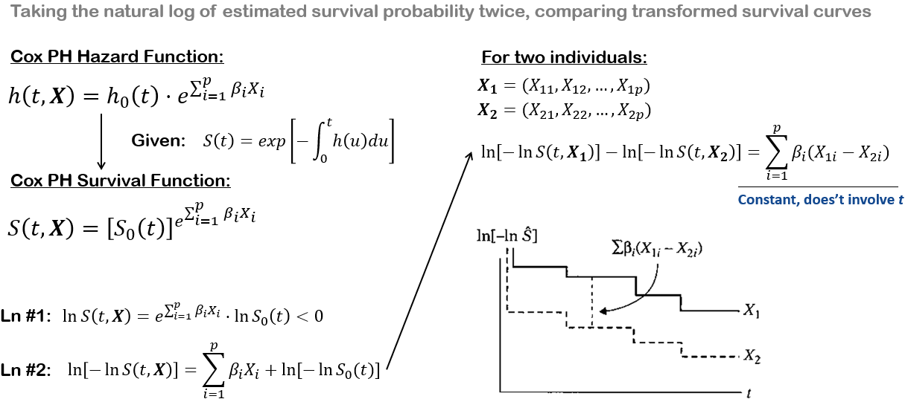
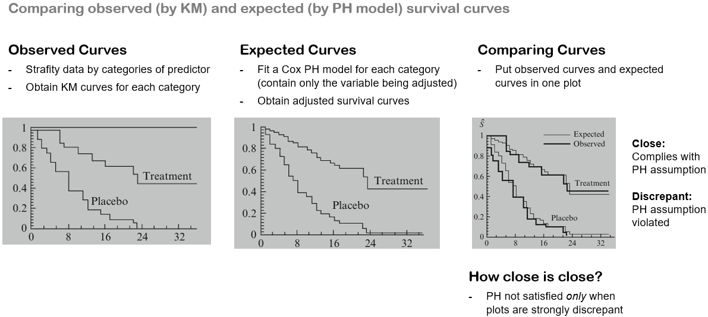
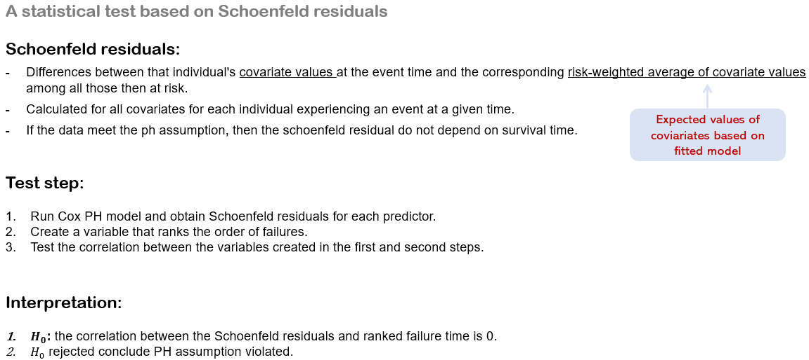

# Evaluating the Proportional Hazards Assumption

> Three approaches for evaluating the PH assumption of the Cox model:
>
> - Graphical
>   - log-log survival curves
>   - observed versus expected survival curves
> - Goodness-of-Fit
> - Time-dependent Covariates


## 1. Graphical Approach 1: Log-Log Plots




The parallelism of log–log survival plots for the Cox PH model provides us with a graphical approach for assessing the PH assumption. That is, if a PH model is appropriate for a given set of predictors, one should expect that **empirical plots of log–log survival curves** for different individuals will be approximately parallel.
By empirical plots, we mean plotting log–log survival curves **based on Kaplan–Meier (KM) estimates** that do not assume an underlying Cox model. Alternatively, one could plot log–log survival curves which **have been adjusted for predictors already assumed to satisfy the PH assumption** but have not included the predictor being assessed in a PH model.
Also, There is a concern about how to decide “how parallel is parallel?” This decision can be quite subjective for a given data set, particularly if the study size is relatively small. We recommend that one should use a conservative strategy for this decision by assuming **the PH assumption is satisfied unless there is strong evidence of non-parallelism of the log–log curves**.

## 2. Graphical Approach 2: Observed Versus Expected Plots

The use of observed versus expected plots to assess the PH assumption is the graphical analog of the goodness-of-fit (GOF) testing approach to be described later, and is therefore a reasonable alternative to the log–log survival curve approach.



When using observed versus expected plots to assess the PH assumption for a continuous variable,observed plots are derived, as for categorical variables, by forming strata from categories of the continuous variable and then obtaining KM curves for each category.
However, for continuous predictors, there are two options available for computing expected plots.


## 3. The Goodness of Fit (GOF) Testing Approach

The GOF testing approach is appealing because it provides a test statistic and p-value for assessing the PH assumption for a given predictor of interest. Thus, the researcher can make a more objective decision using a statistical test than is typically possible when using either of the two graphical approaches described above.



<u>**Implementation Using SAS**</u>

```SAS
proc phreg data=mydata;
    class group(ref="Placebo");
    model time*status(0) = group wbc;
    output out=resid ressch=r_group r_wbc; /* output Schoenfeld residuals for each covariate */
quit;

proc rank data=resid(where=(status=1)) out=ranked_r ties=mean;
    var time;
    ranks timerank;
run;

proc corr data=ranked_r nosimple;
    var r_group r_wbc;
    with timerank;
run;
```

Or, an easier way is the `zph` option in `proc phreg` statement, which is a similar statistical test based on **weighted Schoenfeld residuals**:

```SAS
proc phreg data=mydata zph(transform=rank);
    class group(ref="Placebo");
    model time*status(0)=group wbc;
run;
```
And if you want to get the same output from these two ways, you should use `wtressch=` rather than `ressch=` option in the `output` statement in the first way.

## 4. Assessing the PH Assumption Using Time-Dependent Covariates


