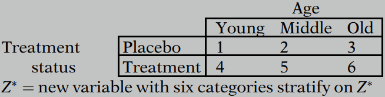
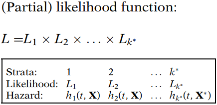
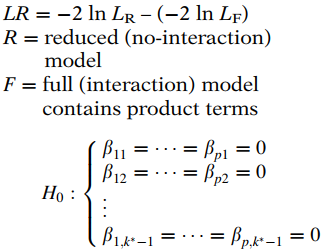
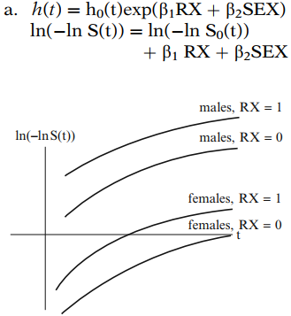
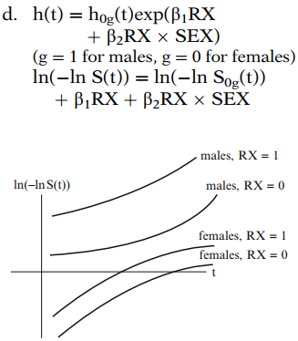

# The Stratified Cox Procedure

The “stratified Cox model” is a modification of the Cox proportional hazards (PH) model that allows for control by “stratification” of a predictor that does not satisfy the PH assumption.
**Predictors that are assumed to satisfy the PH assumption are included in the model, whereas the predictor being stratified is not included.**
> Because the stratified variable is not included in the model, it is not possible to obtain a hazard ratio value for the effect of stratified variable adjusted for the other included variables. This is the price to be paid for stratification on the stratified variable.

## 1. The General Stratified Cox (SC) Model

Assume that we have $k$ variables not satisfying the PH assumption denoted by $Z_1,Z_2,\dots,Z_k$, and $p$ variables satisfying the PH assumption denoted by $X_1,X_2,\dots,X_p$.

To perform the stratified Cox procedure, we define a single new variable, which we call $Z^*$ :

- categorize each $Z_i$ 

- form combinations of categories (strata)

- the strata are the categories of $Z^*$ 

For example, suppose $k$  is 2, and the two $Z's$  are age (an interval variable) and treatment status (a binary variable). Then we categorize age into, say, three age groups – young, middle, and old. We then form six age group–by–treatment-status combinations, as shown below. 

These six combinations represent the different categories of a single new variable that we stratify on in our stratified Cox model. We call this new variable $Z^*$.  

In general, the stratification variable $Z^*$ will have $k^*$ categories, where $k^*$ is the total number of combinations (or strata) formed after categorizing each of the $Z's$ .

The general SC model:
$$
h_g(t,\bold X)=h_{0g}(t)exp[\beta_1X_1+\beta_2X_2+\dots+\beta_pX_p],\ g=1,2,\dots,k^*
$$
Note that the baseline hazard function $h_{0g}(t)$ is allowed to be different for each stratum. However, the coefficients $\beta_1,\beta_2,\dots,\beta_p$ are the same for each stratum, and thus the estimates of hazard ratios are the same for each stratum, which we called the **"no-interaction"** assumption. 

To obtain estimates of the regression coefficients $\beta_1,\beta_2,\dots,\beta_p$, we maximize a (partial) likelihood function $L$ that is obtained by multiplying together likelihood functions for each stratum.

## 2. The No-Interaction Assumption and How to Test It

We previously pointed out that the SC model contains regression coefficients, denoted as $\beta's$, that do not vary over the strata. We have called this property of the model the "no-interaction assumption." 

The no-interaction model:
$$
h_g(t,\bold X)=h_{0g}(t)exp[\beta_1X_1+\beta_2X_2+\dots+\beta_pX_p]
$$
But if we allow interaction, then the model will be:
$$
h_g(t,\bold X)=h_{0g}(t)exp[\beta_{1g}X_1+\beta_{2g}X_2+\dots+\beta_{pg}X_p]
$$
Notice that in this interaction model, each regression coefficient has the subscript $g$, which denotes the g-th stratum and indicates that the regression coefficients are different for different strata of $Z^*$. 

An alternative way to write the interaction model is:

- uses product terms involving $Z^*$ 

- define $k^*-1$ dummy variables $Z_1^*,Z_2^*,\dots,Z^*_{K^*-1}$ from $Z^*$

- products of the form $Z_i^* \times X_j$, where $i=1,\dots,K^*-1$ and $j=1,\dots,p$.

$$
h_g(t,\bold X)=h_{0g}(t)exp[\beta_1X_1+\cdots+\beta_pX_p\\+\beta_{11}(Z_1^* \times X_1)+\cdots+\beta_{p1} (Z_1^* \times X_p)\\+\beta_{12}(Z_2^* \times X_1)+\cdots+\beta_{p2} (Z_2^* \times X_p)\\+\cdots\\+\beta_{1,k^*-1}(Z^*_{k^*-1}\times X_1)+\cdots+\beta_{p,k^*-1}(Z_{k^*-1}^*\times X_p)]
$$

**This alternative formula is actually equivalent to the above one**. And we will use the alternative model to describe a test of the no-interaction assumption.

The test is a **likelihood ratio (LR) test** which compares log likelihood statistics for the interaction model and the no-interaction model. 

That is, the LR test statistic is of the form $-2 \ln L_R$ minus $-2 \ln L_F$, where $R$ denotes the reduced model, which in this case is the no-interaction model, and $F$ denotes the full model, which is the interaction model. 

The LR test statistic has approximately a $\chi^2$ distribution with $p(k^*-1)$ degrees of freedom under the null hypothesis. The degrees of freedom here is $p(k^*-1)$ because this value gives the number of product terms that are being tested in the interaction model. 
$$
LR \  \dot\sim \  \chi^2(p(k^*-1))
$$

## 3. A Graphical View of the Stratified Cox Approach

In this section we examine four log–log survival plots illustrating the assumptions underlying a stratified Cox model with or without interaction. Each of the four models considers two dichotomous predictors: treatment (coded $RX=1$ for placebo and $RX=0$ for new treatment) and SEX (coded 0 for females and 1 for males).  

**<u>Model 1</u>**

This model assumes the PH assumption for both RX and SEX and also assumes no interaction between RX and SEX. Notice all four log–log curves are parallel (PH assumption) and the effect of treatment is the same for females and males (no interaction). The effect of treatment (controlling for SEX) can be interpreted as the distance between the log–log curves from $RX=1$ to $RX=0$  for males and for females, separately.

**<u>Model 2</u>**

This model assumes the PH assumption for both RX and SEX and allows for interaction between these two variables. All four log–log curves are parallel (PH assumption) but the effect of treatment is larger for males than females as the distance from $RX=1$ to $RX=0$  is greater for males.

**<u>Model 3</u>**

This is a stratified Cox model in which the PH assumption is not assumed for SEX. Notice the curves for males and females are not parallel. However, the curves for RX are parallel within each stratum of SEX indicating that the PH assumption is satisfied for RX. The distance between the log–log curves from $RX=1$ to $RX=0$ is the same for males and females indicating no interaction between RX and SEX.

**<u>Model 4</u>**

This is a stratified Cox model allowing for interaction of RX and SEX. The curves for males and females are not parallel although the PH assumption is satisfied for RX within each stratum of SEX. The distance between the log–log curves from $RX=1$ to $RX=0$  is greater for males than females indicating interaction between RX and SEX.

## 4. The Stratified Cox Likelihood

In Chapter 3 (The Cox Proportional Hazards Model and Its Characteristics), we illustrated the Cox likelihood using the dataset shown below. In this section, we extend that discussion to illustrate the likelihood for a stratified Cox model. 

Now consider a stratified Cox model, in which the stratified variable is a dichotomous indicator of whether the subject has or does not have a history of hypertension. The predictor SMOKE remains in the model.
$$
h_g(t)=h_{0g}(t)e^{\beta_1SMOKE}\\
\text{g=1 history of hypertension}\\
\text{g=2 no history of hypertension}
$$
The model allows for a violation of the PH assumption. However, within each category of hypertension, the PH assumption is assumed to hold.

The data are shown below. The additional variable is HT which is the variable we wish to stratify on. Barry and Harry have a history of hypertension (coded $HT=1$) while Gary and Larry do not (coded $HT=2$). 

The stratified Cox likelihood is formulated in pieces. Each piece represents a stratified category. Within each piece, the likelihood is formulated similarly as the likelihood formulated for a Cox PH model.

For the first stratum ($HT=1$), Barry gets an event at $TIME=2$. Barry and Harry are in the risk set when Barry gets his event. Barry is the only event from this stratum as Harry is censored at $TIME=5$. Therefore the likelihood for this piece, $L1$ , contains only one term.  
$$
L_1=\frac{h_{01}e^{\beta_1}}{h_{01}e^{\beta_1}+h_{01}e^0}
$$
For the second stratum ($HT=2$), Gary gets an event at $TIME=3$. Gary and Larry are in the risk set when Gary gets his event. Larry gets an event at $TIME=8$ and is the only one in the risk set at the time of his event. Therefore, the likelihood for this piece, L2, is a product of two factors. 
$$
L_2=\frac{h_{02}e^0}{h_{02}e^0+h_{02}e^{\beta_1}}\times \frac{h_{02}e^{\beta_1}}{h_{02}e^{\beta_1}}
$$
The stratified Cox likelihood can be formulated by taking the product of each piece ($L1$ and $L2$). Each piece was formulated within a stratum.
$$
L=L_1 \times L_2=\left[\frac{h_{01}e^{\beta_1}}{h_{01}e^{\beta_1}+h_{01}e^0}\right]\left[\frac{h_{02}e^0}{h_{02}e^0+h_{02}e^{\beta_1}}\times \frac{h_{02}e^{\beta_1}}{h_{02}e^{\beta_1}}\right]\\
=\left[\frac{e^{\beta_1}}{e^{\beta_1}+e^0}\right]\left[\frac{e^0}{e^0+e^{\beta_1}}\times \frac{e^{\beta_1}}{e^{\beta_1}}\right]
$$
One additional point about this model is that the $\beta_1$ in the first piece of the likelihood ($L1$) is the same $\beta_1$ that is in the second piece of the likelihood ($L2$). In other words, this is a no interaction model. The effect of smoking (expressed as $\beta_1$) does not depend on hypertension status. 