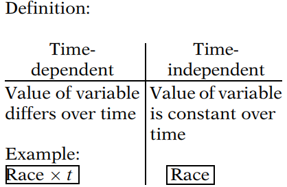
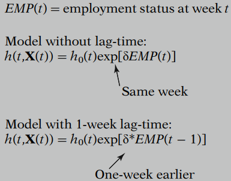
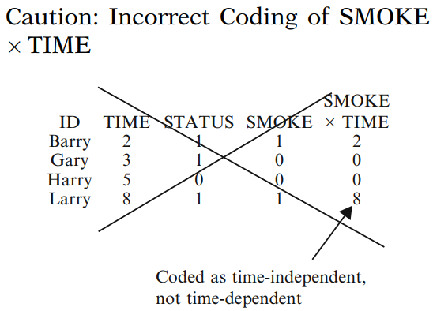

# Extension of the Cox Proportional Hazards Model for Time-Dependent Variables

## 1. Definition and Examples of Time-Dependent Variables

A time-dependent variable is defined as any variable whose value for a given subject may differ over time ($t$). In contrast, a time-independent variable is a variable whose value for a given subject remains constant over time. 

**<u>Defined Variable</u>**

As a simple example, the variable $RACE$ is a time-independent variable, whereas the variable $RACE \times time$ is a time-dependent variable.

The variable $RACE \times time$ is an example of what is called a “defined” time-dependent variable. Most defined variables are of the form of the product of a time-independent variable (e.g., $RACE$) multiplied by time or some function of time.   

A second example of a defined variable is given by $E\times(\log t-3)$, where $E$ denotes, say, a (0,1) exposure status variable determined at one’s entry into the study. Notice that here we have used a function of time, $\log t-3$, rather than time $t$ alone.  

**<u>Internal Variable</u>**

Another type of time-dependent variable is called an “internal” variable. Examples of such a variable include exposure level $E$ at time $t$, employment status ($EMP$) at time $t$, smoking status ($SMK$) at time $t$, and obesity level ($OBS$) at time $t$.  

All these examples consider variables whose values may change over time for any subject under study; moreover, for internal variables, the reason for a change in value depends on “internal” characteristics or behavior specific to the individual.  

**<u>Ancillary Variable</u>**

In contrast, a variable is called an “ancillary” variable if its value changes primarily because of “external” characteristics of the environment that may affect several individuals simultaneously.   

An example of an ancillary variable is air pollution index at time t for a particular geographical area. Another example is employment status ($EMP$) at time $t$, if the primary reason for whether someone is employed or not depends more on general economic circumstances than on individual characteristics.  

**<u>Part Internal and Part Ancillary</u>**

As another example, which may be part internal and part ancillary, we consider heart transplant status ($HT$) at time $t$ for a person identified to have a serious heart condition, making him or her eligible for a transplant. The value of this variable $HT$ at time $t$ is 1 if the person has already received a transplant at some time, say $t_0$, prior to time $t$. The value of $HT$ is 0 at time $t$ if the person has not yet received a transplant by time $t$.  

**<u>Reason for Distinguishing  Variable Types</u>**

The primary reason for distinguishing among defined, internal, or ancillary variables is that the computer commands required to define the variables for use in an extended Cox model are somewhat different for the different variable types, depending on the computer program used. 

<u>Nevertheless, the form of the extended Cox model is the same regardless of variable type, and the procedures for obtaining estimates of regression coefficients and other parameters, as well as for carrying out statistical inferences, are also the same.</u>  

## 2. The Extended Cox Model for Time-Dependent Variables

**<u>The General Formula</u>**
$$
h(t,\bold X(t))=h_0(t)\exp\left[\sum_{i=1}^{p_1}\beta_iX_i+\sum_{j=1}^{p_2}\delta_jX_j(t)\right]
$$
where $X_1,X_2,\dots,X_{p_1}$ are time-independent variables, and $X_1(t),X_2(t),\dots,X_{p_2}(t)$ are time-dependent variables.

As with the simpler Cox PH model, the regression coefficients in the extended Cox model are estimated using a maximum likelihood (ML) procedure. ML estimates are obtained by maximizing a (partial) likelihood function $L$. However, the computations for the extended Cox model are more complicated than for the Cox PH model, because the risk sets used to form the likelihood function are more complicated with time-dependent variables.  

Methods for making statistical inferences are essentially the same as for the PH model. That is, one can use Wald and/or likelihood ratio (LR) tests and large sample confidence interval methods. 

**<u>Assumption of the Model and Lag-Time Effect</u>**

An important assumption of the extended Cox model is that the effect of a time-dependent variable $X_j(t)$ on the survival probability at time $t$ depends on the value of this variable at that same time $t$, and not on the value at an earlier or later time.  

Note that even though the values of the variable $X_j(t)$ may change over time, the hazard model provides only one coefficient for each time dependent variable in the model. Thus, at time $t$, there is only one value of the variable $X_j(t)$ that has an effect on the hazard, that value being measured at time $t$ .

It is possible, nevertheless, to modify the definition of the time-dependent variable to allow for a **“lag-time”** effect.  

To illustrate the idea of a lag-time effect, suppose, for example, that employment status, measured weekly and denoted as $EMP(t)$, is the time-dependent variable being considered. Then, an extended Cox model that does not consider lag-time assumes that the effect of employment status on the probability of survival at week t depends on the observed value of this variable at the same week $t$, and not, for example, at an earlier week.  

However, to allow for, say, a time-lag of one week, the employment status variable may be modified so that the hazard model at time t is predicted by the employment status at week $t-1$. Thus, the variable $EMP(t)$ is replaced in the model by the variable $EMP(t-1)$.

**<u>General Lag-Time Extended Model</u>**
$$
h(t,\bold X(t))=h_0(t)\exp\left[\sum_{i=1}^{p_1}\beta_iX_i+\sum_{j=1}^{p_2}\delta_jX_j(t-L_j)\right]
$$
where $L_j$ denotes the lag-time specified for time-dependent variable $j$ .

## 3. The Hazard Ratio Formula for the Extended Cox Model

The most important feature of the HR formula is that the proportional hazards assumption is no longer satisfied when using the extended Cox model.
$$
\widehat {HR}(t)=\frac{\hat h(t,\bold X^*(t))}{\hat h(t,\bold X(t))}=\exp\left[\sum_{i=1}^{p_1}\hat\beta_i[X_i^*-X_i]+\sum_{j=1}^{p_2}\delta_j[X_j^*(t)-X_j(t)]\right]
$$
The two sets of predictors, $\bold X^*(t)$ and $\bold X(t)$, identify two specifications at time t for the combined set of predictors containing both time-independent and time-dependent variables.   

Note that, in the hazard ratio formula, the coefficient $\hat\delta_j$ of the difference in values of the $j$th time-dependent variable is itself not time-dependent. Thus, this coefficient represents the **“overall” effect** of the corresponding time-dependent variable, considering all times at which this variable has been measured in the study.  

## 4. The Extended Cox Likelihood

We still use the following data to indicate how to calculate the extended cox likelihood:

Now consider an extended Cox model, which contains the predictor $SMOKE$ and a time-dependent variable $SMOKE \times TIME$ . For this model, it is not only the baseline hazard that may change over time but also the value of the predictor variables. 
$$
h(t)=h_0(t)e^{\beta_1SMOKE+\beta_2SMOKE\times TIME}
$$
The extend cox likelihood ($L$) for these data is shown below.

The baseline hazard cancels in the extended Cox likelihood as it does with the Cox PH likelihood. Thus, the form of the baseline hazard need not be specified, as it plays no role in the estimation of the regression parameters. 
$$
L=\left[\frac{e^{\beta_1+2\beta_2}}{e^{\beta_1+2\beta_2}+e^0+e^0+e^{\beta_1+2\beta_2}}\right]\times\left[\frac{e^0}{e^0+e^0+e^{\beta_1+3\beta_2}}\right]\times\left[\frac{e^{\beta_1+8\beta_2}}{e^{\beta_1+8\beta_2}}\right]
$$
A word of caution for those planning to run a model with a time-varying covariate: It is incorrect to create a product term with $TIME$ in the data step by multiplying each individual’s value for $SMOKE$ with their survival time.  In other words, $SMOKE\times TIME$ should not be coded like the typical interaction term. In fact, if $SMOKE\times TIME$ was coded as following, then $SMOKE\times TIME$ would be a time-independent variable. Larry’s value for $SMOKE\times TIME$ is incorrectly coded at a constant value of 8 even though Larry’s value for $SMOKE\times TIME$ changes in the likelihood over $L1$, $L2$, and $L3$.  

If the incorrectly coded time independent $SMOKE\times TIME$ was included in a Cox model, it would not be surprising if the <u>coefficient estimate was highly significant even if the PH assumption was not violated</u>. It would be expected that <u>a product term with each individual’s survival time would predict the outcome (their survival time), but it would not be meaningful</u>. Nevertheless, this is a common mistake.  

To obtain a correctly defined $SMOKE\times TIME$ time-dependent variable, computer packages typically allow the variable to be defined within the analytic procedure.  

Alternatively, the (start, stop) or counting process (CP) data layout can be used, to explicitly define a time-dependent variable in the data.

