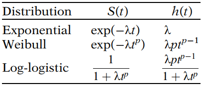
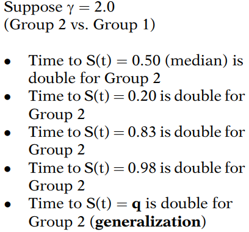

# Parametric Survival Models

A parametric survival model is one in which survival time (the outcome) is assumed to follow a known distribution. Examples of distributions that are commonly used for survival time are: the `Weibull`, the `exponential` (a special case of the Weibull), the `log-logistic`, the `lognormal`, and the `generalized gamma`.

The Cox proportional hazards model, by contrast, is not a fully parametric model. Rather it is a <u>semi-parametric</u> model because even if the regression parameters (the betas) are known, the distribution of the outcome remains unknown. The baseline survival (or hazard) function is not specified in a Cox model.  

## 1. Probability Density Function in Relation to the Hazard and Survival Function

For parametric survival models, time is assumed to follow some distribution whose probability density function $f(t)$ can be expressed in terms of unknown parameters. Once a probability density function is specified for survival time, the corresponding survival and hazard functions can be determined. The survival function $S(t)=P(T>t)$ can be ascertained from the probability density function by integrating over the probability density function from time t to infinity. The hazard can then be found by dividing the negative derivative of the survival function by the survival function.
$$
f(t)=dF(t)/dt\ \ \text{where}\ F(t)=Pr(T \le t)\\
$$

$$
S(t)=Pr(T\gt t)=\int_{t}^\infty f(u) du
$$

$$
h(t)=\frac{-d[S(t)]/dt}{S(t)}
$$

The survival function can also be expressed in terms of the hazard function by exponentiating the negative of the cumulative hazard function. The cumulative hazard function is the integral of the hazard function between integration limits of 0 and t. 
$$
S(t)=\exp\left(-\int_0^th(u)du\right)
$$
Finally, the probability density function can be expressed as the product of the hazard and the survival functions, $f(t)=h(t)S(t)$.

The key point is that specifying any one of the probability density function, survival function, or hazard function allows the other two functions to be ascertained.   

Following are survival and hazard functions for some selected distributions:

The probability density function for these distributions can be found by multiplying $h(t)$ and $S(t)$.  

Typically for parametric survival models, <u>the parameter $\lambda$ is re-parameterized</u> in terms of predictor variables and regression parameters and <u>the parameter $p$ (sometimes called the shape parameter) is held fixed</u>.  

## 2. Exponential Example

The first example we consider is the exponential model, which is the simplest parametric survival model in that the hazard is constant over time:
$$
h(t)=\lambda
$$
For simplicity, we demonstrate an exponential model that has TRT as the only predictor.  We state the model in terms of the hazard by re-parameterizing $\lambda$ as $\exp(\beta_0+\beta_1TRT)$.   

The assumption that the hazard is constant for each pattern of covariates is a <u>much stronger assumption than the PH assumption</u>. If the hazards are constant, then of course the ratio of the hazards is constant. However, the <u>hazard ratio being constant does not necessarily mean that each hazard is constant</u>. In a Cox PH model the baseline hazard is not assumed constant.   

## 3. Accelerated Failure Time Assumption

**Many parametric models are acceleration failure time (AFT) models rather than PH models**. The exponential and Weibull distributions can accommodate both the PH and AFT assumptions.  

The underlying assumption for AFT models is that the effect of covariates is <u>multiplicative (proportional) with respect to survival time</u>, whereas for PH models the underlying assumption is that the effect of covariates is <u>multiplicative with respect to the hazard</u>.  

To illustrate the idea underlying the AFT assumption, consider the lifespan of dogs. It is often said that dogs grow older seven times faster than humans. So a 10-year-old dog is in some way equivalent to a 70-year-old human. In AFT terminology we might say the probability of a dog surviving past 10 years equals the probability of a human surviving past 70 years.  

For a second illustration of the accelerated failure time assumption, consider a comparison of survival functions among smokers $S_1(t)$ and non-smokers $S_2(t)$. The AFT assumption can be expressed as $S_2(t)=S_1(\lambda t)$ for $t\ge0$, where $\lambda$ is a constant called the **acceleration factor** comparing smokers to nonsmokers.  

In a regression framework the acceleration factor $\lambda$ could be parameterized as $\exp(\alpha)$ where $\alpha$ is a parameter to be estimated from the data. With this parameterization, the AFT assumption can be expressed as:
$$
S_2(t)=S_1([\exp(\alpha)]t) \ \ \text{or} \\
S_1(t)=S_2([\exp (-\alpha)]t)
$$
Suppose $\exp (\alpha)=0.75$, then the probability of a nonsmoker surviving 80 years equals the probability of a smoker surviving 80(0.75) or 60 years. 

The AFT assumption can also be expressed in terms of random variables for survival time rather than the survival function. If $T_2$ is a random variable (following some distribution) representing the survival time for nonsmokers and $T_1$ is a random variable representing the survival time for smokers, then the AFT assumption can be expressed as $T_1=\lambda T_2$.    

The acceleration factor is the key measure of association obtained in an AFT model. It allows the investigator to evaluate the effect of predictor variables on survival time just as the hazard ratio allows the evaluation of predictor variables on the hazard.

The acceleration factor is a ratio of survival times corresponding to any fixed value of $S(t)$.  

This idea is graphically illustrated by examining the survival curves for Group 1 ($G=1$) and Group 2 ($G=2$) shown below. For any fixed value of $S(t)$, the distance of the horizontal line from the $S(t)$ axis to the survival curve for $G=2$ is double the distance to the survival curve for$G=1$.  

**For AFT models, this ratio of survival times is assumed constant for all fixed values of $S(t)$**.  