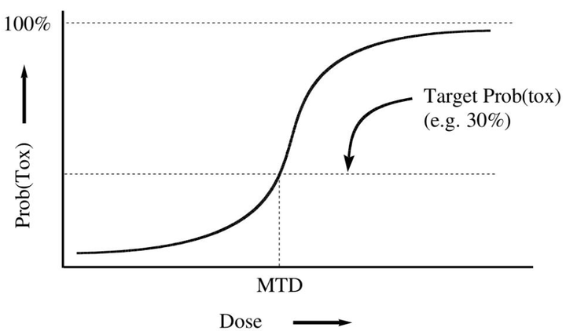

# Phase I 剂量探索试验简介

在临床研究领域，Ⅰ期临床试验通常以研究药物的毒性为主要终点，研究的是人体对新药的耐受性。对于具有细胞毒性的药物，我们通常假设它的有效性和毒性都是随剂量单调递增的，即：随着受试者用药剂量的增大，药物产生的治疗效果越好，同时人体承受的药物毒性也越高。在这种假设下，我们会自然地去考虑：在药物毒性处于可接受范围内的前提下，我们可用于临床的最高剂量是多少呢？

这（通常）便是Ⅰ期剂量探索试验（Phase Ⅰ Dosing Finding Trials）要解决的主要问题。一般而言，Ⅰ期剂量探索试验以剂量限制毒性（dose limiting toxicity, DLT）为主要终点，主要目标是找到研究药物的最大耐受剂量（maximum tolerated dose, MTD）。

- **剂量限制毒性（DLT）：**DLT的定义因试验而异，通常是可参照美国国家癌症研究所（National Cancer Institute, NCI）的不良事件通用术语标准（common terminology criteria for adverse events, CTCAE）评分的3~4级不良事件。受试者发生DLT事件则说明其对当前剂量的试验药物不耐受，在临床研究中通常会使用受试者中**DLT事件的发生率**作为当前剂量对应的**毒性概率**（toxicity probability）**。**
- **最大耐受剂量（MTD）：**MTD指的是毒性概率不超过**目标毒性概率**（target toxicity probability）的最大药物剂量，此剂量代表的是药物安全性与有效性的平衡，通常也是开展Ⅰ期剂量探索试验的主要目的。

> 通俗地讲，在Ⅰ期剂量探索试验中，研究者会设定一个目标概率毒性值（更高的毒性概率不再能被临床所接受，更低的毒性概率则不利于药物达到充分的治疗效果），通过试验我们要从预设的若干个剂量水平中，找到最接近目标概率毒性的剂量，即最大耐受剂量（MTD），此过程也称“剂量爬坡”。

## 常见的几类设计方法

在Ⅰ期剂量探索试验中，目前常见的设计方法主要分为三类：

- **基于算法的设计：**基于预设算法进行剂量爬坡，常见有**传统3+3设计、加速滴定设计、R6设计** 等。优点是操作简单，无需统计学计算，易于操作和理解。缺点是统计性能不佳，通常也是导致新药研发成功率低下的原因之一。
- **基于模型的设计：**利用试验中已接受治疗的受试者数据指导下一组受试者剂量的选择，通常是建立剂量-毒性关系假设统计模型，并基于累计数据对模型参数不断更新，从而指导剂量爬坡。常见有**持续再评估法（Continual Reassessment Method, CRM）设计** 等。此类设计优点是统计性能较好，相比基于算法的设计能更准确地找到正确的MTD。缺点是持续的模型拟合导致计算相当复杂，对于研究者的统计背景要求较高，因此在实践中使用得并不广泛。
- **模型辅助设计：**综合 基于算法的设计 和 基于模型的设计 二者优点的一类新型设计方法，既基于剂量-毒性模型进行有效地剂量决策，又能在试验开始前给出明确的剂量递增/递减规则，兼具较好的统计性能和较高的可操作性。常见有**贝叶斯最优区间（BOIN）设计、mTPI设计、键盘（Keyboard）设计** 等。

模型辅助设计因其很好地结合了 基于算法的设计 和 基于模型的设计 的优点，目前在实践中的使用越来越广泛！