# 贝叶斯最优区间 (BOIN)设计

贝叶斯最优区间（Bayesian optimal interval，BOIN）设计是模型辅助设计的代表以及BOIN设计家族的源头，也是我们在一期剂量探索研究中最常使用的设计方法之一。

## 1. 背景

BOIN设计是由袁鹰教授团队于2015年提出的一种新的基于贝叶斯理论的Ⅰ期临床试验设计方法，用于探索试验药物的最大耐受剂量（MTD）。其在发表的文章中通过一系列模拟试验，验证了BOIN设计在探索MTD方面不仅具有与其他连续重评估方法同等良好的表现，还能有效降低试验过程中分配受试者至错误剂量组的风险。此外，BOIN设计可以像3+3设计一样提前给出剂量决策表，具有操作简单、决策透明的特点。

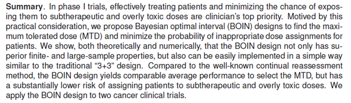

随后在2021年，BOIN设计正式获得了FDA的Fit-For-Purpose认证。Fit-For-Purpose是FDA对临床研究方法、工具的一种官方认证。获得此认证，意味着BOIN设计可以作为一种被官方认可的统计方法应用于以探索MTD为目标的 I 期临床试验中。

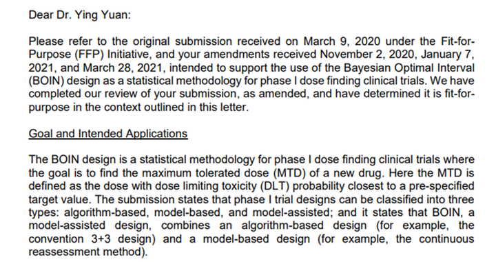

这里有两点需要说明：第一个是袁鹰教授 2015 年发表的文章里，除了提出了BOIN设计，还提出了一种广义BOIN设计，即Global BOIN design，但这次认证是只针对我们目前广泛使用的 BOIN 设计，也叫做 Local BOIN（局部BOIN设计）；第二个要说明的是在 FDA 的审阅过程中，他们发现了BOIN设计理论存在一些问题，经过几轮更新以后才最终通过认证，所以我们目前最新的 BOIN 设计理论跟袁鹰教授2015年的那篇文章，甚至是早两年我们使用的BOIN设计都有些差异，建议以FDA认证的版本为准。

## 2. 区间设计的一般思路

在引入贝叶斯决策之前，我们有必要了解一下一个区间设计的一般思路。

假设在Ⅰ期试验中共有 $J $个预设的剂量水平（ $j=1,2,⋯,J $剂量递增），令 $\phi$表示目标毒性概率（通常由临床医生指定）， $n_j$表示在剂量水平 $j$中接受治疗的受试者人数， $m_j$ 表示在剂量水平 $j$ 中发生剂量限制毒性（DLT）的受试者，定义 $\hat p_j=m_j/n_j$为剂量水平 $j$ 观测到的 DLT 发生率，通常我们按以下步骤进行试验：

- 1.第一组（*cohort*）受试者接受最低剂量水平的治疗。
- 2.假定当前剂量水平为 $j$ , 则下一组受试者接受治疗的剂量水平将按以下规则确定：
  - 如果 $\hat p_j≤λ_{1j}(n_j,\phi)$ , 则提升剂量水平至 $j+1$（若 $j=J$ ，则继续维持剂量 $j$ ）
  - 如果 $\hat p_j>λ_{2j}(n_j,\phi)$ , 则降低剂量水平至 $j−1$（若 $j=1$ ，则继续维持剂量 $j$）
  - 如果 $λ_{1j}(n_j,\phi)<\hat p_j≤λ_{2j}(n_j,\phi)$ ，则维持在当前剂量 $j$

- 3.重复上一步直至达到最大样本量或者试验提前终止。

此处 $λ_{1j}(n_j,\phi)$ 和$λ_{2j}(n_j,\phi)$是关于 $j,n_j,\phi$ 的函数，代表剂量升降的决策阈值，$λ_{1j}(n_j,\phi)≤λ_{2j}(n_j,\phi)$ 。设计思想是很简洁明了的：观测到的 DLT 率落在升剂量区间（小于某个阈值，意味着毒性很低，暗示剂量太低，治疗效应有限），那下一组受试者就提升剂量，落在维持剂量区间，那下一组受试者就维持当前剂量，如果落在降剂量区间（超过某个阈值，意味着毒性过高，此剂量不能被临床所接受），下一组受试者就降低一个剂量。

以上是一个区间设计的一般范式，涉及的指标其实只有三个：一个是剂量水平 $j$ 观测到的 DLT 发生率 $\hat p_j$，由于是观测值，因此在试验过程中是一个已知的值；另外两个是决策的阈值$λ_{1j}(n_j,\phi)$ 和$λ_{2j}(n_j,\phi)$（以下简写为 $λ_{1j},λ_{2j}$），只要确定这一对决策阈值，我们应该就完成了这个区间设计。

那么现在关键的问题就变成了：我如何去确定决策阈值呢？

## 3. BOIN设计的原理

### 3.1 “最优”的定义

对于上述问题，不同的解决思路会最终产生不同的设计方法，BOIN设计的思路是：$λ_{1j},λ_{2j}$的设置应该以最小化受试者被分配 到不恰当剂量上的概率为目标，也就是说使用这一组阈值能够让我们做出错误决策的概率最小，这就是所谓的“最优”。对于错误决策，我们定义如下：

- 应提升剂量时，实际却维持或降低了剂量
- 应维持剂量时，实际却升高或降低了剂量
- 应降低剂量时，实际却维持或升高了剂量

如果用数学语言来描述，错误决策的定义过程如下：

假定 $p_j$表示剂量水平 $j$ 对应的实际毒性概率，指定3个点假设：

- $H_{0j}: \quad p_j=\phi \quad\quad \phi:$ *Target toxicity porbability*
- $H_{1j}: \quad p_j=\phi_1 \quad\quad \phi_1:$ *The highest toxicity probability that is deemed subtherapeutic*
- $H_{2j}: \quad p_j=\phi_2 \quad\quad \phi_2:$ *The lowest toxicity probability that is deemed over toxic*

以上假设来自原文，但这样的点假设容易给人误导，实际上我们可以这样来理解这三个假设：

- $H_{0j}:$ *on target*  当前剂量水平即MTD，下一组受试者应该继续保持在该剂量水平下接受治疗$(R/\bar R)$
- $H_{1j}:$ *underdosing*  当前剂量水平低于MTD（亚治疗），下一组受试者应该在更高剂量水平下接受治疗$(E/\bar E)$
- $H_{2j}:$ *overdosing*  当前剂量水平高于MTD（过毒），下一组受试者应该在更低剂量水平下接受治疗$(D/\bar D)$

即： $H_0$代表当前剂量水平就是 MTD 附近的水平，这种情况下的正确决策应该是下 一组受试者继续保持在这个剂量水平上接受治疗，我们以 $R$ 表示，对应的错误决策就是 $\bar R$ ；$H_1$代表当前剂量水平过低了，可能无法充分发挥药物的治疗效应，这种情况下的正确决策应该是下一组升高一个剂量水平接受治疗，我们以 $E$ 表示，对应的错误决策就是 $\bar E$ ；$H_2$代表当前剂量水平过毒了，这种情况下的正确决策应该是下一组降低一个剂量水平接受治疗，我们以 $D$ 表示，对应的错误决策就是 $\bar D$ 。

原文之所以用真实毒性概率等于某一个值的这种形式去做假设，是为了我们后面去做边界的运算，类似做不等式用边界值代进去运算是一个道理。此外这里还要注意我们有个暗含的前提假设，是剂量-毒性递增假设，就是随着剂量递增，药物毒性也在升高，这个条件不满足，那上述内容都是不成立的。

接下来，我们知道在贝叶斯理论框架下，对于每一个未知参数都有一个先验分布。在贝叶斯理论框架下，对于每一个剂量水平 $j$ ， $H_{0j},H_{1j},H_{2j}$ 为真的先验概率可指定为：

$\pi_{0j}=Pr(H_{0j}) \quad \pi_{1j}=Pr(H_{1j}) \quad \pi_{2j}=Pr(H_{2j})$

则错误决策的概率可表示为：

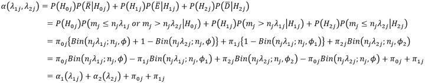

即在剂量水平 $j$ 中使用 $λ_{1j},λ_{2j}$ 这一组决策阈值时，整体的错误决策概率是各假设分别为真时对应的错误决策概率之和，这一点在式中表达得很明确。该表达式最后可以整理为只与 $λ_{1j}$相关的部分 $\alpha_1(\lambda_{1j})$ 及只与 $\lambda_{2j}$ 相关的部分 $\alpha_2(\lambda_{2j})$ 。

如果当前剂量组为最低剂量或最高剂量，因为升降规则跟其他剂量水平不太 一样，所以都单独有一个表达式，但原理是一样的。

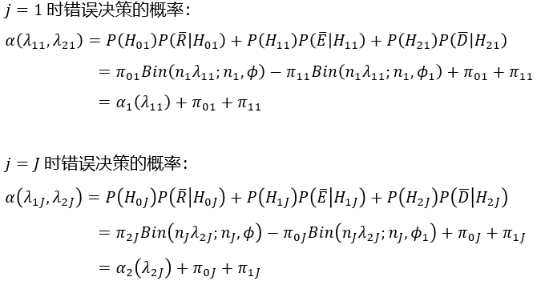

### 3.2 求解

为求得 $\alpha(\lambda_{1j},\lambda_{2j})$ 的最小值，我们分别对 $\alpha_1(\lambda_{1j})$ 和 $\alpha_2(\lambda_{2j})$ 求最小值，最后可以求解 $\lambda_{1j}, \lambda_{2j}$：

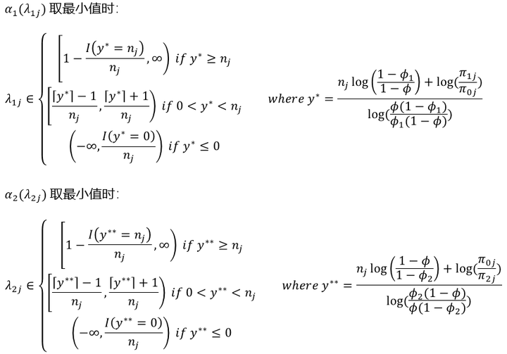

求解出的 $\lambda_{1j}, \lambda_{2j}$形式相当复杂，但从应用层面而言，其实并不关键，我们只需关注到一个点：即在同一个试验中，$\lambda_{1j}, \lambda_{2j}$并非只有唯一解，而是可取一系列的值。那我们在应用的时候如何选择要使用的值呢？

关于这一点，作者在文章中给出了一组推荐值：

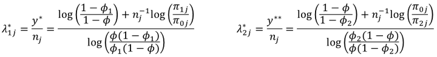

我们在实践中，通常使用的就是这一组值。仔细看这组推荐值的形式，我们可以发现 $\lambda_{1j}^*, \lambda_{2j}^*$ 与当前剂量水平 j 是相关的，这意味着试验中每个剂量水平的决策阈值都是不一样的。但通常，我们会给三个假设正确的概率指定无信息先验，即 $π_{0j}=π_{1j}=π_{2j}=1/3$ ，在这种情况下 $\lambda_{1j}^*, \lambda_{2j}^*$  可进一步简化为：

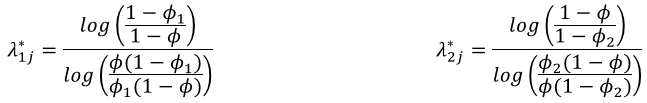

此时可以发现 $\lambda_{1j}^*, \lambda_{2j}^*$  与当前剂量水平 $j$ 无关了，这意味着在同一个试验中，所有剂量水平共享同一组决策阈值，极大地简化了操作难度，因此实践中一般推荐使用此无信息先验的形式。此外，经FDA的Fit-For-Purpose认证的也是这一形式。

关于 $\lambda_{1j}^*, \lambda_{2j}^*$  ，值得关注的一些特性如下：

- 如果指定有信息先验，则有可能发生的情况是 $\lambda_{1j}^*> \lambda_{2j}^*$  ，此时不能使用它们作为决策阈值（因为不满足 $λ_{1j} (n_j, \phi) \le λ_{2j} (n_j, \phi)$这一前提条件），而需要再通过一些数值探索去寻找可用的 $\lambda_{1j}^*, \lambda_{2j}^*$  。
- 如果指定无信息先验，则 $\lambda_{1j}^*, \lambda_{2j}^*$  总是可用的，因为由 $0<\phi_1<\phi<\phi_2<1$ 可以推导出 $0<\lambda_{1j}<\phi<\lambda_{2j}<1$ 。
- 如指定无信息先验，则 $\lambda_{1j}^*$ 是满足 $P(H_1|y_j,n_j )≥P(H_0 |y_j,n_j)$ 条件的最大值， $\lambda_{2j}^*$ 是满足 $P(H_2|y_j,n_j )>P(H_0 |y_j,n_j)$ 条件的最小值。

### 3.3 剂量排除规则

通常，模型辅助设计的剂量增减决策只基于当前剂量水平下的“局部”数据，因此决策有可能在安全剂量和下一过毒剂量之间来回波动。为了解决这一问题，BOIN设计会额外施加剂量排除规则。具体而言：如果 $P(p_j>\phi|m_j,n_j )>0.95$ & $n_j\ge3$ ， 则将剂量水平 $j$ 及更高剂量水平从试验中排除，如果 $j=1$，则提前终止试验。

我们可以通过建立Beta-Binomial模型来求解 $p_j>\phi$ 的后验概率：

- $m_j$ 服从参数为 $n_j$ 和  $p_j$  的二项分布，即 $m_j∼Bin(n_j, p_j)$ 
- 指定 $p_j$ 的先验分布，如 $p_j \sim beta(1,1)$ 
- 根据已观测到的数据求解 $p_j$ 的后验分布 $P(p_j|m_j,n_j) \sim beta(1+m_j,1+n_j-m_j) $
- 根据 $p_j$ 的后验分布求解 $P(p_j>\phi|m_j,n_j )$

### 3.4 确定MTD

上文中，我们介绍了BOIN设计确定决策阈值$\lambda_{1}, \lambda_{2}$ 的思路，并给出了求解过程。综合起来，我们在临床研究实践中实施BOIN设计的流程如下图所示：

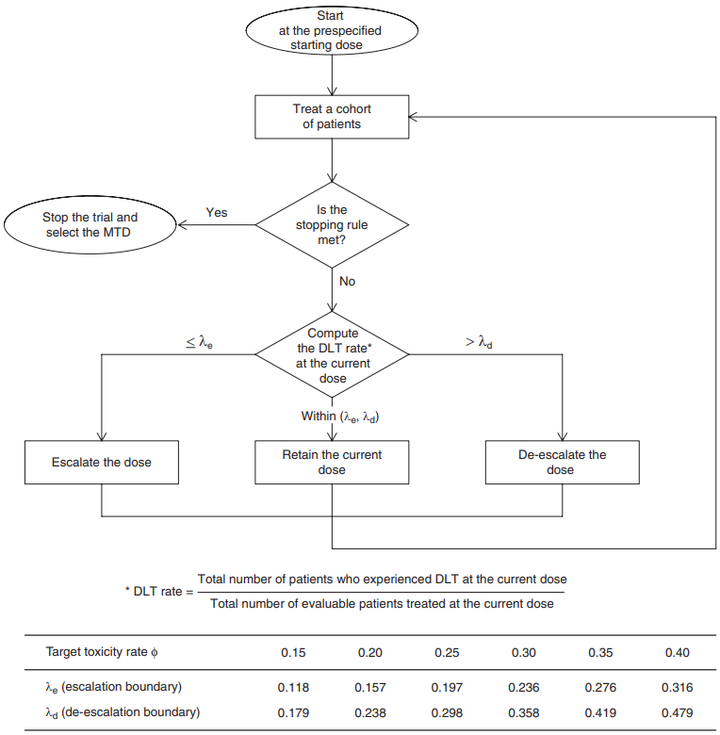

通常，临床试验的研究者依据上图所示的流程开展受试者的剂量爬坡，在所有受试者完成DLT评估后，接下来就应当依据已收集的数据确定MTD了。

#### 3.4.1 确定MTD的流程

- 假定各剂量水平的DLT发生率 **预测值** 为 $p_1^′, p_2^′, …, p_J^′$ ，经保序变换(*isotonical transform*)后得到处理后的DLT发生率预测值序列 $\tilde p _1,\tilde p_2,…, \tilde p _J$。
- 从中选择与目标毒性概率 $\phi$ 绝对值差距最小的剂量水平 $j^∗$ 即为MTD，即$j^∗=argmin$ $abs(\tilde p _j-ϕ)$ 。
- 如果  $j^∗$ 有多个，则按如下规则选择MTD：
- 若 $\tilde p_{j^∗ }<\phi$ ，则取其中最高的剂量水平（如 $\tilde p _1=0.29, \tilde p _2=0.29,ϕ=0.3→MTD=dose2$ ）
- 若 $\tilde p_{j^∗ }>\phi$ ，则取其中最低的剂量水平（如 $\tilde p _1=0.31, \tilde p _2=0.31,ϕ=0.3→MTD=dose1$ ）
- 也可从满足 $\tilde p _j∈[0,\phi]$ 条件的剂量组中选择MTD，此时$j^∗=argmin (\phi-\tilde p _j)$ 。
- 被剔除的剂量水平、无受试者接受治疗的剂量水平均不参与保序变换和MTD的选择。

上述流程中，值得额外讲解的点有两个，其一是“各剂量水平DLT发生率预测值”在实践中是如何确定的；其二是“保序变换”实际是如何操作的？

#### 3.4.2 保序变换

在BOIN设计的应用层面，通常我们会取各剂量组真实毒性概率 的后验分布期望值 作为DLT发生率的预测值。具体而言：

- （1）为 $p_j$ 指定无信息先验， $p_j \sim beta(0.05,0.05)$
- （2）假设剂量水平$j$中已治疗人数为$n_j$，其中发生DLT的人数为$y_j$，即观测数据 $D_j=(n_j,y_j)$
- （3）根据观测数据可得 $p_j$ 的后验分布 $p_j \sim beta(0.05+y_j,0.05+n_j-y_j)$
- （4） $p_j^′=E(p_j)=(y_j+0.05)/(n_j+0.1)$

在得到DLT发生率预测值后，接下来需要对预测值序列进行保序变换。

$p_1^′, p_2^′, …, p_J^′$ 是各剂量水平的DLT发生率预测值，保序变换的目标则是求解一组拟合的响应值 $\tilde p _1,\tilde p_2,…, \tilde p _J$ 以最小化以下方程：

$f(p^′)=\sum_{j=1}^{J}{w_j(\tilde p_j-p^′_j)^2} \quad \tilde p_1 \le \tilde p_2 \le\cdots \le \tilde p_J ;w_j>0$ 

保序回归的目的主要是维护剂量-毒性递增假设，通常我们在实践中实现上述目标的算法为PAVA（The Pool Adjacent Violators Algorithm）。

PAVA的实现过程如下： 

- a. 对于DLT发生率预测值序列 $(p_1^′, p_2^′, …, p_J^′)$ ，由前向后一次判断各元素是否满足 $p_j^′ \le p_{j+1}^′$ 这一条件，若有元素违反此条件，则称其为"违例"。
- b. 针对违例，采用特定的方法进行处理（如算术平均、加权平均），然后重复上一步骤。
- c. 重复a和b，直至处理后的序列不存在违例时结束。

为方便理解，请参考以下三个示例：

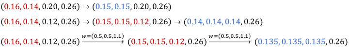

- 在示例1中，0.16>0.14为违例，对涉及的两个元素取平均值后，序列不存在违例，转换结束。
- 在示例2中，0.16>0.14为违例，对涉及的两个元素取平均值后存在相邻违例0.15>0.12，则对原序列中0.16, 0.14, 0.12取平均值，随后序列不存在违例，转换结束。
- 在示例3中，处理违例的方法为加权平均，各元素的权重值为 $w=(0.5,0.5,1,1)$

在BOIN设计的实际应用中，通常转换的原始序列为各剂量水平的DLT发生率预测值 $(p_1^′, p_2^′, …, p_J^′)$ ，其取值见前文；处理违例的方法为加权平均法，权重取值为 $p_j$后验分布方差的倒数，即$w_j=\frac{(n_j+0.1)^2(n_j+0.1+1)}{(y_j+0.05)(n_j-y_j+0.05)}$。

## 4. BOIN设计软件操作演示

### 4.1 试验场景

假定目前有某临床试验，该试验目标之一是确定某嘧啶基多激酶抑制剂药物（实验药物，TG02）联合替莫唑胺治疗复发间变性星形细胞瘤或胶质母细胞瘤在成人患者中的最大耐受剂量MTD。试验的设计参数如下：

- 预设的待探索剂量共4个水平：（150mg，200mg，250mg，300mg）
- 目标DLT率设置为 $\phi=0.35$ 
- 剂量探索的最大样本量设置为24，受试者以3人为一组（cohort）入组接受治疗
- 起始治疗的剂量组为200mg

接下来我们依据此试验的参数设置，使用推荐的BOIN设计软件来完成试验设计。

### 4.2 软件操作演示

BOIN设计推荐使用软件[BOIN Suite](http://trialdesign.cn/one-page-shell.html#BOIN)，是由袁鹰教授团队使用R Shiny开发的Web应用。

进入软件"Trial Setting"模块，我们依次输入试验的设计参数。首先是剂量水平设置，我们的试验共有4个剂量水平，起始剂量水平为第2个（200mg组）。

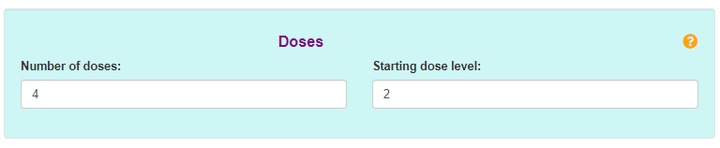

随后设置目标毒性概率 $\phi$ 和亚治疗剂量毒性边界 $\phi_1$ 及过毒剂量的毒性边界 $\phi_2$ ，这些取值是由临床试验的研究者根据临床经验及临床研究的需要确定的。

需注意的是， $\phi_1,\phi_2$ 虽然是由研究者指定，但袁鹰教授团队在经过一系列的数值试验后推荐的取值为 $\phi_1=0.6\phi; \phi_2=1.4\phi$ 。通常我们会使用该默认值以取得较好的统计性能，因此建议勾选"Use the default alternatives to minimize decision error (recommended)."选项。

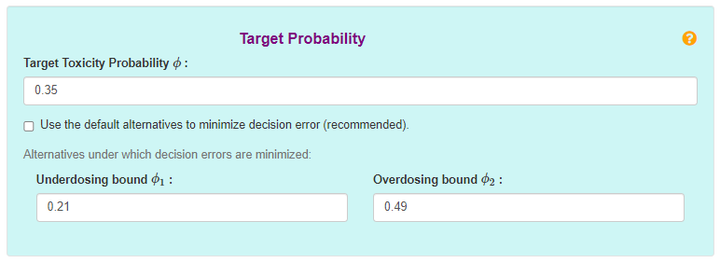

接下来指定样本量相关参数，Cohort size=3，最大样本量为24，则共有24/3=8个Cohort。通常，如果在试验进程中我们对确定MTD已经有较高的把握，BOIN设计会在某剂量组治疗人数达到某个预设值时提前结束剂量爬坡，这个预设值一般可取9,12,15等值，建议取m=12。

"Peform accelerated titration"选项选择是否执行加速滴定，这是一种加快爬坡进程，防止较多受试者暴露于亚治疗剂量的设计方法。依据实际情况，示例试验未涉及加速滴定，因此勾选"No"选项。

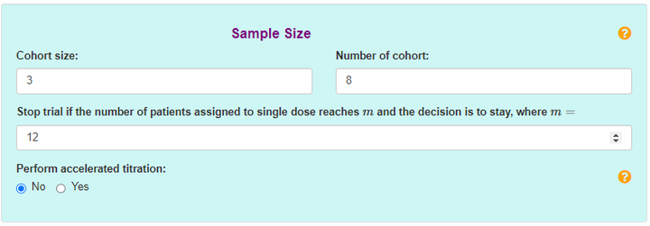

最后设定过剂量控制规则（细节可参考上一期文章），我们指定当剂量 $j$ 的毒性概率 $p_j$ 超过目标毒性概率 $\phi$ 的后验概率大于 $p_E=0.95$ 时，将剂量 $j$ 及更高剂量水平从试验中剔除。

若勾选"Check to impose a more stringent safety stopping rule on the lowest dose"选项，则可以对试验施加更严格的安全性规则。具体而言，如果最低的剂量水平满足 $Pr(p_1>\phi|data)>p_E-\delta$ ，则整个试验将基于安全性考虑而停止。 $\delta$ 一般指定较小的正数（0~0.1），一般可取 $\delta=0.05$ 。

若勾选"Check to ensure......"选项，可限制在剂量爬坡结束后从满足 $\tilde p _j∈[0,ϕ]$ 条件的剂量组中选择MTD，此时 $MTD=argmin (ϕ-\tilde p _j)$。

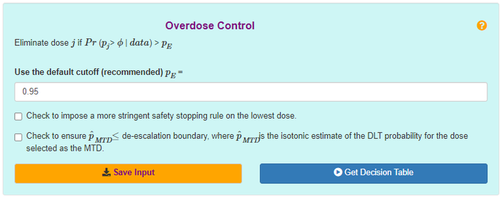

在所有参数设置完成后，点击"Get Decision Table"，获取软件生成的设计流程图和决策表。

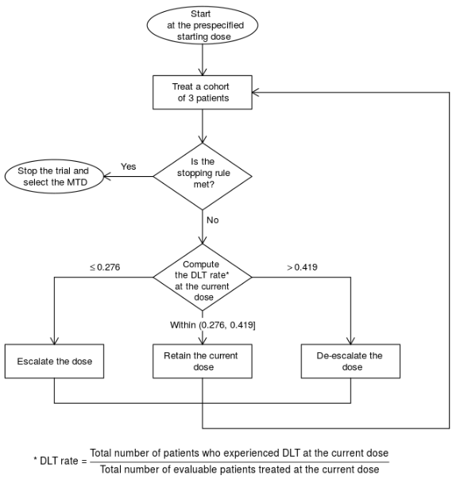

上图即为示例试验实际的操作流程，在临床试验实践中，为了进一步简化操作，上述流程中的决策过程会被决策表替代。

在有了决策表之后，研究者不再需要在每组受试者完成DLT评估后计算DLT率，也不需要计算 $Pr(p_j>\phi|data)$ 以确定当前剂量是否满足过剂量控制规则，升降剂量、维持剂量、剔除剂量的决策全部通过查表完成。例如，若当前剂量组已有6例受试者完成治疗，则：

- 当其中发生<=1例DLT时，下一组受试者升剂量治疗；
- 当其中发生>=3例DLT时，下一组受试者降剂量治疗；
- 当其中发生>=5例DLT时，当前剂量和更高剂量将从试验中剔除；
- 否则，下一组受试者维持在当前剂量治疗。

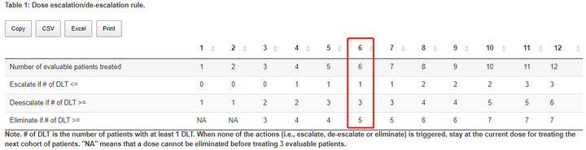

在研究者根据试验流程和决策表完成剂量爬坡后，我们可以根据收集到的数据来确定试验药物MTD。在软件的菜单行选择"Select MTD"模块，在该模块中对应填入各剂量水平的实际治疗人数、发生DLT的人数数据后，点击"Estimate the MTD"，获取MTD的估计结果。

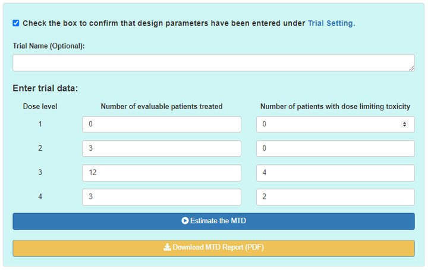

根据软件给出的计算结果，我们可以获取各剂量水平的后验DLT率（即毒性概率）、95%置信区间、过剂量控制规则的计算结果和最终选择的MTD。

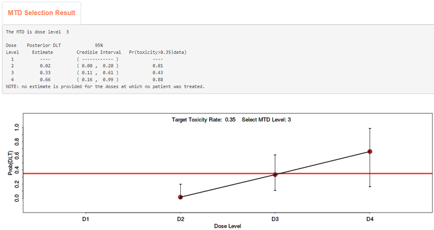

对于上图结果的解读是：最终选择为MTD的剂量为剂量3（即250mg），估计此剂量组的DLT率为0.33。注意，没有受试者接受治疗的剂量水平（dose level 1），不参与MTD的估计。

## 参考资料

---

[1] Liu S. and Yuan, Y. (2015). Bayesian optimal interval designs for phase I clinical trials, Journal of the Royal Statistical Society: Series C , 64, 507-523.

[2] https://www.fda.gov/drugs/development-approval-process-drugs/drug-development-tools-fit-purpose-initiative

[3] Zhou Y, Lin R, Kuo YW, Lee JJ, Yuan Y. BOIN Suite: A Software Platform to Design and Implement Novel Early-Phase Clinical Trials. JCO Clin Cancer Inform. 2021 Jan;5:91-101. doi: 10.1200/CCI.20.00122. PMID: 33439726; PMCID: PMC8462603.