# mTPI设计和键盘（Keyboard）设计

在Ⅰ期剂量探索试验中，常见的模型辅助设计除了BOIN设计，还包括改进的毒性概率区间（modified Toxicity Probability Interval, mTPI）设计和键盘（Keyboard）设计。

## 1. mTPI设计

### 1.1 背景

mTPI设计是嵇元教授团队2010年提出的一种基于贝叶斯理论框架的Ⅰ期剂量探索临床试验设计方法，用于探索试验药物的最大耐受剂量（MTD）。

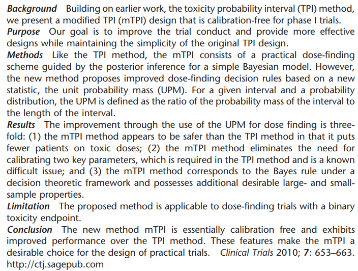

### 1.2 mTPI设计的剂量探索方法

假定我们即将开展一项针对某细胞毒性药物的Ⅰ期剂量探索试验，预设 $J$ 个待探索的剂量水平，以 $p_j$ 表示剂量水平 $j$ 的真实毒性概率， $j=1,2,⋯,J$ 。同BOIN设计一样，对于细胞毒性药物，假定毒性随剂量递增是合理的，即 $p_1<p_2<\cdots<p_J$ 。此外，假定剂量探索的目标毒性概率为 $p_T$ 。

使用mTPI设计开展上述试验的剂量爬坡过程如下：

**（1）指定等效区间EI（Equivalence Interval）**

等效区间被定义为$[p_T-\epsilon_1,p_T+\epsilon_2],\epsilon_1,\epsilon_2\ge0$ ，即目标毒性概率 $p_T$ 附近的一个毒性概率区间。该区间定义了一个被临床医生认可的足够“接近”目标毒性概率 $p_T$的范围，即毒性概率在此区间内的剂量可以接受被选择为MTD。

在指定EI后，毒性概率范围（0,1）就自然地被划分为三个区间：

- 剂量不足区间 $(0,p_T-\epsilon_1)$ ，毒性概率位于此区间的剂量被认为低于MTD
- 等效区间 $[p_T-\epsilon_1,p_T+\epsilon_2]$，毒性概率位于此区间的剂量被认为足够接近MTD
- 过剂量区间 $(p_T+\epsilon_2,1)$ ，毒性概率位于此区间的剂量被认为高于MTD

举个例子，若试验的目标毒性概率为 $p_T=0.2$ ，研究者指定目标毒性概率的等效区间为 $[0.15,0.25]$ ，则毒性概率的范围就被分为三个区间： $(0,0.15),[0.15,0.25],(0.25,1)$。

对 EI 的理解要注意与 BOIN设计中的 $(ϕ_1,ϕ_2]$ 区间进行区别：EI 的含义是该区间内的毒性概率足够接近MTD，因而若有某个剂量对应的毒性概率落入 EI ，研究者可以接受以该剂量作为 MTD；而$(ϕ_1,ϕ_2]$则表示毒性可以被临床接受的区间（即使它可能并不 “靠近” MTD），毒性概率低于 $ϕ_1$ 的剂量被认为是不可接受的亚治疗剂量，而毒性概率高于 $ϕ_2$ 的剂量则被认为是不可接受的过毒剂量。

**（2）基于EI的剂量爬坡算法**

第一组（Cohort）受试者在指定的起始剂量水平入组治疗。假定当前剂量水平$j,j \in \{1,\cdots,J\}$，共有 $n_j$ 个受试者接受治疗，其中有 $y_j$ 个受试者发生了剂量限制毒性（DLT）。mTPI设计假定 $y_j$  服从beta-binomial模型：

$y_j|n_j,p_j \sim Binomial(n_j,p_j)$ 

$p_j \sim Beta(1,1) \equiv Uniform(0,1)$

则基于观测数据 $D_j=(n_j,y_j)$ 可以计算 $p_j$ 的后验分布为：

$p_j|D_j \sim Beta(y_j+1,n_j-y_j+1), j=1,\cdots,J$ 

在得到 $p_j$ 的后验分布后，mTPI设计通过比较（1）中三个毒性区间的单位概率密度UPM（Unit Probability Mass）来决定下一组受试者入组的剂量水平。具体而言，三个毒性区间的UPM分别定义为：

$UPM1=\frac{Pr(p_j \in (0,p_T-\epsilon_1)|D_j)}{p_T-\epsilon_1}$

$UPM2=\frac{Pr(p_j \in [p_T-\epsilon_1,p_T+\epsilon_2]|D_j)}{\epsilon_1+\epsilon_2}$

$UPM3=\frac{Pr(p_j \in (p_T+\epsilon_2,1)|D_j)}{1-p_T-\epsilon_2}$ 

其具体含义为 $p_j$ 落在各区间的后验概率与对应区间长度的比值，这也是称之为“概率密度”的原因。

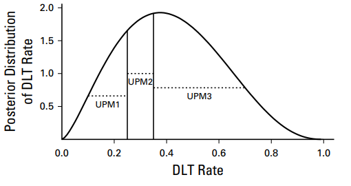

随后我们就可以进行剂量爬坡决策了：

- 如果 $UPM1=max\{UPM1,UPM2,UPM3\}$ ，即剂量不足区间的UPM最大，则下一组受试者升至剂量水平 $j+1$ 治疗。
- 如果 $UPM2=max\{UPM1,UPM2,UPM3\}$，即等效区间的UPM最大，则下一组受试者维持当前剂量水平治疗。
- 如果 $UPM3=max\{UPM1,UPM2,UPM3\}$ ，即过剂量区间的UPM最大，则下一组受试者降至剂量水平 $j−1$ 治疗。

重复上述规则，直至达到最大样本量N，试验结束。此外，为了解决决策有可能在安全剂量和下一过毒剂量之间来回波动的问题，mTPI设计也纳入了Overdose Control规则，详情可参考BOIN设计。

总结一下mTPI的剂量探索方法如下：

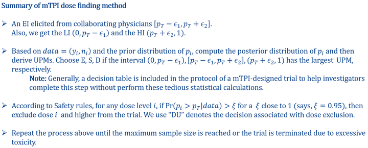

在完成剂量爬坡后，对各剂量水平的毒性概率构建保序回归，并选择最接近目标的毒性概率 pT 的毒性概率估计值对应的剂量水平作为MTD（详情可参考前两期BOIN设计的讲解）。

### 1.3 mTPI设计缺陷

在实践中，mTPI设计易受质疑的一个主要缺陷是其有很大风险将患者分配至过毒剂量上治疗，因此从安全性方面考虑可能难以被临床研究者所接受。

例如，考虑一个目标毒性 $p_T=0.2$ 的Ⅰ期临床试验，等效区间取[0.17,0.23]，则剂量不足区间为(0,0.17)，过剂量区间为(0.17,1)。假设在某次决策中， $p_j$ 落在三个区间的后验概率分别为0.01,0.09和0.9，即观测数据表明当前剂量水平有90%的概率是过毒的，只有9%的概率是适当的。此时合理的决策应该是降低剂量，然而根据mTPI的原则，依然要选择维持当前剂量入组新的受试者，因为等效区间具有较大的UPM：

$UPM1=0.01/0.17=0.06$

$UPM2=0.09/(0.23-0.17)=1.5$ 

$UPM3=0.9/(1-0.23)=1.17$

此例说明mTPI设计并不能识别和控制过剂量风险，究其原因，是UPM计算公式的分母（即各区间的长度不同）。一般而言，过剂量区间一般最长，很容易低估过毒风险，以至于即使 $p_j$ 大于目标毒性概率的后验概率很高，mTPI也仍旧维持此剂量入组新的受试者。

## 2. Keyboard设计

### 2.1 背景

基于我们上文中所阐述的mTPI设计的缺陷，言方荣教授等人在2017年提出了Keyboard设计以改进mTPI设计的安全性表现。

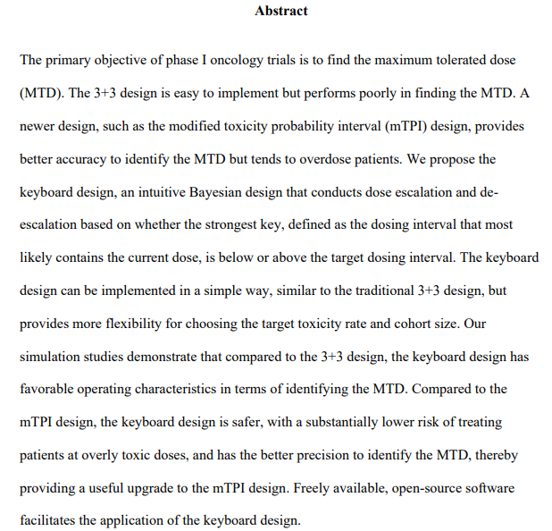

此外，嵇元教授团队在2017年也提出mTPI-2设计以改进mTPI过毒剂量的问题。mTPI-2所采用的思路和Keyboard一致，从应用层面看并无区别，但由于其概念和推理过程繁琐晦涩，不如Keyboard设计简单易懂，因此较难被非统计临床人员实施应用。

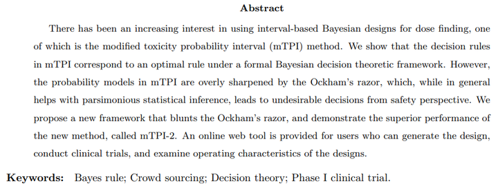

考虑到Keyboard的原理更简单，且在剂量增减规则上与mTPI一致，因此只挑选Keyboard设计做介绍。

### 4.2 Keyboard设计的剂量决策规则

由于mTPI设计缺陷的来源主要是毒性区间的长度不一致，那么解决思路自然地可以想到划分等长度的毒性区间。

具体而言，Keyboard设计先同mTPI设计一样指定等效区间 $EI=[p_T-\epsilon_1,p_T+\epsilon_2]$ ，称之为目标键（Target Key），使用目标键的宽度将 $(0,p_T-\epsilon_1)$ 和 $(p_T+\epsilon_2,1)$ 划分为若干个等长的区间。例如，若目标键为[0.25,0.35]，宽度为0.35-0.25=0.1，则在其左侧可划分2个等长区间（称作“键”），即（0.15,0.25），（0.05,0.15）；在其右侧可划分6个键，即（0.35,0.45），（0.45,0.55），（0.55,0.65），（0.65,0.75），（0.75,0.85），（0.85,0.95）。

记这些键为 $I_1,I_2,\cdots,I_K$ ，记目标键为 $I^∗$ ，这些键都具有相等的宽度，且位于[0,1]区间内。注意两侧的极端值如（0,0.05），（0.95,1）可不必再填充键，因为它们的长度不足以形成一个键。作者在文章中阐述：由于 $p_j$ 的后验分布是单峰的，通过对比目标键和最强键（定义在下文中给出）的位置来决定剂量升降，忽略两侧的极端值并不会给剂量决策造成任何问题。

随后，假定当前剂量水平 j 观测到的数据为 $D_j=(n_j,y_j)$ ，Keyboard设计定义“最强键” $I_{max}$ 为 $p_j$ 位于该区间的后验概率最大的键，即：

$I_{max}=argmax_{k \in\{1,\dots,K\}}\{Pr(p_j \in I_k|D_j)\}$ 

计算 $Pr(p_j \in I_k|D_j)$ 的方法依然是建立beta-binomial模型，此处不再赘述。

下图为mTPI（左）和Keyboard（右）原理对比。

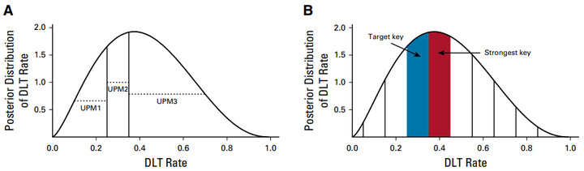

从实际意义上看， $I_{max}$ 为 $p_j$ 后验分布曲线下面积最大的键，代表了最有可能包含真实毒性概率 $p_j$ 的区间。因此，基于目标键和最强键的位置关系可按以下规则进行剂量增减决策：

- 若最强键在目标键左侧（绿色为目标键，橙色为最强键），表明观测到的数据显示当前剂量水平是低毒的，下一组受试者上升至剂量水平 $j+1$ 治疗；

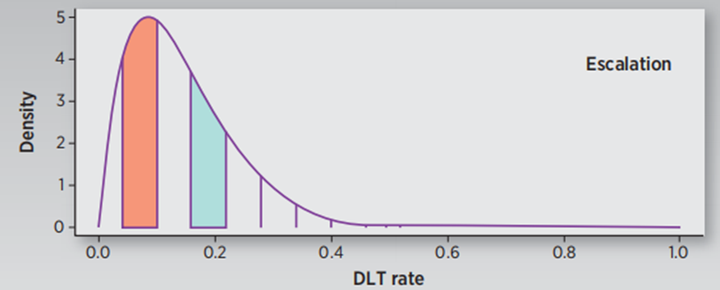

- 若最强键在目标键右侧，表明观测到的数据显示当前剂量水平是过毒的，下一组受试者降低至剂量水平 $j−1$ 治疗；

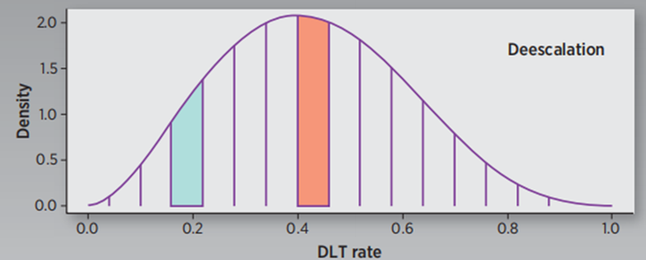

- 若最强键为目标键，表明观测到的数据显示当前剂量水平的毒性位于目标毒性等效区间，下一组受试者维持在当前剂量水平治疗。

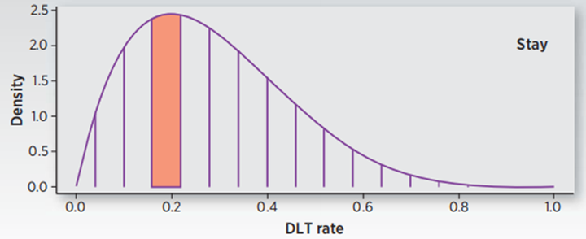

重复上述步骤，直到达到最大样本量N，然后选择采用保序回归法选择MTD。此外，Keyboard同样纳入了剂量排除规则，其内容与mTPI设计和BOIN设计一致，不再赘述。

值得一提的是，与BOIN设计一样，mTPI设计和Keyboard设计都可以通过穷举当前剂量组观测数据 $(n_j,y_j)$ 的所有可能情况，并分别计算对应的 $p_j$ 的后验分布，使得其剂量增减决策可在试验开始之前给出以降低设计的操作难度。例如，若某试验设计参数如下：

- Target toxicity probability: 0.3
- EI: (0.25, 0.35)
- Cohort Size: 3; Cohort Number: 10
- Stop when treat at least 12 patients

则采用分别mTPI设计和Keyboard设计的剂量增减决策表如下：

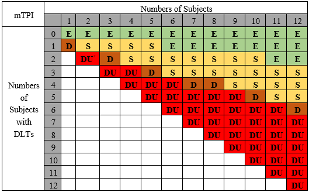

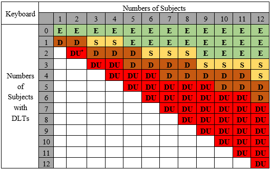

## 3. Keyboard设计软件操作演示

### 3.1 试验场景

试验场景依然采用BOIN设计中使用过的案例。假定目前有某临床试验，该试验目标之一是确定某嘧啶基多激酶抑制剂药物（实验药物，TG02）联合替莫唑胺治疗复发间变性星形细胞瘤或胶质母细胞瘤在成人患者中的最大耐受剂量MTD。试验的设计参数如下：

- 预设的待探索剂量共4个水平：（150mg，200mg，250mg，300mg）
- 目标DLT率设置为 $\phi=0.35$
- 剂量探索的最大样本量设置为24，受试者以3人为一组（cohort）入组接受治疗
- 起始治疗的剂量组为200mg

### 3.2 软件操作演示

Keyboard设计可使用[Keyboard Suite](http://trialdesign.cn/one-page-shell.html#Keyboard)软件完成，此软件收录于Trial Design网站中。

软件启动页面，有Keyboard设计的简单介绍（注意 aka mTPI-2）

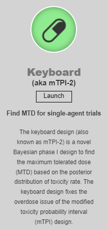

启动软件后，在"Trial Setting"模块中，依次输入试验的设计参数。首先是剂量水平设置，我们的试验共有4个剂量水平，起始剂量水平为第2个（200mg组）。

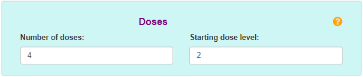

随后指定试验的目标毒性概率和等效区间EI。通常，等效区间需要由临床医生（研究者）决定，为了使其准确理解等效区间的实际意义，统计师可以在决策过程中提供引导。例如，可以参考以下这种方式向研究者提问：

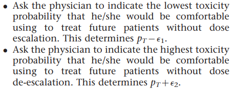

本例中，我们假定等效区间取[0.3,0.4]，将参数填入。

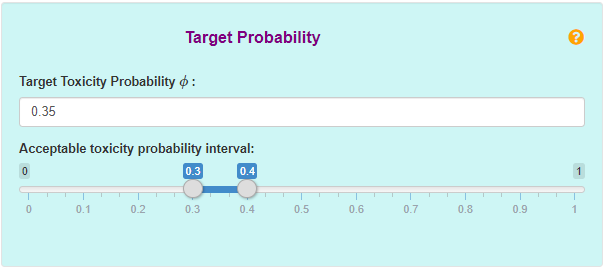

接下来指定样本量相关参数，Cohort size=3，最大样本量为24，则共有24/3=8个Cohort。通常，如果在试验进程中我们对确定MTD已经有较高的把握，我们可以在某剂量组治疗人数达到某个预设值时提前结束剂量爬坡，这个预设值一般可取9,12,15等值，建议取m=12。

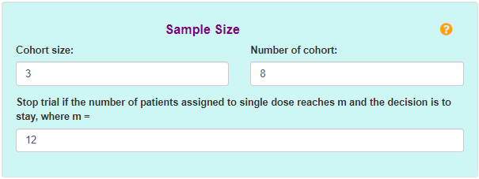

最后设定过剂量控制规则，与前BOIN设计软件操作类似。

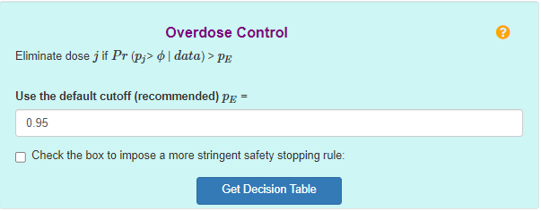

在所有参数设置完成后，点击"Get Decision Table"，获取软件生成的决策表。

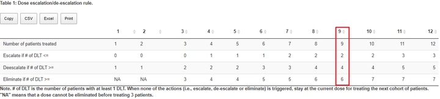

在剂量爬坡阶段，研究团队将基于决策表来确定受试者的入组剂量。例如，若当前剂量组已有9例受试者完成治疗，则：

- 当其中发生<=2例DLT时，下一组受试者升剂量治疗；
- 当其中发生>=4例DLT时，下一组受试者降剂量治疗；
- 当其中发生>=6例DLT时，当前剂量和更高剂量将从试验中剔除；
- 否则，下一组受试者维持在当前剂量治疗。

## 参考资料

---

[1] Ji Y, Liu P, Li Y, Bekele BN. A modified toxicity probability interval method for dose-finding trials. Clin Trials. 2010 Dec;7(6):653-63. doi: 10.1177/1740774510382799. Epub 2010 Oct 8. PMID: 20935021; PMCID: PMC5038924.

[2] Yan F, Mandrekar SJ, Yuan Y. Keyboard: A Novel Bayesian Toxicity Probability Interval Design for Phase I Clinical Trials. Clin Cancer Res. 2017 Aug 1;23(15):3994-4003. doi: 10.1158/1078-0432.CCR-17-0220. Epub 2017 May 25. PMID: 28546227; PMCID: PMC5554436.

[3] Guo W, Wang SJ, Yang S, Lynn H, Ji Y. A Bayesian interval dose-finding design addressingOckham's razor: mTPI-2. Contemp Clin Trials. 2017 Jul;58:23-33. doi: 10.1016/j.cct.2017.04.006. Epub 2017 Apr 27. PMID: 28458054.