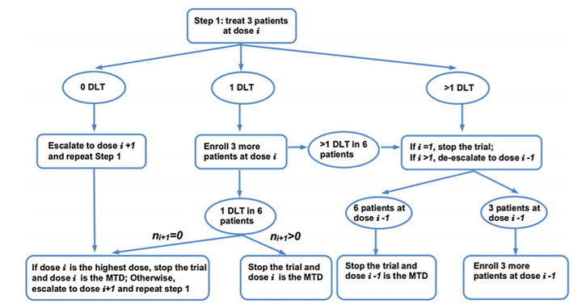
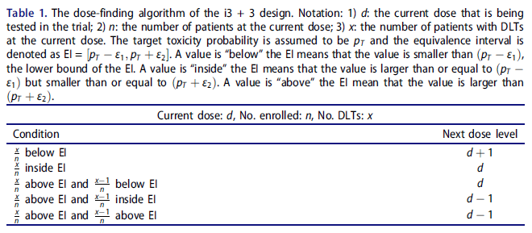

# 传统3+3设计和i3+3设计

## 1. 背景

3+3设计是基于规则（算法）的临床试验设计方法的代表，其优势在于方法本身简单透明，临床研究者无需在统计师的帮助下即可自行进行MTD的探索。3+3设计简单但也粗糙，不足之处有很多：MTD估计准确度相对较低、可能会将过多的受试者暴露在过低剂量治疗、目标毒性概率不能灵活调整（只能是33%）等，但这并不妨碍其在 I 期临床试验中仍被大量采用。

此外，3+3设计还有很多拓展和变形，例如 i3+3 设计。

## 2. 3+3设计

3+3设计的剂量爬坡规则可概括如下：

- 在最低剂量水平下纳入一组受试者（3例）进行试验，观察毒性反应结果。
- 若3例受试者均未出现DLT，则在高一级的剂量水平下纳入一组受试者进行试验，或者停止试验并选择当前剂量组为MTD（当前剂量组为最高剂量）。
- 若出现1例DLT，则在当前剂量水平下再纳入3例受试者进行试验。
- 若1/6 DLT（即新增的3例受试者未出现DLT），则在高一级的剂量水平下纳入下一组受试者进行试验，或者停止试验并选择当前剂量组为MTD（当前剂量组为最高剂量）。
- 若 >1/6 DLT（即新增的3例受试者至少出现1例DLT），则降低一个剂量入组下一组受试者，或者停止试验（当前剂量组为最低剂量）。若降低的剂量组仅有3例受试者完成评估，则再入组3例受试者；若已有6例完成评估，则停止试验，选择此降低的剂量为MTD。
- 若出现≥2例DLT，则降低一个剂量入组下一组受试者，或者停止试验（当前剂量组为最低剂量）。若降低的剂量组仅有3例受试者完成评估，则再入组3例受试者；若已有6例完成评估，则停止试验，选择此降低的剂量为MTD。
- 重复上述过程，直到找到MTD或试验停止。

## 3. i3+3设计

前文提到，相比于基于模型的设计，3+3设计在确定MTD的准确率上表现不佳。但3+3设计的一些衍生设计对此做了改进，以达到和基于模型的设计同等的统计效能，i3+3设计（Meizi Liu, Sue-Jane Wang, and Yuan Ji, 2019）便是其中之一。

i3+3设计的剂量爬坡规则如下：

假定有预设的 $D$ 个待探索剂量，探索MTD的目标毒性概率为 $p_T$ （如： $p_T=0.3$ ）， $d$ 为当前试验剂量， $n$ 为当前剂量已完成评估的受试者人数， $x$ 为当前剂量已观测到的DLT例数。与mTPI设计类似，i3+3设计要需要构造等效区间 $EI = [p_T-\delta_1, p_T+\delta_2]$ （如： EI=[0.25,0.35] ），i3+3设计的剂量决策则依据当前试验剂量组观测到的DLT率与等效区间 EI 的位置关系来决定：

- 在剂量水平 $d$ ，如果观测到的DLT率 $\frac{x}{n}$ 低于等效区间下限 $p_T−δ_1$ ，则下一组受试者升至下一个剂量 $d+1$ 接受治疗。如果 $d$ 已经是最高剂量，则继续保持当前剂量治疗下一组受试者。
- 如果$\frac{x}{n}$ 位于等效区间范围内，则下一组受试者保持当前剂量接受治疗。
- 如果$\frac{x}{n}$ 高于等效区间上限 $p_T+\delta_2$ ，则继续考虑：
  - (1) 如果$\frac{x-1}{n}$ 低于等效区间下限 $p_T−δ_1$ ，则继续保持当前剂量治疗下一组受试者；
  - (2) 否则，下一组受试者降至上一个剂量 $d−1$ 接受治疗。如果 d 已经是最低剂量，则继续保持当前剂量治疗下一组受试者。

同mTPI、BOIN设计一样，i3+3也设计了类似的安全性规则：

- **早期终止规则：**对于剂量组1，如果满足 $Pr(p_1>p_T|x_1,n_1)>\xi$ ,（ $\xi$ 可取0.95），则试验由于不可接受的毒性终止。
- **剂量排除规则：**当某次剂量决策为从剂量 $d$ 递增至 $d+1$ 时，如果 $Pr(p_{d+1}>p_T|x_{d+1},n_{d+1})>\xi$ ，则下一组受试者依据保持在当前剂量组接受治疗，且将剂量 $d+1$ 及更高剂量从试验中排除。

i3+3设计将在达到试验最大样本量时停止，或者因安全性规则而停止。在爬坡结束后，依然基于观察到的数据采用保序回归法估计MTD（在前几期介绍BOIN设计已详细说明）。

i3+3设计可借通过作者提供的在线应用[i3plus3](https://i3design.shinyapps.io/i3plus3/)完成。

## 参考资料

---

[1] Liu M, Wang SJ, Ji Y. The i3+3 design for phase I clinical trials. J Biopharm Stat. 2020 Mar;30(2):294-304. doi: 10.1080/10543406.2019.1636811. Epub 2019 Jul 15. PMID: 31304864.