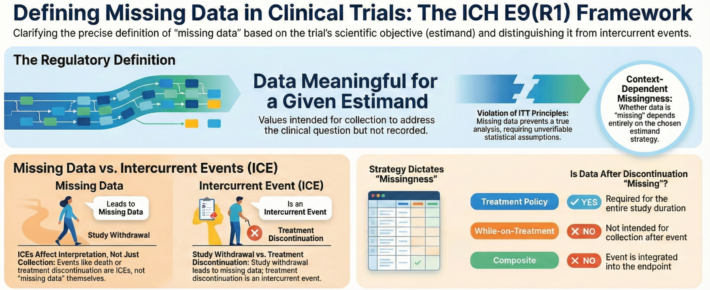
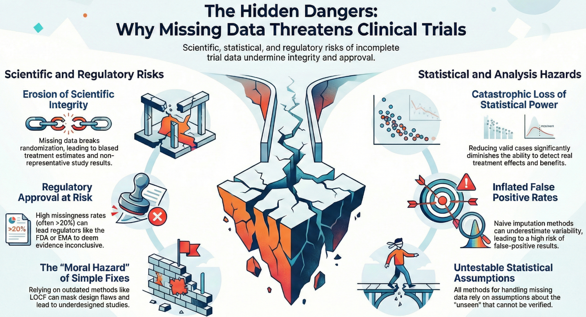
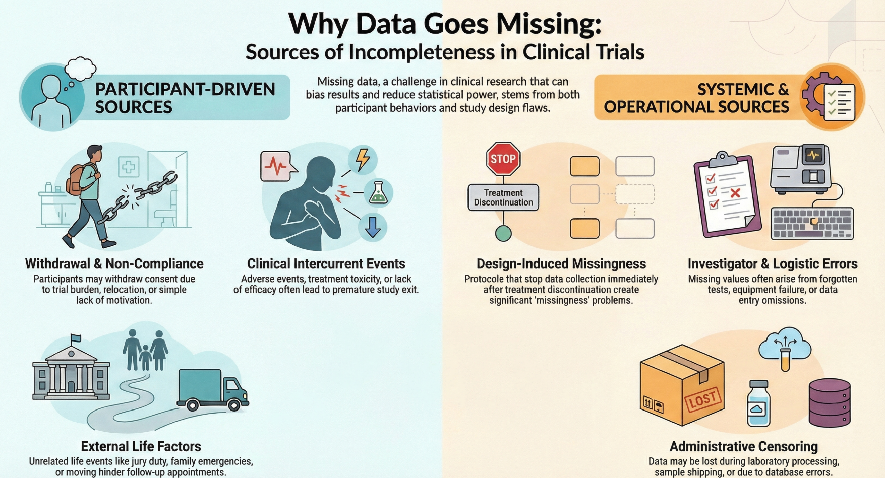
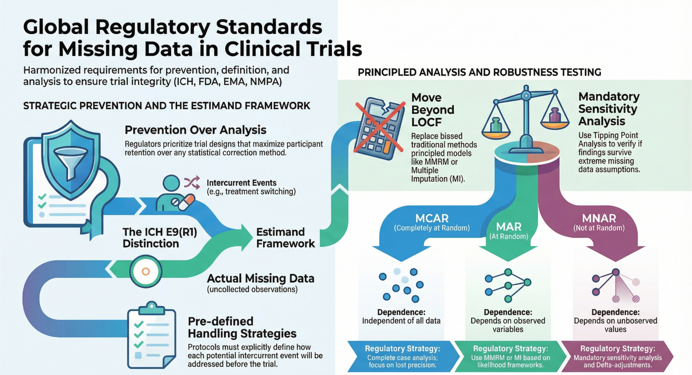

# 临床试验中的缺失数据

## 1. 缺失数据的定义

在ICH E9(R1)框架下，缺失值被定义为 “对于既定估计目标（Estimand）的分析有意义，但未能按计划收集到的数据”.而从统计学角度看（Rubin，2020），缺失值是指如果被观测到将对分析有意义的未观测值，即“一个缺失值隐藏了一个有意义的数值”。

 在ICH E9(R1)框架下，必须将“缺失数据”与以下两种情况严格区分：

- **不存在的数据（Data that do not exist）**：例如，受试者死亡后无法产生的测量值。这类数据在物理上不存在，因此不属于缺失数据。
- **因伴发事件而无意义的数据（Data considered not meaningful）**：伴发事件（Intercurrent Events，如治疗中断、使用补救治疗）发生后，根据预设的估计目标策略，某些后续数据可能被视为与分析无关。如果这些数据未被收集，它们不被视为缺失数据，因为它们不属于既定估计目标所需的信息。

因此，在Estimand框架下，数据是否被定义为“缺失”，取决于试验所采用的伴发事件处理策略：

- **疗法策略（Treatment Policy Strategy）**：如果采用此策略（即无论是否发生伴发事件都需评估治疗效果），则受试者发生伴发事件后原本计划收集但未收集的数据，**属于**缺失数据。
- **在治策略（While on Treatment Strategy）**：如果采用此策略（仅关注伴发事件发生前的效应），则受试者发生伴发事件后未收集的数据**不属于**缺失数据，因为这些数据在该策略下被认为无意义。
- **假想策略（Hypothetical Strategy）**：如果采用此策略（例如设想受试者未发生此事件），则并未收集的数据需要通过模型推断来替代，这些未观测到的“假设”数值在概念上通过统计方法处理，而未收集的实际数值不一定被视为传统意义上的缺失数据问题，而是估计问题。
- **复合策略（Composite Strategy）**：如果采用此策略，则把伴发事件定义到目标变量/终点中，将其纳入评价疗效的变量中进行分析，发生了伴发事件可视为已观测到相应估计目标变量，因此**不存在**缺失。
- **主层策略（Principal Stratum）**：如果采用此策略，则仅针对未发生伴发事件的受试者进行分析，计划收集但未收集的数据**属于**缺失数据。

## 2. 缺失数据的危害

临床试验中缺失数据的危害主要体现在破坏试验的科学性、引入统计偏倚、降低检验效能以及误导监管决策等方面。

### 2.1 引入偏倚

缺失数据可能为研究引入偏倚，破坏治疗效果的估计，这是缺失数据**最核心**的危害。

- **破坏组间可比性**：缺失数据会打破随机化所建立的组间平衡。如果脱落是由于药物不良反应或疗效不佳引起的（非随机缺失），那么剩余的“完整病例”将不再是原始随机人群的代表，导致治疗组和对照组在基线特征或预后因素上不再可比，从而引入系统性偏倚。
- **统计推断偏倚**：使用不恰当的插补方法（如LOCF）也会导致偏倚。在病情随时间恶化的疾病中，LOCF会高估疗效；在病情随时间改善的疾病中，则可能低估疗效。如果只分析已观察到的病例（Observed Case Analysis），可能会根据脱落的原因高估或低估治疗效果。例如，若治疗组中病情较重的患者因无效而脱落，剩余患者的平均疗效会虚高。忽略缺失数据也直接违反了意向性治疗（Intention-to-Treat, ITT）原则。

### 2.2 降低统计效能与精度

- **样本量减少**：直接剔除缺失数据的受试者会导致有效样本量减少，从而直接降低统计效能，使得试验更难检测出实际存在的治疗差异。
- **I类错误膨胀**：某些填补方法（如均值填补、LOCF等）看似保留了样本量，但往往人为减少了数据的变异性，导致标准误被低估，假阳性结果的概率增加。
- **统计结果可信度降低**：
  - **代表性丧失**：如果缺失数据不是完全随机的，那么最终纳入分析的人群可能无法代表目标患者群体（例如，耐受性差的老年患者脱落，导致分析人群显得比实际目标人群更年轻、更健康）。这使得试验结论难以推广到真实的临床实践中。
  - **不可验证的假设**：所有的缺失数据处理方法都依赖于无法通过数据本身验证的统计假设（如MAR或特定的MNAR假设）。缺失数据越多，结论对这些假设的依赖性就越强，试验结果的稳健性就越差。

### 2.3 监管风险

缺失数据过多或处理不当会增加结果的不确定性，导致监管机构无法得出确切的有效性结论，从而拒绝批准药物上市。

## 3. 缺失数据的来源

### 3.1 受试者驱动的缺失

这是缺失数据最直观的来源，通常与受试者的健康状况、心理状态或生活变动有关。

- **与临床结果相关的脱落（有信息缺失）**：
  - **不良事件/毒性**：受试者因药物副作用或难以耐受的毒性而退出研究或拒绝后续检测。
  - **疗效缺乏**：受试者因病情恶化或治疗无效而失去继续参与的动力。
  - **康复或症状改善**：受试者因感觉良好，认为不再需要治疗或随访而停止参与。
  - **病情过重**：例如在生活质量（QoL）调查中，患者因病情太重、太虚弱而无法前往诊所或填写问卷。
- **与临床结果无关的脱落**：
  - **失访**：受试者搬家、移民或因其他后勤原因（如交通困难）无法联系。
  - **撤回知情同意**：受试者因个人原因决定不再参与研究，且不愿提供理由。

### 3.2 流程或操作驱动的缺失

这部分缺失源于研究执行过程中的失误或不可抗力。

- **行政或程序错误**：
  -  **漏记与漏测**：研究人员忘记采集数据、病例报告表（CRF）填写遗漏、或未要求受试者进行特定检查。
  -  **设备故障**：测量仪器（如血压计、实验室设备）故障导致数据未生成。
  -  **样本损坏**：生物样本（如血液、组织）在运输或处理过程中丢失或损坏。
- **沟通与依从性问题**：
  - 受试者未能按预约时间就诊。
  - 受试者拒绝回答特定问题（例如问卷中的敏感问题）。

### 3.3 研究设计驱动的缺失

由临床试验方案设计本身所导致的缺失，分为 “有计划的” 及 “设计缺陷”。

- **计划性缺失**：为了减轻受试者负担，设计者可能有意识地只对部分受试者采集某些昂贵或侵入性的数据。这种缺失是受控的，通常属于完全随机缺失或随机缺失。
- **设计缺陷**：
  - **停止数据收集**：这是一个被反复批评的常见问题。有些试验方案规定，一旦受试者停止服用试验药物（停药），就停止后续的数据收集。这种做法人为制造了大量缺失数据，因为“停药”并不等同于受试者退出研究。
  - **负担过重**：随访过于频繁或程序过于繁琐（如侵入性检查），导致受试者依从性下降而产生缺失。
  - **数据性质**：某些类型的数据本身就比其他数据更容易缺失，例如涉及非法行为、性行为等隐私话题的问卷，受试者拒绝回答的比例较高。

## 4. 监管机构要求

全球主要监管机构（如ICH、FDA、EMA、NMPA）对于临床试验中缺失数据的处理已经形成了高度共识。他们的核心意见可以归纳为：**“预防优先，明确估计目标（Estimand），摒弃简单插补，必须进行敏感性分析”**。

### 4.1 核心理念：预防胜于补救

所有监管机构一致认为，没有任何统计方法能够完全弥补数据缺失带来的损失。

- **预防为主**：监管机构强调，最好的处理方法是防止数据缺失的发生。试验设计阶段应采取措施最大程度减少缺失，例如减少受试者负担、优化随访时间窗等。
- **继续收集数据**：即使受试者停止了试验治疗（停药），只要未撤回知情同意，**必须继续收集其结局数据**。这是为了满足“意向性治疗（ITT）”原则，避免因停药导致的“人为”数据缺失。
- **不可忽略**：在确证性试验中，直接忽略缺失数据（如仅分析完成病例）是不可接受的，因为这会破坏随机化带来的组间平衡，引入严重偏倚。

### 4.2 框架变革：ICH E9(R1) 与估计目标

随着ICH E9(R1)的实施，监管要求发生了根本性转变，要求首先定义“估计目标”，而非直接跳到“如何插补数据”。

- **区分概念**：必须严格区分**伴发事件**与真正的**缺失数据**。
- **策略决定缺失**：数据是否被视为“缺失”，取决于所选的估计目标策略。（见前文第1章）
- **NMPA要求**：中国药审中心（CDE）要求在统计分析计划中，明确区分“与伴发事件相关的缺失”和“与伴发事件无关的单纯数据缺失”，并分别描述处理方法。

### 4.3 统计方法：摒弃旧习

监管机构对具体的统计分析方法有明确的偏好和限制：

- **不建议简单填补方法**：
  - **LOCF（末次观测值结转）**：已被广泛批评且不再被推荐作为确证性试验的主要分析方法。因为它假设受试者状态不变，往往会引入偏倚（可能高估或低估疗效）并人为降低方差，导致I类错误膨胀。
  - **BOCF（基线观测值结转）、WOCF（最差观测值结转）**：虽然在某些领域（如疼痛）被视为保守方法，但在大多数情况下假设过于僵化。
- **推荐方法**：作为主要分析，监管机构通常接受基于**随机缺失（MAR）** 假设的方法，如**重复测量混合效应模型（MMRM）** 和 **多重填补（MI）**，这些方法被认为在控制 I 类错误和减少偏倚方面优于 LOCF。

此外，由于“数据缺失机制是随机的（MAR）”这一假设无法通过数据本身验证，监管机构强制要求对重要的疗效终点进行敏感性分析。必须通过敏感性分析来验证主要分析结果是否稳健。即，如果假设数据是**非随机缺失（MNAR）**（例如，失访患者的疗效比在组患者差），结论是否依然成立。具体的方法例如：

-  **临界点分析（Tipping Point Analysis）**：逐渐调整缺失值的假设，直到结论发生逆转，评估这种极端假设在临床上是否合理。
- **基于参照的填补（Reference-based Imputation）**：如“跳转至参照（Jump to Reference）”，假设试验组患者停药后疗效退化至安慰剂组水平。这在疼痛或精神类药物试验中常被监管机构接受作为敏感性分析。

如果敏感性分析的结果与主要分析一致，监管机构对试验结论的信心会大大增强；反之，若结果不一致，则需要深入讨论。

### 4.4 文件与报告规范

- **预先定义**：所有缺失数据的处理方法（包括主分析和敏感性分析）必须在**揭盲前**在统计分析计划中详细规定，以避免数据驱动的选择。
- **透明报告**：临床研究报告中必须详细列出缺失数据的数量、比例、时间分布以及缺失的具体原因（如不良事件、疗效缺乏、撤回同意等）。

**总结：** 监管机构的态度是不要试图用统计技巧来掩盖糟糕的试验实施。申办者必须尽最大努力收集完整数据；对于不可避免的缺失，应基于明确的估计目标选择合适的方法，必须通过严格的敏感性分析（例如，假设数据是MNAR）来证明关于疗效的结论经得起推敲。

## 5. 缺失数据的预防与控制

### 5.1 试验设计阶段的预防策略

试验设计阶段的预防是控制缺失数据最关键的环节，目标是从源头上减少数据收集失败的可能性。

- **优化入排标准与筛选**：
  - **设置导入期**：在随机化前设置导入期（Run-in period），剔除那些依从性差或不能耐受药物的受试者，仅将能够完成试验的受试者随机化，从而降低后续脱落率。
  - **排除高风险人群**：排除那些因物流、居住地变动或身体状况极差而极有可能失访的受试者。
- **减轻受试者负担**：
  - **精简评估**：仅收集对分析至关重要的核心数据，避免冗余的问卷和检查。过多的数据采集点会增加受试者疲劳，导致缺失。
  - **灵活随访**：允许更宽的随访时间窗，或采用远程医疗、电话随访、电子患者报告结局（ePRO）等方式，减少受试者往返研究中心的次数。
- **灵活的给药方案**：
  - **滴定设计 (Titration Design)**：允许根据受试者的耐受性调整剂量，而不是一出现不良反应就强制停药退出，这有助于保留受试者在试验中。

### 5.2 试验实施阶段的控制与挽留

在试验执行过程中，重点在于通过管理手段保留受试者并确保持续获取数据。

- **知情同意与沟通**：
  - **明确承诺**：在知情同意书中明确告知受试者，即使他们决定停止服用试验药物，继续参与随访和数据收集对科学研究至关重要。
  - **区分撤回**：严格区分“停止治疗”与“撤回知情同意”。除非受试者明确要求不再提供任何数据，否则不应停止数据收集。
- **激励与支持**：
  - **受试者关怀**：提供交通补贴、托儿服务等后勤支持，消除参与障碍。建立友好的研究中心环境，定期发送感谢信或简报增强受试者归属感。
  - **研究者激励**：避免仅根据入组人数支付研究者费用，应将部分费用与受试者完成随访及数据完整性挂钩。
- **实时监控与预警**：
  - **数据监查**：利用EDC系统实时监控缺失数据率。如果某中心的缺失率异常，应及时介入，进行再培训或现场核查。
  - **补救治疗**：对于疗效不佳的受试者，提供明确的补救治疗方案（Rescue Medication），使其愿意留在试验中继续接受观察，而不是直接失访。
