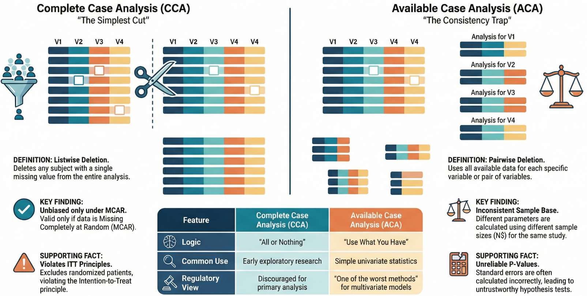
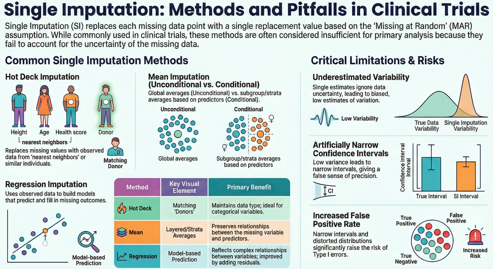
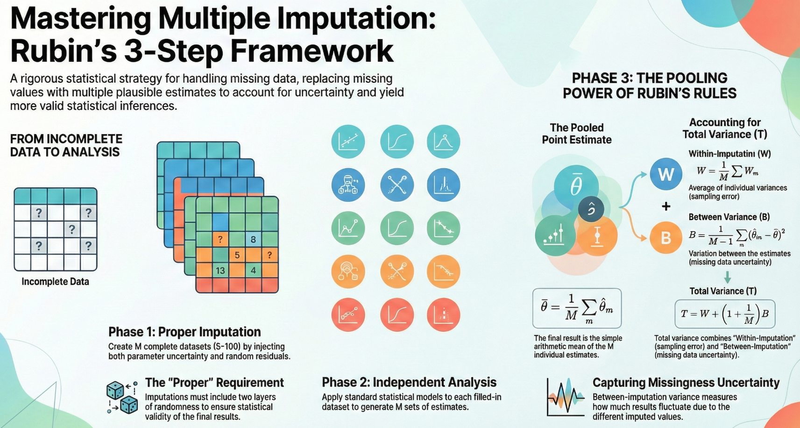
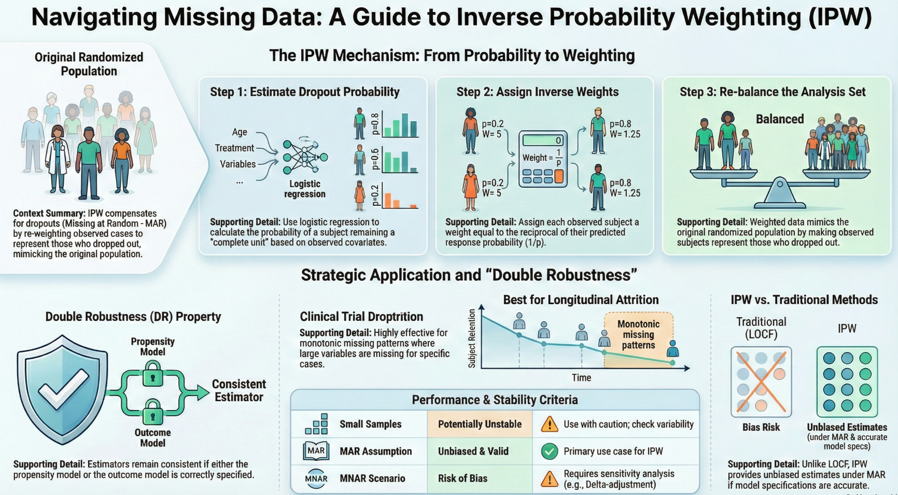
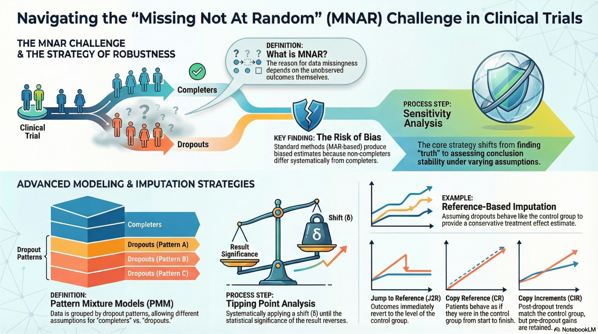

# 基于缺失机制的缺失值处理方法

学术界针对数据缺失问题的统计处理方法有长期的研究，其中关于统计建模和推断的方法不胜枚举。从数据缺失机制的角度考虑，可将这些方法主要分为三个方面，即：

- 完全随机缺失机制下数据缺失的处理方法
- 随机缺失机制下数据缺失的处理方法
- 非随机缺失机制下数据缺失的处理方法

如考虑处理方法本身的特征，也可以分为三类，即：

- 基于完整观测的方法（删除缺失观测）
- 基于填补的方法
- 不显式填补的基于似然的方法

## 1. 完全随机缺失（MCAR）

### 1.1 完整个案分析

完整个案分析（Complete Case Analysis）是一种建立在完全随机缺失机制下的数据缺失处理方法。它是将含缺失数据的受试者资料直接删除，只将数据齐全的个体信息纳入统计分析（即列表删除，Listwise Deletion）。在MACR假设下，CCA可以产生无偏的参数估计值，这是最简单且许多统计软件默认的方法。

但当缺失数据较多时，采用该方法会损失相当多的信息。另外，完整数据集分析违背了意向性分析原则（intention-to-treat, ITT）。更重要的一点是，除非数据缺失符合完全随机缺失机制，否则将不可避免地带来偏倚。因此，不推荐采用该法作为验证性试验中主要的数据缺失处理方法。

尽管如此，完整数据集分析可以应用于以下情况：

- 探索性研究，尤其是药物研发的早期阶段；
- 在验证性临床试验研究中作为敏感性分析来论证结论的稳健性。

### 1.2 可得个案分析

可得个案分析（Available Case Analysis），也可称作已观测个案分析（Observed Case Analysis）。与完整个案分析一旦发现任何缺失值便丢弃整个样本的处理方式不同，可得个案分析的核心逻辑是“物尽其用”，即在进行统计计算时，根据具体的分析需求，尽可能利用所有在该特定变量或变量对上存在的观测数据（即成对删除，Pairwise Deletion）。

具体而言，在计算均值或方差等单变量统计量时，该方法会利用所有在该变量上有记录的个案，而不考虑这些个案在其他变量上是否缺失；而在计算协方差或相关系数等双变量统计量时，则仅利用那两个特定变量同时均有数据的子样本进行计算。

尽管ACA在直观上似乎更具吸引力，但在实际的多变量分析（如多元回归、结构方程模型）中，它存在明显的统计学缺陷，甚至被一些学者认为是实际应用中“最糟糕的方法之一”。最核心的问题在于样本基础的不一致性：由于不同的参数（如均值、相关系数）是基于不同的样本子集计算的，这导致整个分析缺乏一个统一的样本量 *N*，使得标准误的计算变得异常复杂且容易出错。大多数统计软件在进行此类分析时，往往无法正确校正这种样本量的变化，从而导致输出的假设检验结果（如*P*值）不可靠。

## 2. 随机缺失（MAR）

随机缺失的假设较为符合大多数临床试验中数据缺失的实际情况，因此目前国内外对数据缺失的统计处理方法研究主要针对于随机缺失的假设。与完全随机缺失（MCAR）不同，MAR 机制下直接剔除缺失个案通常会导致有偏的估计，除非缺失仅取决于自变量且模型正确设定。因此，在 MAR 假设下，推荐使用能够利用已观测数据对缺失机制进行调整或建模的“原则性”统计方法，主要包括基于似然的方法、填补法以及加权估计方程。

### 2.1 基于似然的方法

在 MAR 假设下，基于似然的方法（Likelihood-Based Methods）是处理缺失数据的首选策略之一，这类方法不需要对缺失值进行显式填补，而是通过模型直接利用所有可用的观测数据进行参数估计。最典型且在临床试验中广泛应用的方法是**混合效应模型重复测量（MMRM）**。MMRM 能够利用受试者在不同时间点的观测数据及相关性，在 MAR 假设下提供无偏且有效的估计，被认为是优于传统单一填补的标准方法。MMRM 利用了所有受试者在所有时间点的数据。即使某个人只完成了前两次访视，他的数据也会被用来帮助构建前两个时间点的模型，并通过受试者内部的相关性，辅助推断后续时间点的整体趋势。

对于结构方程模型或其他多变量正态数据，**全信息最大似然估计（FIML）**也是一种直接处理 MAR 数据的有效手段，它利用每个个案的可用信息构建似然函数。此外，**期望最大化（EM）算法**也是一种经典的迭代方法，用于在 MAR 假设下计算最大似然估计值。

### 2.2 填补法

填补法是指采用适当的估计方法补全缺失的数据，使得标准的完全数据分析方法可在填补后的数据集中展开。当数据缺失率较小(例如 10% ~ 15%)，且含缺失数据的变量对所研 究的问题具有重要意义时，应将填补法作为数据缺失的主要分析策略。

但填补法也有其缺点，一方面填补过程可能很困难，特别是在多维复杂结构下，算法不易实现；另一方面一些简单的填补可能歪曲数据的分布和变量间的真实关系。因此，在进行数据填补之前，首先需要判断数据的缺失模式和机制，尤其需要注意根据不同的缺失机制采用不同的方法；在进行数据填补时需遵循保守原则，并对不同填补方式所得出的结论进行敏感性分析，以证实填补结果的可靠性。

填补法分为单一填补(single imputation)和多重填补(multiple imputation, MI)两类。对缺失数据产生一个填补值的方法称为单一填补法；反之，产生多个填补值的方法称为多重填补法。

#### 单一填补（Single Imputation）

MAR 机制下的单一填补法是指采用一定方式，对每个缺失数据只构造一个合理的替代值，将其填补到原缺失数据的位置上，从而对填补后的完整数据集进行相应的统计分析的方法。在数据随机缺失的假设条件下，临床试验中常用的单 一填补方法包括热卡填补法(hot deck imputation)、均值填补法(mean imputation)和回归填补 法(regression imputation)等。

- **热卡填补法**

热卡填补法又称热平台填补法、热层填补法或匹配填补法。对于数据缺失的个体，该方法首先从具有完整观测数据的样本中寻找与其相似的个体组成新的集合， 称为“近邻”数据集；然后从“近邻”数据集中随机选择一个个体，并用该个体相应的观测值填补缺失数据。该法可保持变量本身的数据类型，易实现多重估算，适用于分类变量和等级变量。

- **均值填补法**

包括非条件均值填补法和条件均值填补法。非条件均值填补法采用所研究变量的均值来代替该变量中的每一个缺失数据。但由于样本均值是唯一的，因此非条件均值填补法的本质是用同一个预测值替代所有的缺失数据，这显然会低估变量的变异程度，同时还会忽略缺失变量与其他变量的关联程度。条件均值填补法也称为冷卡填补法，是根据预测变量(如性别、年龄、病情严重程度等)将总体交叉分层，用该个体所在层的完整数据的均数来代替缺失数据。与非条件均值填补法相比，条件均值法改善了对变量不确定性的估计程度，并且能够保持该变量与其他预测变量之间的关系。

- **回归填补法**

回归填补法是利用已观察到的数据建立含缺失数据的变量(通常是结局变量)关于协变量的回归模型，并通过该模型产生的预测值估计缺失数据的方法。根据模型预测值产生方式的不同，回归填补法还可进一步分为单一回归填补和随机回归填补。前者直接采用模型的预测值作为缺失数据的填补值，后者在前者计算结果的基础上还增加了残差的抽样值以反映随机误差对结果的影响。利用回归填补法可以充分反映缺失变量与协变量之间的关系，但是在建立模型的过程中应充分考虑模型的合理程度，避免由于模型选择的主观性以及协变量之间的复共线性等原因对填补结果造成的影响。

对于所有的单一填补法而言，它们共同的不足之处在于只对缺失数据进行了一次填补， 因而忽略了填补数据的不确定性，造成对数据变异性的估计偏低，使得估计的置信区间可能过窄，由此可能导致假阳性率的升高以及样本分布的改变等一系列问题。

#### 多重填补（Multiple Imputation）

多重填补是另一种处理 MAR 数据的核心方法，其核心思想是通过多次填补缺失值来创建多个完整的数据集，从而反映缺失数据带来的不确定性。与单一插补不同，MI 能够通过汇总多个数据集的分析结果（使用 Rubin 规则）来提供正确的标准误和置信区间。在实施 MI 时，常用的算法包括**链式方程多重插补（MICE）**（也称为全条件定义 FCS），它通过一系列单变量条件模型逐个填补变量，非常灵活且适用于混合变量类型；以及基于**联合建模（Joint Modeling）**的方法，通常假设数据遵循多元正态分布（MVN）。只要插补模型正确包含了与缺失机制相关的变量，MI 在 MAR 下是无偏的。

相比单一填补，多重填补法能够正确反映由于缺失数据带来的不确定性，提供有效的标准误和置信区间。即使在 MCAR 下，MI 通常也比成列删除能保留更多的信息和统计功效。

### 2.3 加权估计方程

**加权估计方程（Weighted Estimating Equations, WGEE）** 对于非正态纵向数据（如二分类或计数数据），广义估计方程（GEE）是常用的分析工具，但标准的 GEE 仅在 MCAR 下有效。在 MAR 情况下，可以使用**逆概率加权（Inverse Probability Weighting, IPW）**的 GEE，即 WGEE。该方法通过对完整观测的个案赋予权重（权重的倒数是个案被观测到的概率，通常由逻辑回归模型基于已观测数据估算）来纠正由于缺失造成的偏差。这种方法被称为“双重稳健”估计量的基础，因为它结合了对缺失机制的建模。

## 3. 非随机缺失（MNAR）

在非随机缺失模式下，标准的统计方法如混合效应模型重复测量或基于随机缺失假设的多重插补会产生有偏估计。因此，处理MNAR数据的核心策略不再是试图恢复单一的“真实”结果，而是通过**敏感性分析**来评估主要分析结论在不同缺失假设下的稳健性。目前主流的处理方法主要建立在模式混合模型（Pattern Mixture Models, PMM）和选择模型（Selection Models）的框架之上，其中基于PMM的受控多重填补和临界点分析在临床试验中应用最为广泛。

### 3.1 末次访视结转

针对非随机缺失机制，临床试验中普遍采用的是末次访视结转（last observation carried forward, LOCF）方法，该方法采用受试者在时间上最接近的一次观察数据代替缺失数据。但是，在临床试验中对于LOCF的一种错误认识是既然LOCF方法对缺失机制的随机性并没有要求，因此它们倾向于得到“保守”的结论，但是实际情况并非如此。例如，在药物治疗阿尔茨海默病（Alzheimer disease）的临床试验中，主要目的是延缓疾病进程，阻止患者的认知能力或日常生活能力等量表的评分随时间下降。如果药物本身与安慰剂相比差异无统计学意义，但试验组患者却因药物引起的不良事件而在试验早期退出，那么使用LOCF方法就不能真实地反映出试验组患者的终点指标随时间变化而不断下降的趋势，反而有可能得出试验药物优于安慰剂的结论。

除了LOCF方法外，基线访视结转法（baseline observation carried forward, BOCF）和最差结果填补法（worst observation carried forward, WOCF）也是临床试验中可供选择的非随机缺失数据处理方法，通常出现在对连续型变量采用疗法策略处理的场景下出现。

### 3.2 模式混合模型

模式混合模型（Pattern Mixture Models, PMM） 是处理MNAR数据最直观且常用的框架。该方法的核心思想是将总体数据按照缺失模式（例如“完成试验者”与“不同时间点的脱落者”）划分为不同的亚组，并假设不同亚组具有不同的参数分布。在实际操作中，PMM通常通过**受控多重填补（Controlled Multiple Imputation）** 来实施。这种方法首先基于MAR假设生成插补数据，然后根据特定的MNAR假设对插补值进行修改。例如，研究者可以显式地设定脱落者的预后比留存者差，或者假设脱落者在退出后的数据分布不再遵循原治疗组的规律，而是转向参照组的分布。由于这种方法能够清晰地向临床医生和监管机构解释“如果缺失数据表现得像对照组一样会发生什么”，因此在ICH E9(R1)指南背景下被广泛推荐用于评估疗法策略估计目标的稳健性。

在PMM框架下，**基于参照的插补（Reference-Based Imputation）** 是一类重要的具体实施策略，它通过借用试验中参照组（通常是安慰剂组或标准治疗组）的信息来构建缺失数据的分布。这类方法不依赖于难以验证的数学参数，而是基于临床情境的合理推断。常见的策略包括**跳转至参照（Jump to Reference, J2R）**，即假设受试者一旦脱落，其疗效立即退化至与参照组相同的水平，这常用于模拟药物洗脱效应；**复制参照（Copy Reference, CR）**，即假设脱落者从试验开始就如同在参照组一样表现，这是一种极度保守的假设；以及**复制参照增量（Copy Increments in Reference, CIR）**，即假设受试者在脱落后，其后续的疗效变化趋势（斜率）与参照组相同，但保留了脱落前已经获得的累积疗效。这些方法通过构建不同的反事实场景，系统地评估了当缺失数据偏离MAR假设时，治疗效应是否依然存在。

另一种基于PMM的量化分析方法是**德尔塔调整（Delta-Adjustment）** 与 **临界点分析（Tipping Point Analysis）**。这种方法不依赖于参照组的数据，而是直接在MAR插补值的基础上加上一个位移参数 *δ*（Delta）。例如，在疼痛评分研究中，可以人为给治疗组的缺失值加上一个正值，意味着缺失数据的患者疼痛程度比模型预测的要严重。通过逐渐增大 *δ* 的数值，研究者可以观察统计结论（如P值或效应量）何时发生逆转（即从显著变为不显著）。如果使结论翻转所需的 *δ* 值在临床上是不现实的极端值，那么就可以认为主要分析结果是稳健的。这种方法因其能够直观展示结论崩溃的临界点，常被监管机构（如FDA）要求作为关键的敏感性分析手段。

### 3.3 选择模型

除了模式混合模型，**选择模型（Selection Models, SM）** 也是处理MNAR的一种理论框架。与PMM根据缺失模式对数据建模不同，选择模型通过联合建模结果变量 *Y* 和缺失机制 *R* 来直接描述缺失过程。经典的例子包括 Heckman 选择模型和 Diggle-Kenward 模型。这类模型试图通过引入观测数据与缺失概率之间的函数关系（例如，当前未观测到的疗效值越差，缺失概率越高）来校正偏差。然而，选择模型在实际应用中面临巨大挑战：其结果往往对不可验证的分布假设（如残差的正态性）高度敏感，且计算过程容易出现不收敛的问题。因此，尽管在计量经济学中有应用，但在现代临床试验中，选择模型更多被视为一种补充性的敏感性分析工具，而非首选方法。

### 3.4 共享参数模型

最后，**共享参数模型（Shared Parameter Models, SPM）** 提供了一种通过潜在变量处理MNAR的视角。该方法假设测量过程和缺失过程均受一组共同的、未观测到的随机效应（Random Effects）影响。例如，一个潜在的“健康恶化因子”可能同时导致患者疗效评分下降和提前退出试验。通过对这些潜在变量建模，SPM可以在一定程度上解释导致MNAR的相关性。这类方法常用于纵向数据的联合建模，但同样依赖于较强的模型假设。

综上所述，在非随机缺失模式下，并不存在一种“正确”的填补方法能恢复真实数据。推荐的做法是采用**基于原则的敏感性分析**策略：以MAR分析（如MMRM或标准多重填补）作为主要分析，随后利用**基于参照的插补（如J2R）** 或 **临界点分析** 等方法，在不同的MNAR假设下对数据进行压力测试，以验证研究结论的可靠性。

