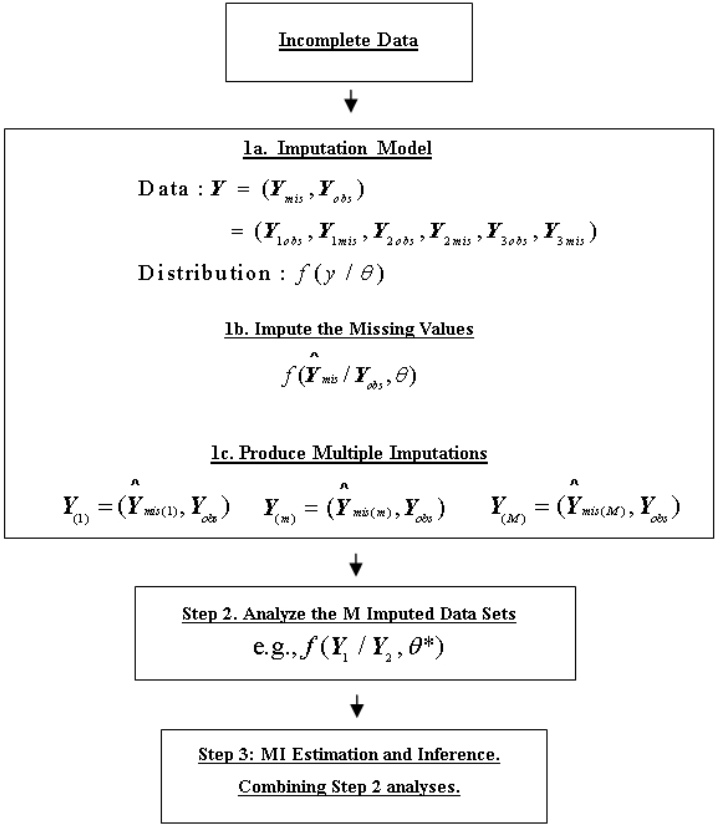
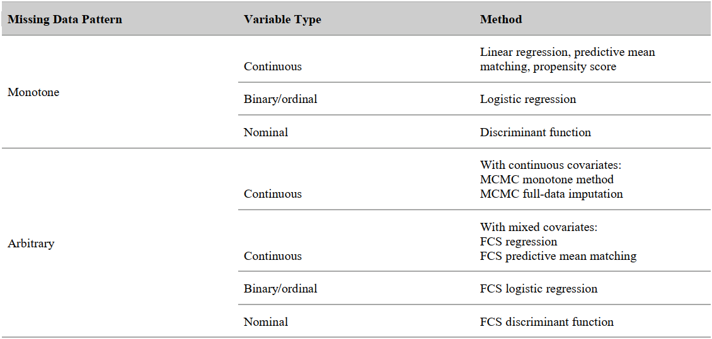
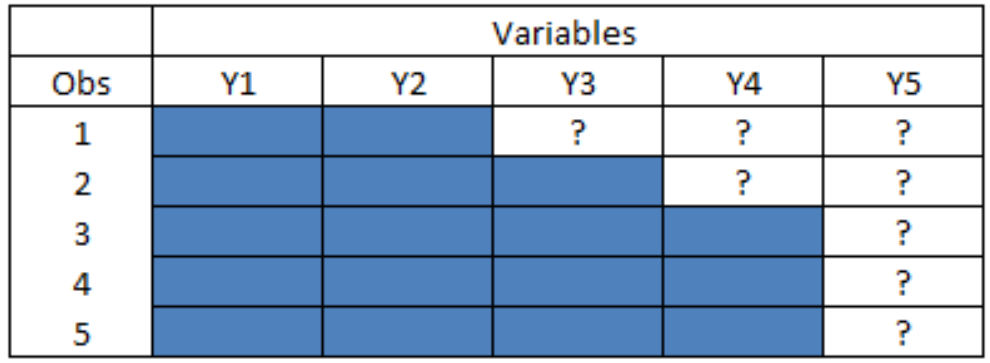
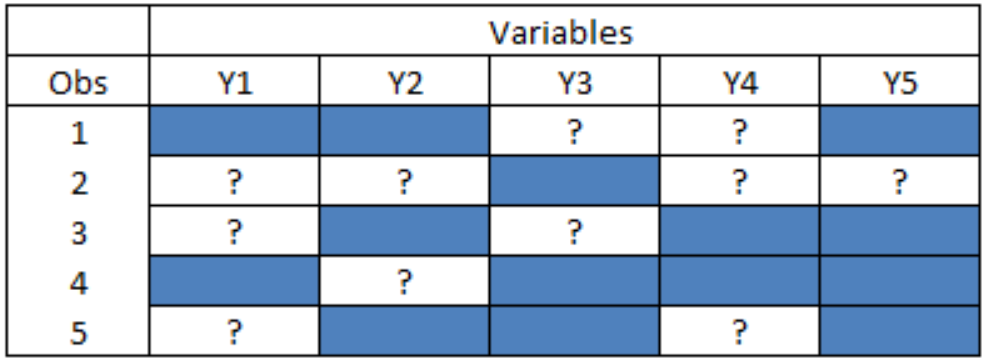

# 多重填补法

多重插补法是一种处理缺失数据的统计方法。它通过选择合适的模型，用随机生成的值替换缺失数据，从而产生多个完整的衍生数据集（即“插补数据集”）。随后，对每个插补数据集分别进行统计分析，最后将这些分析结果综合起来，得到参数的点估计值和标准误。这种方法能够有效地反映因数据缺失而带来的不确定性。

## 1. 多重填补的优势

多重填补方法处理项目缺失数据的优势在于设计和执行得当的 MI 方法所具备的以下属性：

- **MI 是基于模型的。** MI 确保了插补过程的统计透明度和完整性。为了保证分析的稳健性，插补模型所包含的变量范围通常应比后续用于分析的模型更广。
- **MI 具有随机特征。** MI 基于从缺失数据 $Y_{mis}$的预测分布中抽取的模型参数和误差项来填充缺失值，而非简单的均值替换。
- **MI 具有多元特征。** 
- MI 不仅保留了单个变量的分布特征，还保留了插补模型中各变量之间的关联性。值得注意的是，在“随机缺失” 的假设下，这些被保留的多元关系反映的是观测数据$Y_{obs}$中固有的关系。
- **MI 采用了插补过程的多次独立重复**，能够估计出由缺失值引起的参数估计不确定性（即方差）。这是除数据本身变异和抽样变异之外的额外变异来源。
- **MI 对轻微偏离严格理论假设具有稳健性。** 尽管没有任何模型能完全符合真实分布或完美的缺失机制假设，但实证研究表明，MI 对严格理论假设的轻微偏离具有较好的稳健性，仍能产生有效的估计和推断。

## 2. 多重填补流程

多重插补处理统计分析中缺失数据的三步流程：

- 首先为数据定义多元“插补模型”，在此模型框架下对原始数据集中的缺失值进行m=1,…,M次独立插补，生成M个完整的分析数据集“重复版本”。
- 随后在M个数据集上独立进行统计分析，并输出相应结果。
- 整合M次独立分析的结果，运用多重插补公式计算目标描述统计量或模型参数的估计值、标准误、置信区间及检验统计量。

### 2.1 填补过程

#### 2.1.1 定义填补模型

对项目缺失值进行插补的实际过程受插补模型调控。我们将插补模型定义为可供插补过程使用的变量集合$Y=Y_1,\dots,Y_p$，以及关于Y各元素间多元关系的分布假设 $f(Y|\theta)$。

**<u>选择纳入模型中的变量</u>**

选择纳入插补模型的变量时，不应局限于仅包含存在项目缺失数据的变量或预期用于后续分析的变量。根据经验法则，多重插补分析所采用的插补模型应比分析模型包含更多、更广泛的变量集合。例如，若年龄与身体质量指数是舒张压分析模型选定的预测变量，那么在为舒张压和身体质量指数的项目缺失数据做插补时，可能需要纳入许多额外变量，如性别、种族/民族、婚姻状况、身高、体重、收缩压等。若年龄与舒张压的关系非线性，用于插补缺失血压测量值的回归模型可同时包含年龄的线性项与二次项。若性别对年龄与舒张压的关系存在调节效应，则插补模型应包含年龄与性别的交互项。

显然，在调查数据集中使用所有可能的变量来定义插补模型并进行多重插补并不可行。根据Schafer（1999）和van Buuren（2012）的建议，以下是选择插补模型变量的实用准则：

- 包含所有关键分析变量（因变量Y1与自变量Y2）
- 包含与分析变量相关或关联的其他变量（Y3）
- 包含能预测分析变量项目缺失数据的变量（Z）

若未将分析变量（Y1和Y2）纳入插补模型，可能导致后续多重插补估计与推断产生偏差。纳入能有效预测分析变量的额外变量（Y3）可提高项目缺失数据插补的精确度与准确性。在项目缺失数据满足随机缺失假设的前提下，加入与缺失变量相关且能预测回答倾向的变量（Z）将减少由缺失数据机制引起的偏差。

在多重插补实践中，基于大量实证研究与模拟测试得出的通用建议是：“如有疑虑，在插补模型中纳入更多变量往往更为稳妥。”

**<u>填补模型的数据分布假设</u>**

所有插补方法的核心都是定义变量间关系的统计模型。虽然有些方法（如热卡填充）的模型隐含在算法中，但在多重插补的理论中，通常显式地使用概率模型 $f(Y|\theta)$ 来描述完整数据的多元关系。对于连续变量，常用**多元正态分布**；对于分类变量，则常用**多项式分布**。

**<u>缺失值填补的一般算法</u>**

多重插补的理论基础是贝叶斯推断。填补缺失值 $Y_{mis}$ 的任务，等同于从缺失数据的**后验预测分布** $f(Y_{mis}|Y_{obs},\theta)$ 中随机抽取一个值。其中 $\theta$ 是定义分布的参数（如均值 $\mu$、协方差 $\Sigma$ 或回归系数 $\beta$）。

插补过程通常包含两个步骤的迭代：

1.  **后验步 (Posterior Step, P-step)：** 根据观测数据 $Y_{obs}$ 和先验分布 $g(\theta)$，推导或模拟参数 $\theta$ 的后验分布 $p(\theta|Y_{obs})$，并从中抽取参数值 $\theta^*$。
2.  **插补步 (Imputation Step, I-step)：** 给定抽取的参数 $\theta^*$，从预测分布 $f(Y_{mis}|Y_{obs},\theta^*)$ 中抽取缺失值的插补值 $Y^*$。

对于简单的单调缺失模式，可以直接计算；对于复杂的任意缺失模式，通常需要使用 **马尔可夫链蒙特卡洛 (MCMC)** 或 **全条件定义 (FCS/MICE)** 等迭代模拟技术来近似联合后验分布。

SAS 的 `PROC MI` 提供了三种主要方法：

*   **MONOTONE：** 适用于单调缺失模式。
*   **MCMC：** 适用于任意缺失模式（假设多元正态分布）。
*   **FCS：** 适用于任意缺失模式（灵活性高，适合混合变量类型）。

**<u>单调缺失数据模式的方法</u>**

单调缺失是指数据呈现阶梯状缺失：如果变量 $Y_j$ 缺失，则后续所有变量 $Y_{j+1}, \dots$ 也都缺失。在下图中，$Y_1$ 和 $Y_2$ 显示为完全观测——这两个变量没有缺失值。从有序数据数组中从左到右移动，其余变量的缺失数据量逐渐增加，并且缺失数据始终是嵌套的，以便每当 $Y_3$ 缺失时，$Y_4$ 和 $Y_5$ 也缺失。同样，任何在 $Y_4$ 上缺失值的案例在 $Y_5$ 上也缺失。

在此模式下，插补是一个非迭代的顺序过程（例如先插补 $Y_3$，有了完整 $Y_3$ 后再插补 $Y_4$……）。`PROC MI` 根据变量类型提供不同的方法：

- **线性回归 (Linear Regression)：**
  适用于连续变量。
  *   **P 步：** 根据观测数据拟合回归模型，得到参数估计 $\hat{\beta}$ 和协方差矩阵。从参数的后验分布中抽取随机参数 $\beta^*$ 和 $\sigma^*$。
  *   **I 步：** 使用抽取出的参数计算预测值，并加上随机误差项，得到插补值 $Y^* = X\beta^* + z\sigma^*$。

- **预测均值匹配 (Predictive Mean Matching, PMM)：**
  适用于连续变量，尤其是数据分布不规则时。
  它也先计算回归预测值，但不是直接使用预测值，而是找到一组观测值中预测值与缺失案例预测值最接近的“邻居”（Neighborhood，默认 $K=5$ 个），然后从这组邻居的实际观测值中随机抽取一个作为插补值。这样能确保插补值一定是真实存在过的数值，符合数据范围。

- **逻辑回归 (Logistic Regression)：**
  适用于二元或有序分类变量。
  *   **P 步：** 拟合 Logistic 模型，从参数后验分布中抽取系数 $\beta^*$。
  *   **I 步：** 计算属于某类别的概率，并与从均匀分布 $U(0,1)$ 中抽取的随机数进行比较，确定插补的类别。

- **判别分析法 (Discriminant Function)：**
  适用于名义分类变量（无序多分类）。
  基于多元正态假设，计算缺失样本属于各组的后验概率，然后根据概率随机分配类别。

- **倾向得分 (Propensity Score)：**
  一种单变量方法，不推荐用于多重插补，因为它无法利用变量间的多元相关性。

**<u>任意缺失数据模式的方法</u>**

考虑更典型的数据场景，其中插补模型是多变量的，包括所有类型的变量，并且具有任意的缺失数据模式。在精确方法不严格适用的这种“杂乱”缺失数据模式的情况下，通常需要一些迭代算法来解决。

- **MCMC 方法 (Markov Chain Monte Carlo)：**
  *   假设所有变量服从多元正态分布 (MVN)。
  *   通过构建马尔可夫链，在 **I 步**（插补缺失值）和 **P 步**（更新参数 $\mu, \Sigma$）之间反复迭代。
  *   经过足够的“预烧期” (Burn-in) 后，链条收敛，从后续迭代中抽取的数据可视为来自真实后验分布的样本。
  *   可以通过**轨迹图 (Trace plots)** 和自相关图来判断是否收敛（理想情况下，图形应呈现无规律的随机波动）。

- **FCS 方法 (Fully Conditional Specification) / 链式方程 (Chained Equations)：**
  *   适用于混合变量类型（连续、分类、计数等）。
  *   不显式定义联合分布，而是为每个变量定义条件分布（例如：$Y_1$ 对其他变量回归，$Y_2$ 对其他变量回归……）。
  *   算法循环遍历每个变量，依次进行插补。经过多次循环迭代后稳定下来。
  *   这种方法极其灵活，在实际应用中效果通常与理论上更严谨的 MCMC 相当。

#### 2.1.2 分析 MI 完成的数据集

最后一步是整合这 $M$ 组结果，得到最终的统计推断。这通常依据 **Rubin 规则 (Rubin's Rules)**：

**<u>参数估计与方差</u>**

1.  **点估计：** 最终参数估计值 $\bar{\theta}$ 是 $M$ 次重复估计值的简单算术平均：
    $$ \bar{\theta} = \frac{1}{M} \sum^M_{m=1} \hat{\theta}_m $$

2.  **方差估计：** 总方差由两部分组成：
    *   **组内方差 (Within-imputation variance, $\bar{W}$)**：反映抽样误差，即 $M$ 次分析的标准误平方的均值。
    *   **组间方差 (Between-imputation variance, $B$)**：反映缺失数据带来的不确定性，即 $M$ 个点估计值之间的变异。
    *   **总方差** 公式为：
        $$ T = \bar{W} + \left(1 + \frac{1}{M}\right) B $$

**<u>置信区间</u>**

构建置信区间时使用 $t$ 分布：
$$
 \bar{\theta} \pm t_{\nu, 1-\alpha/2} \cdot \sqrt{T} 
$$
自由度 $\nu$ 的计算较为复杂，取决于组间方差与组内方差的比率（即**缺失信息比例**, FMI）。对于小样本，SAS 会采用 Barnard-Rubin 调整后的自由度公式，以获得更准确的覆盖率。

$\lambda$ (FMI) 衡量了因数据缺失而丢失的信息量比例。由于插补利用了变量间的相关性“借力” (borrowing strength)，FMI 通常小于该变量的实际缺失率。

### 2.2 需要填补多少次？

理论上，多重插补方法的统计效率在重复次数无限（$M = \infty$）时达到最大，但显然这并不能实现。MI 分析的 SAS 输出中报告的一种相对效率衡量标准是：

$$
RE = \left( 1 + \frac{\lambda}{M} \right)^{-1}
$$
其中：$\lambda$ 是缺失信息比例； $M$ 是 MI 重复次数。

如果缺失数据的比率及缺失信息的比例是适度的（$< 20\%$），那么基于低至 $M=5$ 或 $M=10$ 次重复的 MI 分析将达到最大统计效率的 $> 96\%$。如果缺失信息的比例很高（$30\%$ 到 $50\%$），则建议指定 $M=20$ 或 $M=30$ 以保持 $95\%$ 或更高的最小相对效率。历史上，大多数 MI 实际应用的经验法则是使用 $M=5$，这也是 PROC MI 中的当前默认值。有研究表明，使用更大次数的重复对于 MI 置信区间获得更好的名义覆盖率或 MI 假设检验的名义功效水平是有益的。
