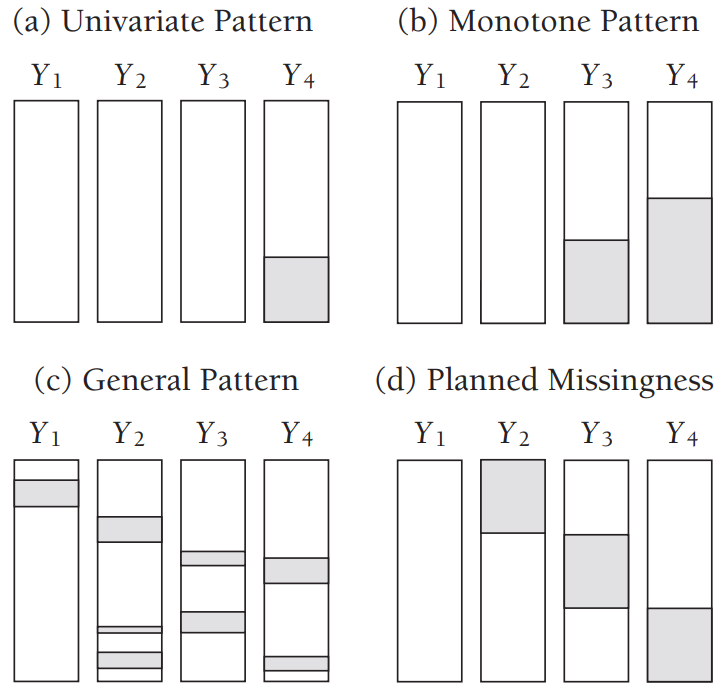
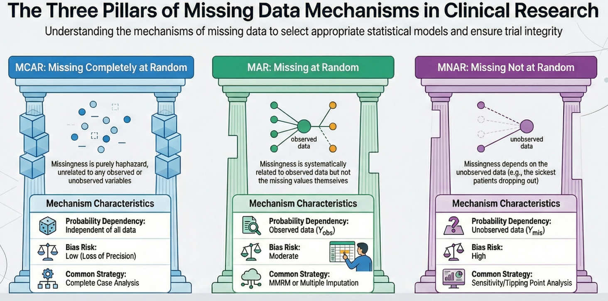
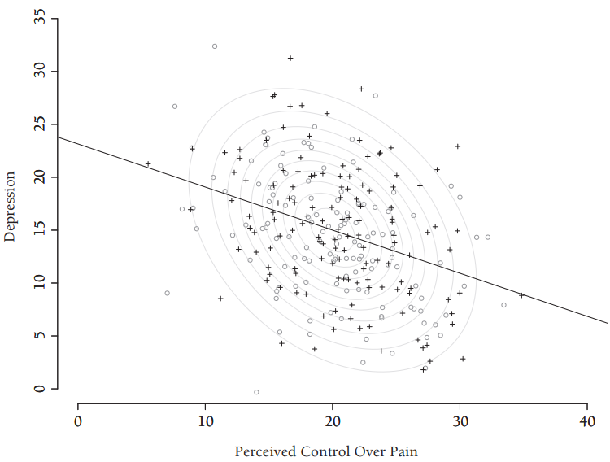
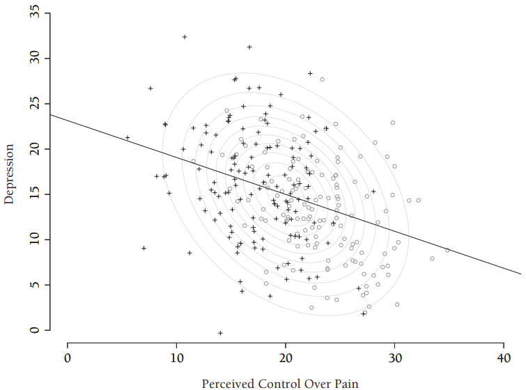
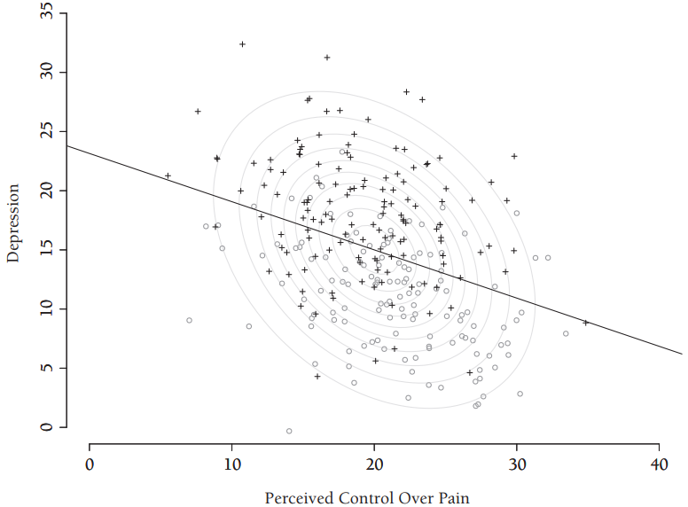

# 数据缺失模式与机制

## 1. 缺失模式

缺失数据模式（Missing Pattern）指的是数据集中观测值与缺失值的分布形态。这一概念需要与数据缺失机制（Missing Mechanism）区分开，后者描述的是数据本身与缺失倾向之间可能存在的关联。简而言之，缺失模式描述的是数据中的"空洞"位于何处，而缺失机制则解释数值为何缺失。

下图展示了四种典型的缺失数据模式，其中阴影区域代表缺失值所在位置。

<u>**单变量缺失（Univariate Missing）**</u>

图a中的单变量模式表现为缺失值仅集中在单一变量上，而其他所有变量都是完整的。例如在一个试验设计中，所有的协变量（如年龄、性别、基线特征）都已收集，唯独主要结局指标在部分受试者中缺失。单变量模式是统计学文献中最早受到关注的缺失数据问题之一，许多经典著作都专述此议题。

**<u>单调缺失（Monotone Missing）</u>**

图b显示了纵向研究中的单调缺失模式：在特定测量时点出现缺失数据的个体，其后续测量值将全部缺失。其数据结构的特点是：可以将变量重新排列，使得如果在变量 $Y_j$ 上有缺失值，则在所有后续变量$Y_{j+1},\dots,Y_k$上也必然有缺失值。

典型的场景是：受试者因不良事件或疗效不佳在第3次随访时退出研究，因此第4、5、6次随访的数据全部缺失。

单调缺失的数据处理相对简单。不需要复杂的迭代算法（如MCMC），可以使用非迭代的方法（如参数回归插补或倾向得分方法）按顺序对变量进行插补。可以将多变量分布分解为一系列单变量条件分布的乘积来简化分析。

**<u>任意缺失（Arbitrary Missing）</u>**

图c展示的是数据的任意缺失模式，也称间歇性缺失（Intermittent Missing）或一般缺失（General Missing），缺失值散落于整个数据矩阵中。

处理任意缺失模式通常需要更复杂的计算方法，标准方法通常是假设联合分布（如多元正态分布），并使用马尔可夫链蒙特卡罗（MCMC）方法进行插补，或者使用链式方程多重插补（MICE/FCS），即为每个缺失变量指定一个条件分布进行迭代插补。此外，实践中还有一种常见的策略，即先将任意缺失模式填补成单调缺失模式，然后再进行后续处理。

**<u>计划缺失（Planned Missing）</u>**

图d展示了计划缺失模式：三个变量在大部分受访者中被刻意设置为缺失。计划缺失设计能降低受访者负担与研究成本，且对统计功效的影响往往微乎其微。

典型的场景如：

- **矩阵抽样（Matrix Sampling）**：将一份长问卷分成几个部分，每个受试者只回答其中一部分，不同受试者回答的部分不同。
- **昂贵检测**：在一项大型研究中，仅对随机抽取的子集样本进行昂贵的生物标志物检测，其余样本该数据“缺失”。

这种缺失通常属于**完全随机缺失（MCAR）**，因为缺失是由随机化机制决定的，与受试者特征无关，因此不会引入偏倚。

## 2. 缺失机制

根据Donald Rubin确立的统计学框架，**数据缺失机制（Missing Data Mechanisms）**描述了“数据为什么会缺失”，即数据缺失的概率与数据本身（包含已观测值和未观测值）之间的概率关系。

理解缺失机制是选择正确统计分析方法的前提。根据缺失概率对数据的依赖程度，缺失机制主要分为三类：完全随机缺失 (Missing Completely at Random, MCAR)、随机缺失 (Missing at Random, MAR)、非随机缺失 (Missing Not at Random, MNAR)。

### 2.1 完全随机缺失

数据缺失的概率**完全独立**于该数据集中的任何变量，既不依赖于已观测到的数据（$Y_{obs}$），也不依赖于未观测到的缺失数据本身（$Y_{mis}$），数学表达为：$P(R|Y_{obs},Y_{mis})=P(R)$，其中$P(R)$为变量缺失的概率。此类缺失是纯粹的随机事件，类似于掷硬币。

下图为完全随机缺失模式的图示，X为疼痛控制感知评分变量，Y为抑郁评分变量，图中圆圈为代表完整个案（两个变量都有观测值），黑色十字标记则代表具有疼痛控制感知评分但无抑郁评分的部分数据记录。该图展示了完全随机缺失过程，缺失值在整个分布中呈非系统性分散状态，使得圆圈与十字标记完全重叠，两者的中心趋势、离散程度及关联性均无差异。该图表直观说明：观测数据可视为假设完整数据集的一个简单随机样本。

典型的场景包括：

- 实验室样本在运输过程中意外打碎或丢失。
- 测量设备发生随机性的故障（与受试者状态无关）。
- 受试者因与健康状况无关的原因（如搬家、工作调动）搬离研究区域而失访。

完全随机缺失的统计特征：

- **无偏性**：在MCAR下，观测到的数据可以被视为原始样本的一个随机子集。因此，简单的分析（如计算均值）通常是无偏的。
- **效率降低**：虽然不会引入偏倚，但样本量的减少会导致统计效能下降和标准误增大。
- **可检验性**：MCAR是唯一可以通过数据本身进行检验的机制（例如Little's MCAR检验），通过比较缺失组与非缺失组在其他变量上的差异来验证。

### 2.2 随机缺失

随机缺失是一个容易让人产生误解的术语。它并不意味着缺失是“随意的”，而是指在**控制了已观测数据（$Y_{obs}$）之后**，数据缺失的概率与未观测到的缺失值（$Y_{mis}$）无关。换句话说，缺失的系统性差异可以用已收集到的变量来解释，数学表达为：$P(R|Y_{obs},Y_{mis})=P(R|Y_{obs})$。

下图为随机缺失模式的图示，抑郁评分缺失概率随疼痛控制感知度的降低而增加，缺失评分主要集中于等高线图的左侧区域。此时，圆圈（双变量完整案例）已不能代表假设的完整数据，因为在疼痛控制感知分布的高分区域存在过多数据，而低分区域则数据过少。但在控制已观测的变量（疼痛控制感知评分）后，抑郁评分的观测值与未观测值具有相同分布（即两组评分遵循相同的条件分布）。

典型的场景如下：

- **基于人口学特征**：在抑郁症调查中，男性比女性更不愿意填写问卷。如果“性别”已被记录，且在同一性别内部，回答与否与抑郁程度无关，则属于MAR。
- **基于既往疗效**：在临床试验中，患者因疗效不佳而退出。如果“疗效不佳”已经通过之前访视的测量值（如基线或前次随访的评分）体现出来，且模型纳入了这些测量值，则可视为MAR。

随机缺失的统计特征：

- **可忽略性（Ignorability）**：如果假设数据是MAR，并且模型参数与缺失机制参数是独立的，那么缺失机制通常被认为是“可忽略的”。
- **分析要求**：直接剔除缺失值的“完整病例分析”（Complete Case Analysis）在MAR下通常会导致**有偏估计**。必须使用利用所有可用数据的统计方法（如混合效应模型MMRM或多重插补MI）才能得到无偏估计。

### 2.3 非随机缺失

非随机缺失是指数据缺失的概率**依赖于未观测到的缺失值本身**，即使在控制了所有已观测数据后，这种依赖关系依然存在。这是最难处理的情况，也被称为“不可忽略的缺失”（Non-ignorable），数学表达为$P(R|Y_{obs},Y_{mis})$ 无法简化，必须包含$Y_{mis}$项。

下图为非随机缺失模式的图示，抑郁评分缺失主要集中于等高线图上半部、回归线上方的区域。此时圆圈显然已不能代表假设的完整数据。与规定“在控制其他变量后观测值与缺失值具有相同分布”的条件性随机缺失机制不同，非随机缺失过程意味着两组评分具有不同的分布特征：绝大多数缺失评分位于回归线上方，而完整数据则主要分布在回归线下方。这一特征使得数据填补变得尤为困难，因为缺乏可用于估计缺失数据分布独特参数的参考数据。

例如：若仅利用疼痛控制感知评分进行填补，生成的填补值将随机分布于回归线两侧；而在未掌握缺失抑郁值信息的情况下，我们也无法制定恰当的调整方案。因此，针对非随机缺失过程的分析方法只能通过引入对未观测数据相对较强的假设来应对这种不确定性。

典型场景如下：

- **因病重缺失**：在生活质量调查中，患者因为病情太重、太虚弱而无法来医院填写问卷。这里“无法填写”直接取决于当前的“健康状况”（即缺失值本身）。
- **敏感数据**：高收入人群在调查中更有可能拒绝回答收入问题。
- **不良事件导致的脱落**：患者因药物副作用（未被观测到或记录）而退出试验。

非随机缺失的统计特征：

- **严重偏倚**：常规的统计方法（包括MMRM和标准MI）在MNAR下会产生有偏估计。
- **不可检验性**：无法通过观测数据本身来区分数据是MAR还是MNAR，因为关键信息本身就缺失了。
- **处理策略**：必须进行敏感性分析（Sensitivity Analysis），通过引入额外的假设（如模式混合模型PMM或选择模型Selection Models）来评估结论的稳健性。

### 2.4 总结对照

| 特征         | 完全随机缺失 (MCAR)            | 随机缺失 (MAR)                     | 非随机缺失 (MNAR)                     |
| ------------ | ------------------------------ | ---------------------------------- | ------------------------------------- |
| **缺失原因** | 与任何数据均无关（纯随机）     | 与**已观测**数据相关               | 与**未观测**数据（缺失值本身）相关    |
| **例子**     | 试管摔碎、设备故障             | 因之前疗效差（已记录）而退出       | 因当前病情重（未记录）而无法来访      |
| **偏倚风险** | 无偏（但降低精度）             | 若处理不当（如仅用完整病例）会有偏 | 严重偏倚                              |
| **推荐方法** | 完整病例分析（虽然低效但无偏） | **MMRM**, **多重插补 (MI)**        | **敏感性分析** (如 Tippng Point, J2R) |
| **可检验性** | 可通过统计检验验证             | 不可验证（依赖假设）               | 不可验证                              |

在临床试验中，监管机构（如FDA, EMA）通常不接受MCAR假设，因为这不太接近现实。默认的主要分析通常基于**MAR假设**，并强制要求通过敏感性分析来探索数据可能是**MNAR**的情况，以证明试验结论的可靠性。