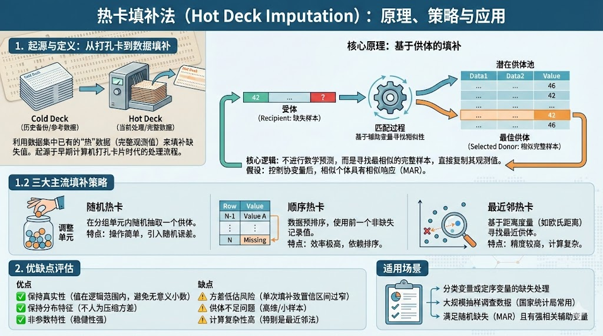

# 热卡填补法（Hot Deck Imputation）

在众多的单一填补方法中，“热卡填补法”（Hot Deck Imputation）以其独特的“借用”逻辑和分布保持特性，成为了一种经典且广泛应用的非参数方法。



## 1. 什么是热卡填补

热卡填补法，顾名思义，是一种利用数据集中已有的“热”数据（即当前正在处理的、主要变量完整的观测值）来填补缺失值的方法。其名称起源于早期的计算机打孔卡片时代：当时的数据存储在纸质卡片堆（Deck）中，待处理的当前卡片堆被称为“Hot Deck”，而用于备份或参考的历史数据卡片堆被称为“Cold Deck”。

### 1.1 核心定义与原理

从统计学原理上看，热卡填补属于**基于供体（Donor-based）**的填补技术。其核心逻辑并非通过数学模型（如回归方程）预测出一个新的数值，而是从数据集中寻找一个或多个与缺失样本（Recipient）在特征上最为相似的完整样本（Donor），直接将供体的观测值复制给受体。

这种方法基于一个关键假设：在控制了相关协变量后，缺失机制是随机的（MAR），且相似的个体具有相似的响应值。

### 1.2 填补策略

在实际操作中，确定“哪一个样本是合适的供体”通常有以下几种常见策略：

- **随机热卡（Random Hot Deck）**：在由辅助变量定义的“调整单元”（Adjustment Cell）内，随机抽取一个供体进行填补。这种方法操作简单，但可能引入额外的随机误差。
- **顺序热卡（Sequential Hot Deck）**：数据预先按照辅助变量排序，当遇到缺失值时，直接使用该记录在排序中**前一个**非缺失记录的值进行填补。这种方法计算效率极高，但对排序的依赖性较强。
- **最近邻热卡（Nearest Neighbor Hot Deck）**：基于某种距离度量（如欧氏距离、马氏距离或预测均值匹配 PMM），在全局或局部范围内寻找与缺失样本距离最小的供体。这是目前精度较高的一种策略。

## 2. 优缺点及适用场景

**<u>优点</u>**

*   **保持真实性**：热卡填补的值来自真实的观测记录，因此填补后的值绝不会超出变量的定义域或逻辑范围。这对于离散型变量（如性别、职业代码）或整数型变量尤为重要，因为它避免了均值填补产生的无意义小数（例如“2.5 个孩子”）。
*   **分布特征保持**：与均值填补极大地压缩方差不同，热卡填补能够较好地保留原始变量的分布形态（Distribution Shape）和方差结构，不会人为地制造“尖峰”分布。
*   **非参数特性**：该方法不需要假设数据服从正态分布或特定的函数形式，具有较强的稳健性。

**<u>缺点</u>**

*   **方差低估风险**：虽然比均值填补好，但在进行推断统计时，如果不使用重采样（Resampling）或多重填补（Multiple Imputation）技术，普通的单次热卡填补仍倾向于低估估计量的标准误（Standard Error），导致置信区间过窄，增加了第一类错误（Type I Error）的风险。
*   **供体不足问题**：在高维数据或样本量较小的情况下，可能难以找到足够相似的“供体”，导致匹配质量下降。
*   **计算复杂性**：尤其是最近邻热卡，在大规模数据集上计算所有样本对之间的距离矩阵，计算成本较高。

**<u>适用场景</u>**

热卡填补法特别适用于以下场景：

- 分类变量或定序变量的缺失处理，需要填补值必须是合法的类别代码。
- 大规模调查数据（Survey Data），由于其非参数特性，常被国家统计局或普查机构用于处理复杂的抽样调查数据。
- 缺失机制接近随机缺失（MAR），且存在与缺失变量强相关的辅助变量可用于构建调整单元或计算距离。

## 3. 示例

以下分别展示在统计分析领域常用的 R 语言 和 SAS 中实现热卡填补的方法。

在 R 中，`VIM` 包提供了 `hotdeck` 函数，支持基于排序和距离的填补。

```r
# 安装并加载必要的包
# install.packages("VIM")
library(VIM)
library(dplyr)

# 构造一个含有缺失值的示例数据集
set.seed(123)
data <- data.frame(
  Age = sample(20:60, 10),
  Income = c(5000, 5200, NA, 5800, NA, 6200, 6500, 7000, NA, 7500),
  Gender = c("M", "M", "F", "F", "M", "F", "M", "F", "M", "F")
)

# 查看原始数据
print("原始数据:")
print(data)

# 使用 VIM 包进行热卡填补
# variable: 需要填补的变量
# domain_var: 用于匹配的辅助变量（即在 Gender 相同的组内寻找供体）
imputed_data <- VIM::hotdeck(
  data, 
  variable = "Income", 
  domain_var = "Gender" 
)

# 查看填补后的数据
# 结果中会额外生成一个 Income_imp 列，标记该行是否为填补值
print("填补后数据:")
print(imputed_data %>% select(Age, Income, Gender))
```

SAS 提供了专门的 `PROC SURVEYIMPUTE` 过程步，是处理调查数据填补的标准工具，支持热卡填补。

```sas
/* 构造示例数据 */
data survey_data;
    input ID Gender $ Age Income;
    datalines;
    1 M 25 5000
    2 M 30 .
    3 F 28 5500
    4 F 35 .
    5 M 40 6000
    6 M 22 4800
    7 F 29 5200
    8 F .  5800
    ;
run;

/* 使用 PROC SURVEYIMPUTE 进行热卡填补 */
proc surveyimpute data=survey_data method=hotdeck(selection=weighted) seed=12345;
    /* CELLS 语句定义调整单元，即在 Gender 和 Age 分组内寻找供体 */
    /* 注意：若 Age 是连续变量，通常需先离散化处理或不放入 Cells */
    class Gender; 
    cells Gender; 
    
    /* 需要填补的变量 */
    var Income;
    
    /* 输出结果数据集 */
    output out=imputed_result;
run;

/* 查看结果 */
proc print data=imputed_result;
    title "SAS Hot Deck Imputation Results";
run;
```

在 SAS 的 `method=hotdeck` 选项中，还可以配合 `selection=abb` (Approximate Bayesian Bootstrap) 等参数来引入变异性，从而更好地估计标准误。
