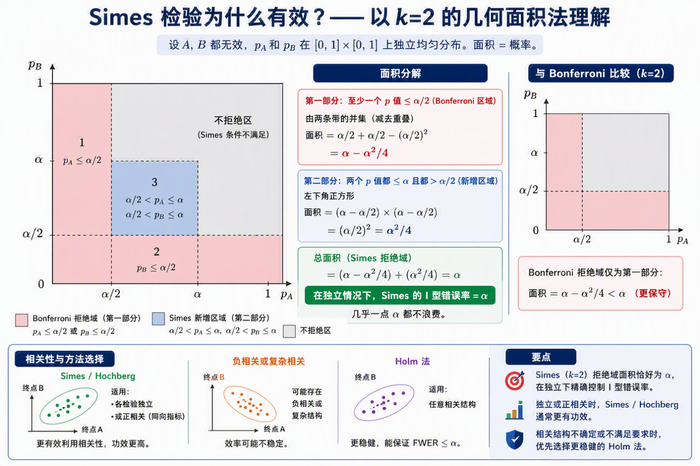
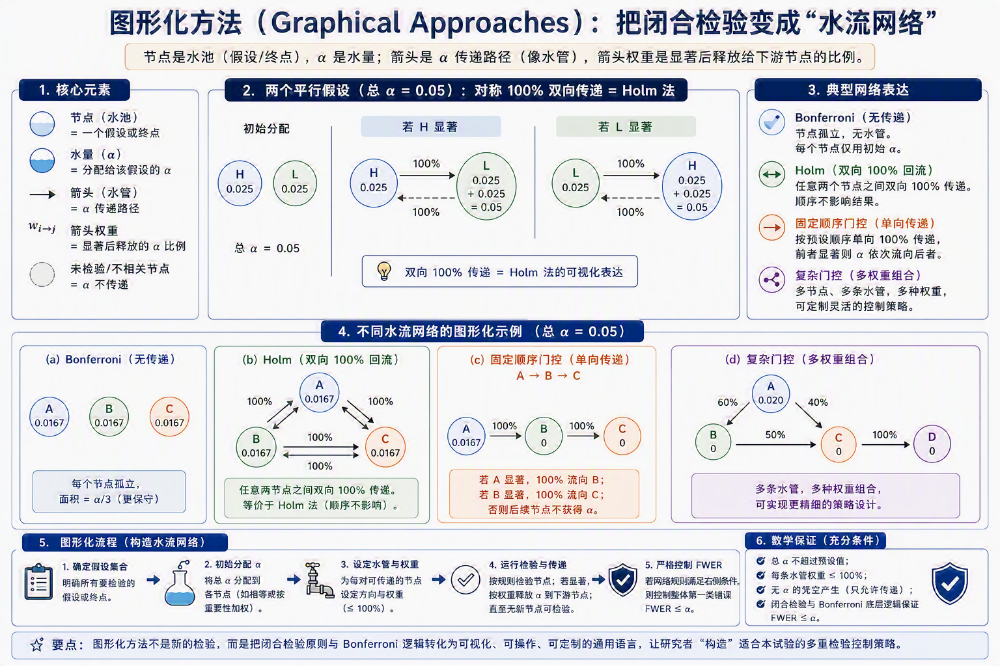
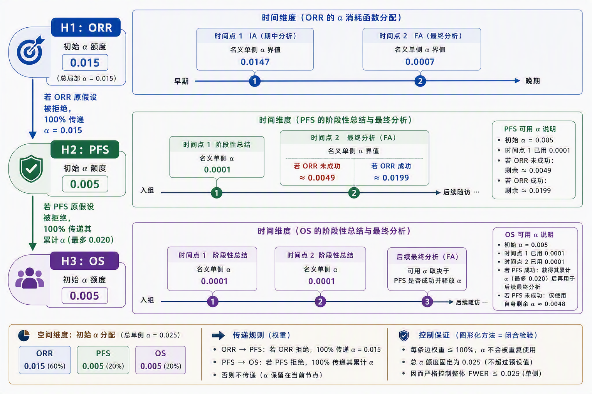
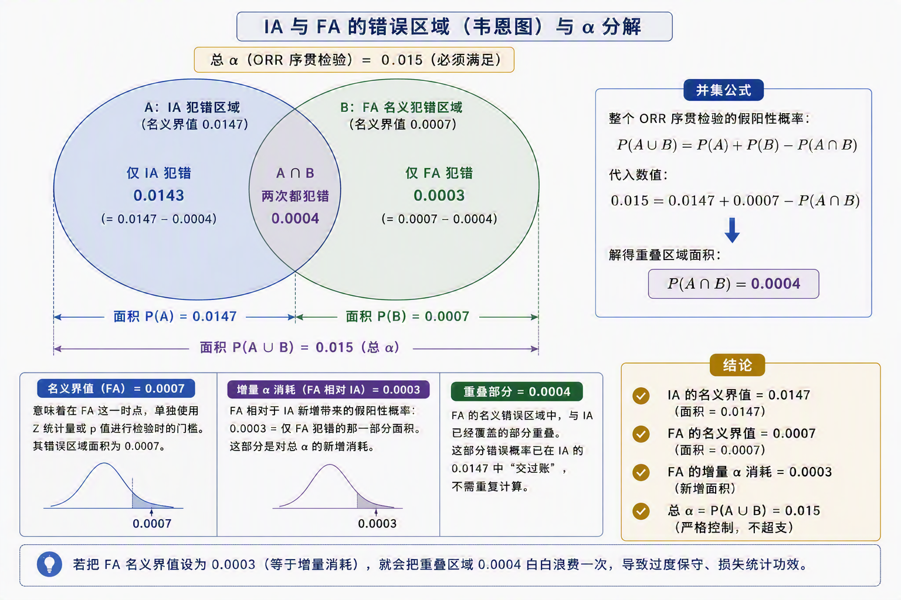

# 临床试验多重性问题的入门方法学

临床试验中的多重性问题，是现代新药研发里一个非常核心、也非常容易被低估的问题。它表面上看只是“多做了几个统计检验”，但真正影响的是一个临床试验最根本的可信度：我们有没有因为多看了几个终点、多试了几个剂量、多偷看了几次数据，而把一个本来无效的药误判成了有效。

如果只做一个检验，我们通常把第一类错误率，也就是假阳性风险，控制在 α=0.05 或单侧 α=0.025。它的含义很朴素：如果药物其实没有真实疗效，试验却因为随机波动得出“有效”的概率，被限制在 5% 以内。但临床试验通常不会只看一个问题：一个抗肿瘤药可能同时看 ORR、PFS、OS；一个剂量探索试验可能同时比较高剂量和低剂量；一个成组序贯设计还可能在期中分析和最终分析时反复查看同一个终点。只要我们允许“只要其中一个检验显著，就宣布试验成功”，假阳性风险就会膨胀。

这就是多重性问题的核心：**不是每一次检验本身失控，而是整个检验家族中“至少犯一次错”的概率失控。**这个“至少犯一次错”的概率，通常称为族系错误率，也就是 FWER（Family-Wise Error Rate）。如果我们独立进行了 k 次检验，每次都用 α=0.05，只要有一次阳性就算成功，那么整体错误率就不再是 0.05，而是：

$$
FWER=1-(1-\alpha)^k
$$
例如做 5 次独立检验：
$$
FWER=1-(1-0.05)^5 \approx 0.2262
$$
也就是说，一个完全无效的药，仅仅因为你给了它 5 次“碰运气”的机会，就有约 22.6% 的概率至少在一个指标上做出显著结果。这就像扔飞镖：只扔一次，靠运气击中靶心的概率是 5%；如果给你扔 5 次，只要有一次击中就算赢，那么赢的概率当然会大幅上升。

因此，多重性控制的本质就是在“不放过假药”和“不错批好药”之间找平衡。方法学的发展，也正是围绕这个平衡不断演进：从最简单的 Bonferroni 校正，到 Holm、Hochberg、闭合检验原则、门控法、图形化方法，再到与成组序贯设计结合的 α 消耗函数。

## 一、Bonferroni 法：最朴素的策略

最经典、最直接的多重性控制方法是 Bonferroni 校正。它的逻辑非常简单：既然你要做 k 次检验，那就把总体 α 平均分给每一次检验。也就是说，每个单独检验的显著性门槛从 α 变成 α/k。这类似于在你多次扔飞镖的同时，要求缩小靶心的尺寸。

如果一个关节炎新药试验设置了 3 个疗效终点：疼痛缓解、关节肿胀减轻、日常活动度提升。我们希望整个试验的 FWER 不超过 0.05，那么按照 Bonferroni：每个终点的门槛 = 0.05 / 3 ≈ 0.0167，只有某个终点的 p 值小于 0.0167，才可以说它在多重性校正后达到统计学显著。

**为什么这样可以控制总第一类错误率**？这里用到的是布尔不等式，也叫联合界（Union Bound）：
$$
P(A 或 B 或 C) <= P(A) + P(B) + P(C)
$$
其中 A、B、C 分别代表三个检验犯假阳性错误。FWER 关心的是“至少一个检验犯错”，也就是 A 或 B 或 C 发生的概率。Bonferroni 的做法就是让每一个错误事件的概率都不超过 α/3，于是：
$$
FWER <= α/3 + α/3 + α/3 = α
$$
这个结论不依赖三个指标之间是否独立。即使它们相关，即使它们重叠，联合界依然成立。所以 Bonferroni 的最大优点就是稳，它几乎不挑数据结构，只要按规则来，总体错误率就能被压住。

我们还可以看一个具体计算。假设三个指标完全独立。如果不校正，每个指标都用 0.05：

- 单次不犯错概率 = 1 - 0.05 = 0.95
- 三次都不犯错概率 = 0.95^3 ≈ 0.8574
- 实际 FWER = 1 - 0.8574 = 0.1426

也就是说，实际错误率约为 14.26%，远远超过 5%。

如果使用 Bonferroni，每个指标使用 0.05/3≈0.01667：

- 单次不犯错概率 = 1 - 0.01667 = 0.98333
- 三次都不犯错概率 = 0.98333^3 ≈ 0.9508
- 实际 FWER = 1 - 0.9508 = 0.0492

实际 FWER 约为 4.92%，被严格控制在 5% 以内。

但 Bonferroni 的问题也很明显：它太保守。靶心被缩小后，不仅假药更难蒙混过关，真正有效的好药也更容易“脱靶”。一个原本 p=0.03 的疗效结果，在普通 0.05 门槛下显著，但在 3 个终点的 Bonferroni 校正下就不显著了。这种“药物实际有效，但试验没能证明有效”的错误，就是第二类错误（Type II Error，β）。统计功效 Power 则是：Power = 1 - β。

Bonferroni 严防第一类错误率的代价，就是提高第二类错误率，降低统计功效。所以方法学的下一步自然就是考虑：**能不能在不放松 FWER 控制的前提下，少浪费一点 α**？

## 二、Holm 法：从静态阈值到动态阈值

Holm 法，也叫 Holm-Bonferroni Step-down Procedure，是 Bonferroni 的重要改进。

Bonferroni 对所有检验一视同仁，每个都用 α/k。Holm 法则先把所有 p 值从小到大排序，然后逐步检验。越靠前的 p 值，门槛越严；只要前面的检验通过，后面的门槛就逐渐放宽。

假设有 k 个 p 值，排序后为：
$$
p(1) <= p(2) <= ... <= p(k)
$$
Holm 法的门槛是：

- 第 1 个：α/k
- 第 2 个：α/(k-1)
- 第 3 个：α/(k-2)
- ......
- 最后 1 个：α

一旦某一步失败，后面全部停止并判定不显著。举一个 3 个指标的例子（总 α = 0.05）

- 指标 A：p = 0.012
- 指标 B：p = 0.022
- 指标 C：p = 0.045

第一步，最小的 A 去比较：0.05 / 3 ≈ 0.0167，因为 0.012 < 0.0167，所以 A 显著。

第二步，B 去比较：0.05 / 2 = 0.025，因为 0.022 < 0.025，所以 B 也显著。

第三步，C 去比较：0.05 / 1 = 0.05，因为 0.045 < 0.05，所以 C 也显著。

同样一组数据，如果用 Bonferroni，三个指标都必须小于 0.0167，那么只有 A 显著。Holm 法却能让 A、B、C 全部显著。这就是动态放宽门槛带来的统计功效提升。

但问题来了：**门槛放宽了，为什么 FWER 不会膨胀**？

直观解释是：Holm 法认为，当最显著的指标已经通过最严苛的门槛后，它不再像一个“假阳性陷阱”那样需要占用同样多的安全防守。剩下还可能犯错的指标数量减少了，于是 α 可以安全地重新分配给剩下的检验。不过这个说法只是直觉。Holm 法真正的底层逻辑来自**闭合检验原则**。

## 三、闭合检验原则：多重性控制的底层逻辑

闭合检验原则（Closed Testing Principle, CTP）是理解现代多重检验方法的底层框架。它看起来抽象，但可以用一个“打假通关赛”的类比理解。

假设我们有三个指标 A、B、C。监管审查员的默认立场是：这些指标可能全都没效。如果你想证明 A 有效，不能只拿 A 自己的数据说服审查员。你必须推翻所有“包含 A 的无效假设”。

对于 A 来说，需（在总α水平上）推翻：

- $H_{ABC}：A、B、C 全都无效$
- $H_{AB}：A、B都无效$
- $H_{AC}：A、C都无效$
- $H_{A}：仅A无效$

只有这些关卡全部打通，A 才能被宣布显著。对于 B 来说，需要推翻：$H_{ABC}、H_{AB}、H_{BC}、H_{B}$。对于 C 来说，需要推翻：$H_{ABC}、H_{AC}、H_{BC}、H_{C}$。

这就是“闭合”的含义：每个单独假设的显著性，都被它所在的所有上层组合假设绑定住。你不能绕过上层组合，直接挑一个最低层的 p 值宣布胜利。

**为什么不能直接检验 A**？因为如果 A、B、C 全部无效，你直接分别用 0.05 检验 $H_A$、$H_B$、$H_C$，就又回到了“广撒网”的问题。A 有 5% 概率靠运气显著，B 有 5%，C 有 5%，至少错批一个的概率会膨胀到约 14.26%。

闭合检验强制你先面对上层组合假设。最高层 $H_{ABC}$ 的意义是：你必须先证明“这一组指标里整体确实存在疗效信号”，而不是你测了三个东西后碰巧撞出一个阳性。

更关键的是，闭合检验为什么可以对每个组合假设使用完整 α=0.05，而不再次产生多重性膨胀？答案在于“真实交集假设”的总闸门。

在现实世界中，不管你测了多少指标，总有一些指标是真正无效的。把所有真正无效的指标打包在一起，会形成一个真实的交集假设。只要你要犯一次假阳性错误，比如把无效的 A 判成有效，根据闭合检验规则，你就必须推翻所有包含 A 的假设，其中必然包括那个由所有真实无效指标构成的“总闸门”。

这个总闸门本身是一个真实零假设。我们用 α=0.05 去检验它，错误推翻它的概率最多就是 5%。于是，不管下面还有多少子关卡，只要想犯假阳性错误，就必须先突破这个真实假设的总闸门。既然总闸门的漏出概率不超过 α，整个 FWER 也就不超过 α。

这就是闭合检验的精妙之处：它不是靠少做检验来控制错误率，而是靠逻辑结构把所有可能的假阳性路径收拢到一个真实闸门上。

## 四、Holm 法与闭合检验的关系：快捷算法

Holm 法其实就是闭合检验原则的一个快捷算法。闭合检验给出完整的通关地图，而 Holm 法用“排序 + Bonferroni”帮你自动完成这张地图里的关键关卡。

继续用 A、B、C 的例子：$\alpha = 0.05, p_A = 0.012, p_B = 0.022,p_C=0.045$。

按照闭合检验，如果要证明所有指标有效，需要推翻：$H_{ABC}、H_{AB}、H_{AC}、H_{BC}、H_{A}、H_{B}、H_{C}$。

每个组合假设都可以用 Bonferroni 作为基础。例如面对 $H_{ABC}$（3 个指标全没效），只要三个指标中最小的 p 值小于 0.05/3，就能推翻 $H_{ABC}$。面对 $H_{BC}$（2 个指标都没效），只要 B、C 中最小的 p 值小于 0.05/2，就能推翻。

Holm 第一步拿最小的 $p_A = 0.012$ 去比 0.05/3≈0.0167。它表面上只是在检验 A，实际上在 CTP 地图里，A 的这个极小 p 值同时推翻了多个假设：

- $H_{ABC}：0.012 < 0.0167$
- $H_{AB}：0.012 < 0.025$
- $H_{AC}：0.012 < 0.025$
- $H_{A}：0.012 < 0.05$

所以 A 已经完成了所有与自己有关的通关任务。

Holm 第二步拿 $p_B=0.022$ 去比 0.05/2=0.025。此时 $H_{ABC}、H_{AB}、H_{AC}$ 已经被 A 推翻了。B 还需要面对的关键组合关卡是 $H_{BC}$。HBC 是双指标组合，Bonferroni 门槛正是 0.05/2=0.025。因为 0.022 < 0.025，B 推翻了$H_{BC}$，同时也能相应推翻$H_B$。

Holm 第三步只剩 C。前面的三指标组合和双指标组合都已经被推翻，C 只需要面对 $H_C$，门槛是完整 0.05。因为 0.045 < 0.05，C 也显著。

所以 Holm 法并没有绕开闭合检验。它是在闭合检验原则允许的逻辑里，用一种排序算法把复杂的组合检验简化了。

## 五、Bonferroni 与闭合检验：工具与方法论

Bonferroni 和闭合检验不是同一层级的东西：闭合检验原则是一套规则框架，它告诉你需要检验哪些组合假设，以及什么时候可以宣布某个单独假设显著。Bonferroni 是一个具体的局部检验工具。站在某个组合假设面前，比如 $H_{ABC}$或 $H_{BC}$，你仍然需要一种方法判断这个组合假设能不能被拒绝。Bonferroni 就是最常用、最稳健的基础工具。

这个层级关系非常重要。后面的 Hochberg、门控法、图形化方法，其实也都可以放进这个框架里理解。

## 六、Hochberg 法：从最大的 p 值开始的 Step-up 方法

Holm 法是 Step-down：从最小的 p 值开始，门槛逐步放宽。Hochberg 法是 Step-up：从最大的 p 值开始，门槛逐步收紧。它的规则更“慷慨”，统计功效也通常更高。假设有 k 个指标。Hochberg 法把 p 值从大到小看：

- 最大 p 值 <= α：全部显著
- 否则，第二大 p 值 <= α/2：它和所有更小的 p 值显著
- 否则，第三大 p 值 <= α/3：它和所有更小的 p 值显著
- ......

例如两个指标：$p_A=0.03, p_B=0.04, \alpha=0.05$。

Holm 法会先拿最小的 0.03 去比 0.025，失败，所以两个都不显著。Hochberg 法先拿最大的 0.04 去比 0.05，成功，于是 A 和 B 全部显著。

这看起来非常大胆。它为什么能控制 FWER？底层仍然是闭合检验原则，只不过对于组合指标的假设检验工具不再是 Bonferroni，而是 Simes 检验。

Simes 检验的规则是：对于一个包含 k 个 p 值的组合假设，把 p 值从小到大排好。如果存在任意一个 i，使得：$p(i)\le i\alpha/k$，那么这个组合假设就可以被拒绝。

以两个指标 A、B 为例，面对 $H_{AB}$（A 和 B 都没效），Simes 推翻该假设的条件是：$p(1)\le \alpha/2$ 或 $p(2)\le \alpha$ ，在 $p_A=0.03, p_B=0.04$的例子里：

- p(1)=0.03 > 0.025
- p(2)=0.04 <= 0.05

所以$H_{AB}$ 被拒绝。接下来 $H_A$ 和 $H_B $是单个假设，可以各自用完整 0.05来检验。$p_A $ 和 $p_B$ 都小于 0.05，于是两个指标都显著。

**Simes 检验为什么有效**？可以用 k=2 的几何面积法理解。如果 A、B 都无效，$p_A $ 和 $p_B$  在 0 到 1 的正方形里均匀分布。Simes 的拒绝条件包含两块区域：

第一块：至少一个 p 值小于 α/2。面积为：
$$
\alpha/2+\alpha/2-(\alpha/2)^2=\alpha-\alpha^2/4
$$
第二块：两个 p 值都小于 α，但两个都大于 α/2 的新增区域。面积为：
$$
(\alpha/2)^2=\alpha^2/4
$$
两块面积加起来正好是α，所以在独立情况下，Simes 的拒绝区域面积刚好等于 α，几乎一点 α 都不浪费。Bonferroni 只覆盖第一块区域，因此更保守。

不过 Hochberg 法有条件：它通常要求各检验独立或正相关。临床终点之间如果是同一药物作用下的同向指标，常常存在正相关，这时 Simes/Hochberg 可以更有效地利用这种相关性。但如果相关结构不满足要求，则Holm 更稳健。



用三个指标再看 Hochberg：$\alpha=0.05, p_A=0.060, p_B=0.022, p_C=0.015$，从大到小排序依次为$p_C, p_B, p_A$

第一步：$p_C $和 0.05 比，失败，所以 C 不显著，继续。

第二步：$p_B$ 和 0.025 比，成功。于是 B 和比 B 更小的 A 都显著。

从 CTP 视角看，$p_B$ 的成功帮助推翻了最高层 $H_{ABC}$，因为 Simes 对 $H_{ABC}$的条件之一是：$p_B \le 2\alpha/3 \approx 0.0333$。它也能帮助推翻  $H_{BC}$，因为在双指标组合  $H_{BC}$ 中：$p_B \le \alpha/2 = 0.025$。

而 A 之所以能“跟着显著”，不是因为它搭便车，而是因为 $p_A$ 比 $p_B$ 更小。既然 $p_B$ 能跨过某些 Simes 门槛，$p_A$ 在所有包含 A 的组合关卡里通常也有足够的数值优势去跨过对应门槛。

## 七、门控法：把临床优先级写进统计顺序

前文的 Bonferroni、Holm、Hochberg 主要是在统计层面处理多个假设。但真实临床试验中，不同终点的临床价值并不一样。

例如抗癌试验里：

- OS（总生存期）：病人活得更久，临床价值最高
- PFS（无进展生存期）：肿瘤更久不恶化，重要但通常次于 OS
- ORR（客观缓解率）：肿瘤缩小，出现较早，但常是替代或支持证据

门控法（Gatekeeping Procedure）就是把这种“轻重缓急”转化为统计检验顺序。最简单的门控法是固定顺序检验，也叫**串行门控**：A -> B -> C。必须先检验 A，A 显著后才能检验 B，B 显著后才能检验 C。如果 A 失败，后面的大门直接关闭。

这可以非常有效地控制 FWER，因为后续检验只有在前面成功时才有资格进行。但它的设计必须尊重临床逻辑。如果把 PFS 放在 OS 前面，就可能出现一种尴尬情况：PFS 没过关，但 OS 很强，药物确实能延长生命。由于 PFS 的门没有打开，OS 反而失去了正式检验资格。这在临床上可能非常不合理。所以固定顺序门控一般会把最关键、最不能错过的终点放在前面。若 OS 是核心获益，就应优先保护 OS，而不是让次级终点挡住它。

但门控法不等于固定顺序检验。固定顺序只是门控法家族里最简单的一种。更复杂的门控包括：

- 并行门控：多个主要终点共同守门，任意一个或若干个成功即可打开后续
- 树状门控：先总体人群，再分亚组；或先主要终点，再分支到多个次要终点

门控法的核心不是“必须一条线走到底”，而是用统计规则表达临床优先级。

## 八、图形化方法：把 CTP 和门控变成水池与水管

现代复杂临床试验往往有多个剂量、多个终点、多个时间点。如果用闭合检验手写所有组合假设，会非常庞大。

如果有 3 个假设，需要检验：2^3 - 1 = 7 个交集假设；如果有 6 个假设，则是：2^6 - 1 = 63 个交集假设。这在实际方案设计里很容易写错、算错、解释错。

图形化方法（Graphical Approaches）解决的是这个工程问题。它不是凭空发明了一种新的底层 p 值检验，而是把闭合检验原则和 Bonferroni 这套底层逻辑，转化成一套可视化、可操作、可定制的“水流网络”。

在图形化方法里：

- 节点 = 一个假设或终点，像一个水池
- 节点里的水 = 分配给该假设的 α
- 箭头 = α 传递路径，像水管
- 箭头权重 = 如果当前节点显著，释放出的 α 有多少比例流向下一个节点

例如两个平行假设 H 和 L，总 α=0.05。如果两个地位相同，可以初始各分配：H：0.025；L：0.025。

如果 H 显著，并且 H 到 L 的箭头权重为 100%，那么 H 的 0.025 会全部流向 L，L 的可用 α 变成：0.025 + 0.025 = 0.05。

如果 L 显著，也可以对称地把 0.025 全部流向 H。这个“双向 100% 传递”的图，本质上就是 Holm 法的可视化表达。这说明图形化方法不是一种孤立的新方法，而是一种通用表达语言：

- Bonferroni：几个水池孤立，没有水管
- Holm：水池之间可以相互 100% 回流
- 固定顺序门控：A 通过 100% 单向水管流向 B，再流向 C
- 复杂门控：多个节点、多条水管、多种权重组合

图形化方法的革命性在于，它让试验设计者从“寻找现成方法”变成了“构造适合本试验的控制策略”。只要图形规则满足总 α 不超过预设值、每个节点流出权重不超过 100% 等条件，水流网络就可以在数学上等价于一个严格控制 FWER 的闭合检验程序。



再看一个更贴近现代抗肿瘤 III 期试验的例子。假设一款药有两个剂量组：高剂量和低剂量；每个剂量组又各有两个终点：OS 和 PFS。于是整个试验有四个节点：

- $H_{OS}：高剂量 OS$
- $L_{OS}：低剂量 OS$
- $H_{PFS}：高剂量 PFS$
- $L_{PFS}：低剂量 PFS$

临床上，OS 是“病人是否活得更久”的硬终点，通常比 PFS 更核心。因此一种常见的初始策略是：把总 α=0.05 全部分给两个 OS 节点，例如：$H_{OS}:0.025, L_{OS}:0.025, H_{PFS}:0, L_{PFS}:0$。

PFS 节点一开始没有 α，不是因为它们不重要，而是因为它们在临床优先级上要等 OS 先打开局面。假设 $H_{OS}$ 首先显著，它释放出 0.025 的 α。此时设计者可以根据临床策略铺水管：一半给 $L_{OS}$，帮助确认低剂量是否也能延长生存；另一半给 $H_{PFS}$，解锁同一高剂量下的次要终点。

```text
HOS 成功后：
  0.025 × 50% = 0.0125 -> LOS
  0.025 × 50% = 0.0125 -> HPFS

此时：
  LOS 变成 0.025 + 0.0125 = 0.0375
  HPFS 从 0 变成 0.0125
```

这个例子很能体现图形化方法的优势：它不是简单地说“先看 OS，再看 PFS”，而是允许设计者把临床逻辑拆成更细的策略：既保住低剂量 OS 的核心证据，又给高剂量 PFS 一个被正式检验的机会。只要 α 的流动规则在试验前写清楚，并满足图形化方法的数学约束，这种看似灵活的网络仍然可以控制总体第一类错误率。

## 九、一个现代抗癌试验图谱：ORR、PFS、OS 的 α 传递

我们现在讨论一个很典型的较复杂的现代设计案例，它的多重性问题同时有空间维度和时间维度。

空间维度上，主要终点包括：客观缓解率ORR、无进展生存期PFS、总生存期OS，总单侧 α 控制在0.025，初始分配为：ORR 0.015、PFS 0.005、OS 0.005。传递规则是：

- 如果 ORR 原假设被拒绝，则 ORR 的 0.015 全部传递给 PFS
- 如果 PFS 原假设被拒绝，则 PFS 的 α 全部传递给 OS

这个设计的临床哲学是：ORR 出现早，适合作为早期突破点；PFS 需要更长随访，是疾病控制的关键证据；OS 是最终临床获益，但成熟最慢。于是方案把较多初始 α 给 ORR，一旦 ORR 成功，就把 α 传递给 PFS，再由 PFS 传递给 OS。

不过这个案例还不只是空间维度，还引入了时间维度：ORR 在时间点 1 做 IA，在时间点 2 做 FA（采用 α 消耗函数分配）；PFS 和 OS 在某些时间点有阶段性总结或最终分析。

最终的规则如下：

```text
ORR 总局部 α = 0.015
ORR IA 名义界值 = 0.0147
ORR FA 名义界值 = 0.0007

PFS 初始 α = 0.005
时间点 1 PFS 阶段性总结：名义单侧 α = 0.0001
如果 ORR 成功，PFS 在时间点 2 可用界值约为 0.0199
如果 ORR 不成功，PFS 在时间点 2 可用界值约为 0.0049

OS 初始 α = 0.005
时间点 1 和时间点 2 的阶段性总结各使用极小名义 α = 0.0001
如果 PFS 成功，PFS 持有的 α 再传递给 OS
```

PFS 的两个界值很好理解：如果 ORR 没显著，PFS 只能用自己的初始 0.005。时间点 1 已经用掉一个极小名义 0.0001，于是时间点 2 剩 0.0049。如果 ORR 显著，ORR 的 0.015 全部传给 PFS，PFS 总 α 量变成：0.005+0.015=0.020，扣掉时间点 1 的 0.0001，时间点 2 剩余0.0199。所以，在 ORR 成功时，PFS 的门槛会从 0.0049 大幅放宽到 0.0199。更完整的示意图如下：



整个案例里最值得关注的点是：为什么 ORR 已经在 IA 消耗 α，成功后仍能传递完整 0.015？直觉上会觉得：ORR 在 IA 已经用了 0.0147，在 FA 又用了 0.0007，为什么一旦 ORR 成功，传给 PFS 的不是“剩余 α”，而是完整 0.015？

关键是要区分 α 使用的两个层次：

- α 消耗：同一个终点内部，在不同时间点如何检验
- α 传递：不同终点之间，在图形化网络里如何转移局部 α

ORR 被分配的 0.015 是它的局部显著性水平，也可以理解为它占用的“总 α 预算”。成组序贯设计只是规定 ORR 这个终点内部如何分两次使用这笔预算：IA 用什么界值，FA 用什么界值。外部图形网络则不关心 ORR 内部是怎么分期检验的。它只看一个结果：ORR 的原假设是否被拒绝？

如果 ORR 在 IA 就达到显著，那么在预设的成组序贯规则下，$H_{ORR}$ 在这一刻已经被整体推翻。后续 FA 仍可以报告更成熟的 ORR 数据，但通常不再作为同一假设是否“首次成功”的必要条件。既然 ORR 这个假设已经成功，它原本占用的完整 0.015 就可以被释放，按图形化规则 100% 传给 PFS。如果 ORR 没在 IA 成功，但在 FA 用对应界值成功了，同样表示 HORR 被推翻，也可以释放完整 0.015。

所以结论是：IA 和 FA 的 α 消耗，决定 ORR 能不能赢成功，ORR 一旦成功了，传递给 PFS 的是 ORR 最初被分配的局部 α 总额。这个整体传递能力并不是 α 消耗函数赋予的，而是图形化方法/闭合检验原则赋予的。即使 ORR 内部不用 HSD 消耗函数，而是手动把 0.015 拆成：IA 0.005、FA 0.010，只要任意一次检验达到预设界值，ORR 原假设被拒绝，仍然可以把完整 0.015 传给 PFS。α 消耗函数的作用不是“允许整体传递”，而是让 ORR 在内部多次检验时更有效率地使用自己的 0.015，提高 ORR 成功的概率。

## 十、空间多重性与时间多重性：两条不同的主线

到这里可以把整个体系拆成两条主线。第一条是空间多重性：

```text
来源：多个不同终点、多个剂量、多个不同假设
例子：ORR、PFS、OS；高剂量 OS、低剂量 OS
工具：Bonferroni、Holm、Hochberg、CTP、门控法、图形化方法
核心：在不同假设之间分配与传递 α，控制 FWER
```

第二条是时间多重性：

```text
来源：同一个终点在多个时间点反复查看
例子：ORR 在 IA 和 FA 各看一次
工具：成组序贯设计、α 消耗函数、Lan-DeMets 框架、HSD 函数
核心：利用同一指标随时间累积数据的相关性，控制反复偷看带来的错误率
```

单指标多次检验，例如只看 ORR 的 IA 和 FA，本质上和闭合检验关系不大。因为闭合检验需要至少两个不同假设才能形成组合假设。只有一个 $H_{ORR}$ 时，没有 $H_{AB}$、$H_{ABC}$ 这样的交集假设。但现代试验经常把这两条线组合起来：外部用图形化方法处理 ORR、PFS、OS 之间的空间多重性，内部则在单个终点内，用 α 消耗函数处理 IA/FA 的时间多重性。

α 消耗函数解决的问题是：同一个指标如果要看多次，如何控制总体第一类错误率，同时尽量不浪费统计功效。

如果一个试验计划在 50% 信息量时做 IA，在 100% 信息量时做 FA，最简单的想法是手动拆分：IA 用 0.01，FA 用 0.015，总共 0.025。

这样当然保守，但问题是：IA 和 FA 不是两批独立数据。FA 的数据包含 IA 的数据，两次检验高度相关。如果 IA 因随机波动出现假阳性，FA 很可能也受同一批数据影响继续偏向阳性。也就是说，两次“犯错区域”有重叠。如果直接按加法切分，就相当于把重叠部分重复扣费，浪费 α。

α 消耗函数的核心思想是：把患者数据随时间累积的过程看作布朗运动或随机游走。随着信息量增加，检验统计量的路径具有明确的相关结构。如果第 1 次分析的信息比例是 t1，第 2 次分析的信息比例是 t2，那么在常见布朗运动框架下，两次 Z 统计量的相关性大致为：
$$
\rho=\sqrt{t_1/t_2}
$$
例如 IA 在 50%，FA 在 100%，$\rho \approx 0.707$。这说明两次检验并不独立，而是高度正相关。

α 消耗函数用信息比例 t 作为输入，输出从试验开始到 t 时刻累计允许消耗的 α：α(t)。

一个合法的消耗函数通常要满足：$\alpha(0)=0, \alpha(1)=\alpha_{total}, \alpha(t)$ 单调递增。如果有多个分析时点，则：

- 第1次累计消耗：α(t1)
- 第 2 次新增消耗：α(t2) - α(t1)
- 第 k 次新增消耗：α(tk) - α(tk-1)

注意这里说的是“新增消耗”，不一定等于试验方案表里看到的“名义 p 值界值”。这一点后面还要专门解释。

α 消耗函数的优势有两个。

第一，它利用前后分析的相关性，不会像简单 Bonferroni 拆分那样重复计算，从而提高统计功效。

第二，它用信息比例 t 来决定消耗量，而不是死板绑定某个具体事件数。真实试验里，原计划 100 个事件做 IA，实际可能因为数据清理、入组速度、事件发生速度，最后 115 个事件才分析。如果方案预设的是函数 α(t)，那么只要把实际 t 代入函数，就能得到合法界值。这比手动写死某个 α 值更灵活，也更透明。

案例中使用的消耗函数为 Hwang-Shih-DeCani α 消耗函数，参数 γ=8。

HSD 函数的常见形式为：

- 当$\gamma \ne0$：$\alpha(t)=\alpha \times (1-e^{-\gamma t})/(1-e^{-\gamma})$
- 当$\gamma =0$：$\alpha(t)=\alpha \times t$

在上述案例中的 ORR 中，$\gamma=8, t=0.5$时，$\alpha(0.5) \approx 0.0147$，这正好解释了为什么 ORR 在 IA 时累计消耗约 0.0147。

## 十一、累计消耗、增量消耗与名义界值

案例中关于α消耗函数还有一个非常关键的问题：

既然 HSD 函数算出：$\alpha(0.5) \approx 0.0147, \alpha(1.0)=0.015$，那么 FA 的新增消耗应该是：0.015 - 0.0147 = 0.0003，为何最终 ORR FA 的名义界值是 0.0007，而不是 0.0003？答案是：**0.0003 是增量 α 消耗，0.0007 是 FA 的名义显著性界值。它们不是同一个概念。**

增量消耗表示 FA 相对于 IA 额外给整个试验带来的“新增假阳性概率”。而名义界值表示 FA 这一时点上，单独拿 FA 的 Z 统计量或 p 值来比较时使用的门槛。由于 IA 和 FA 高度相关，FA 的名义错误区域和 IA 的错误区域会重叠。韦恩图式地看：

```text
A = IA 犯假阳性的区域，面积 0.0147
B = FA 名义犯假阳性的区域，面积 0.0007
A ∩ B = 两次都犯错的重叠区域
A ∪ B = 整个 ORR 序贯检验的总假阳性区域，必须等于 0.015
```

根据并集公式：P(A ∪ B) = P(A) + P(B) - P(A ∩ B)，可以计算出重叠区域的面积是0.0004，于是 FA 的 0.0007 可以拆成：与 IA 已经重叠的旧风险 0.0004，以及FA 新增风险 0.0003。这就是为什么新增消耗只有 0.0003，但名义界值可以是 0.0007。因为其中 0.0004 的错误概率已经在 IA 的 0.0147 中“交过账”了，不需要重复计算。如果强行把 FA 名义界值设成 0.0003，就相当于把重叠区域又罚了一遍，白白浪费统计功效。



那么这个重叠区域在真实软件里怎么算？

步骤大致是：

1. 把 IA 和 FA 的 p 值界值转换为 Z 值界值。例如单侧 p=0.0147 对应 Z 约 2.18。
2. 根据两次分析的信息比例计算相关系数。例如 t1=0.5、t2=1.0，则 ρ≈0.707。
3. 使用双变量正态分布，计算同时满足 Z1 超过 IA 界值、Z2 超过 FA 界值的联合概率。
4. 反复调整 FA 的 Z 界值，直到：FA 名义区域 - IA/FA 重叠区域 = FA 新增消耗 0.0003。

当软件求出合适的 FA Z 界值后，再把它转换回 p 值，就得到约 0.0007。这就是成组序贯设计底层真正做的事：不是简单做减法，而是在多元正态/布朗运动的概率空间里，精确计算各个拒绝区域的并集面积。

## 十二、α 消耗函数如何精确控制总第一类错误率

最直观的理解是：α 消耗函数不是直接给每个时点拍一个 p 值，而是先规定“到每个信息比例为止，累计最多允许泄漏多少假阳性概率”。

比如总 α=0.05，计划在 t=0.5 和 t=1.0 分析。某个保守型函数可能规定：$\alpha(0.5)=0.005,\alpha(1.0)=0.05$，这意味着 IA 的拒绝区域很小，只有极强证据才能提前成功。FA 则在考虑 IA 已经看过一次数据、且两次统计量相关的情况下，计算出一个最终边界。所以我们真正控制的是：P(IA 越界 或 FA 越界 | 原假设为真) <= 0.05，也就是所有可能提前停止或最终停止路径的并集概率不超过 α。

如果没有相关性，两次检验几乎独立，那么两个拒绝区域的并集面积接近相加，必须很严格地拆分。如果相关性很高，例如 90% 信息量时看一次、100% 时再看一次，两次结果几乎是在看同一批数据。这时两个拒绝区域高度重叠，总错误率不会像独立检验那样膨胀到两倍。消耗函数就可以利用这种重叠，给出更有效的边界。

所以 α 消耗函数的底层不是“总和等于 α”这么简单。真正的控制对象是：**所有分析时点拒绝区域的并集概率**，而这个并集概率需要通过联合分布和相关结构计算。

## 十三、对几个容易混淆的问题的补充说明

前文的主线已经把方法学框架搭起来了。但在真正理解多重性控制时，最难的往往不是记住某个公式，而是把几个相似概念区分清楚。

### 1. 为什么闭合检验里做了那么多检验，却不会“再次多重性膨胀”？

这是闭合检验最反直觉的地方。我们习惯性地认为：只要检验次数多，错误率就会膨胀。闭合检验明明检验了 $H_{ABC}、H_{AB}、H_{AC}、H_{BC}、H_{A}、H_{B}、H_{C}$等多个假设，为什么反而还能保证 FWER？

关键在于：闭合检验不是把这些检验当成彼此独立的“通关机会”，而是把它们组织成了一张带有逻辑顺序约束的通关网络。想宣布某个单独假设显著，并不是“任意一个检验过了就行”，而是“所有包含它的相关关卡都必须过”。

用 A、B、C 三个指标来想象。假设真实世界里 A 和 B 都无效，只有 C 有效。此时，$H_{AB}$ 这个假设，也就是“A 和 B 都无效”，就是一个真实零假设。你如果要错误地批准 A 或 B，根据闭合检验规则，就必须推翻所有包含 A 或 B 的组合假设，其中必然包括 $H_{AB}$。换句话说，$H_{AB}$ 像一扇真正坚固的防盗门，挡在错误批准 A 和 B 的必经之路上。

只要 $H_{AB}$ 的检验水平被控制在 α，那么错误推翻 $H_{AB}$ 的概率最多就是 α。你可能还会检验 $H_A$、$H_B$，也可能还会检验 $H_{ABC}$，但只要 $H_{AB}$ 这道真门没有被错误推翻，A 和 B 就无法被错误批准。因此，整体假阳性路径被卡在这个真实交集假设上，而不是随着检验个数无限膨胀。

### 2. 图形化方法到底是不是一种“错误率控制方法”？

严格地说，图形化方法不是像 t 检验、log-rank 检验那样的底层统计检验。它更像一套把闭合检验和加权 Bonferroni 组织起来的操作系统。但这并不意味着它只是一个画图工具。它的价值在于：只要图按规则构造，图上的 α 分配和传递就对应着一个严格控制 FWER 的闭合检验程序。因此，图形化方法可以说是“表现形式”，但它不是没有统计含义的表现形式。它是一种能把复杂控制策略可视化、算法化、方案化的表现形式。

图形化方法最重要的改变，是把试验设计从“套用一个固定方法名”变成了“根据临床逻辑定制一个合法的 α 流转网络”。在复杂 III 期试验中，这非常关键。因为试验设计往往不是简单的 A、B、C 顺序，而是多剂量、多终点、多亚组、多时间点交织在一起。图形化方法提供了一种可交流、可审查、可执行的语言。

### 3. 门控法和图形化方法是什么关系？

门控法可以看作图形化方法里的一类特殊网络。

固定顺序门控：A -> B -> C，在图形化方法里就是：

```text
A 初始 α=0.05
B 初始 α=0
C 初始 α=0
A 成功后 100% 传给 B
B 成功后 100% 传给 C
```

并行门控则可以画成多个主要节点共同连接到后续节点。树状门控则可以画成一个节点成功后分流到多个分支。

所以图形化方法并不是门控法的对立面，而是门控法的更通用表达。前文我们说“串行门控、并行门控、树状门控”，像是在背不同方法名；有了图形化语言后，这些都可以变成节点和箭头。

### 4. 手动拆分和消耗函数的根本区别是什么？

如果在前文案例中，我们手动把 ORR 的 0.015 拆成：IA 0.005 和 FA：0.010。只要这套规则在方案里预先写好，并且整体控制了 ORR 的局部错误率，那么 ORR 一旦在任一时间点显著，仍然可以把完整 0.015 传给 PFS。因为传递取决于图形化方法，而不是取决于内部是手动拆分还是消耗函数。

但手动拆分的问题是效率低。它通常把各时间点当成“加法预算”，没有充分利用 IA 和 FA 数据重叠带来的相关性。结果可能是：表面上分配了 0.015，实际并集错误率却低于 0.015，少掉的那部分就是浪费掉的统计功效。

消耗函数则会在布朗运动/多元正态框架下计算拒绝区域重叠，把重叠区域的部分找回来。它不是为了让 α 可以传递，而是为了让该终点本身更有机会成功，从而也更有机会触发后续传递。

### 5. 为什么不同终点之间不能用 α 消耗函数来分配？

α 消耗函数适合的是同一个终点随时间累积的数据。例如 ORR 在 IA 和 FA 是同一个假设 $H_{ORR}$ 的两次查看，数据前后重叠，有自然的相关结构。但 ORR 和 QoL、PFS 和 OS、不同剂量组之间，是不同假设。它们的关系属于空间多重性，而不是时间多重性。它们之间可能相关，也可能不相关，即使相关也不是“同一条数据轨迹随时间累积”的布朗运动结构。

所以不同终点之间的 α 分配，要用 Bonferroni、Holm、门控等方法；同一终点多个时间点的 α 安排，才用成组序贯设计和 α 消耗函数。
