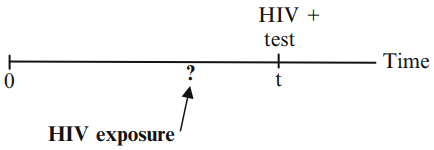
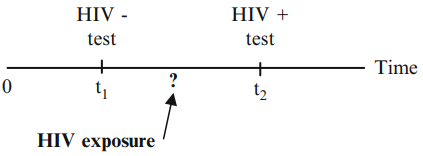
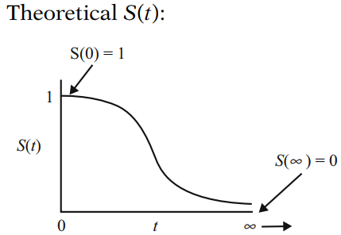
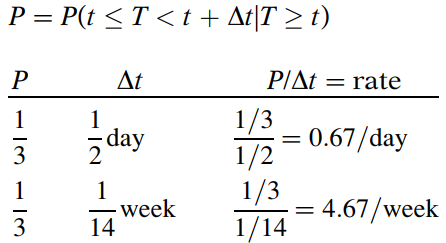
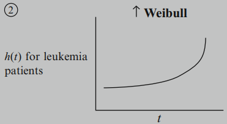
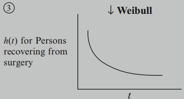
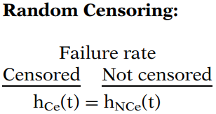
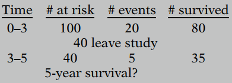

# Introduction to Survival Analysis

## 1. What is Survival Analysis?
Generally, survival analysis is a collection of statistical procedures for data analysis for which **the outcome variable of interest is time until an event occurs**. 

> By **time**, we mean years, months, weeks, or days from the beginning of follow-up of an individual until an event occurs; alternatively, time can refer to the age of an individual when an event occurs.
>
> By **event**, we mean death, disease incidence, relapse from remission, recovery (e.g., return to work) or any designated experience of interest that may happen to an individual.

Although more than one event may be considered in the same analysis, we will assume that only one event is of designated interest. 

When more than one event is considered (e.g., death from any of several causes), the statistical problem can be characterized as either a recurrent event or a competing risk problem.

In a survival analysis, we usually refer to the time variable as **survival time**, because it gives the time that an individual has “survived” over some follow-up period. We also typically refer to the event as a **failure**, because the event of interest usually is death, disease incidence, or some other negative individual experience. 

## 2. Censored Data

**<u>Censoring</u>**: we have some information about individual survival time, but we don’t know the survival time exactly. 

**<u>Why Censoring?</u>**

- a person does not experience the event before the study ends;
- a person is lost to follow-up during the study period;
- a person withdraws from the study because of death (if death is not the event of interest) or some other reason (e.g., adverse drug reaction or other competing risk).

**<u>Right-censored</u>:** true survival time is equal to or greater than observed survival time.

**<u>Left-censored</u>:** true survival time is less than or equal to the observed survival time.

**<u>Interval-censored</u>:** true survival time is within a known time interval.

**<u>How we work with censored data?</u>**

Survival analysis **use all information up to time of censorship**; don’t throw away information. 

For the three persons in who were censored between the 16th and 22nd weeks, there are at least 16 weeks of survival information on each that we don’t want to lose. 

These three persons are contained in all risk sets up to the 16th week; that is, they are each at risk for getting the event up to 16 weeks. Any survival probabilities determined before, and including, 16 weeks should make use of data on these three persons as well as data on other persons at risk during the first 16 weeks.  

## 3. Survivor Function and Hazard Function

> **Key Notations:**
>
> - **T** for the survival time variable 
> - **t** for a specified value of **T** 
> - **d** for the dichotomous variable indicating event occurrence (1) or censorship (0) 

### 3.1 Survivor Function: S(t)

The survivor function S(t) gives the probability that a person survives longer than some specified time t: that is, S(t) gives **the probability that the random variable T exceeds the specified time t**. 
$$
S(t)=P(T>t)
$$
Theoretically, as $t$ ranges from 0 up to infinity, the survivor function can be graphed as a smooth curve. 

In practice, when using actual data, we usually obtain graphs that are **step functions**, as illustrated here, rather than smooth curves. Moreover, because the study period is never infinite in length and there may be competing risks for failure, it is possible that not everyone studied gets the event. The estimated survivor function thus may not go all the way down to zero at the end of the study. 

### 3.2 Hazard Function: h(t)

The hazard function h(t) gives the instantaneous potential per unit time for the event to occur, given that the individual has survived up to time t.
$$
h(t)=\lim_{\Delta t \to 0} \frac{P(t \le T < t+\Delta t|T\ge t)}{\Delta t}
$$
Hazard function (sometimes called  a **conditional failure rate**) is **a rate rather than a probability**. 

In particular, hazard depends on whether time is measured in days, weeks, months, or years, etc. 

Hazard function is always nonnegative, that is, equal to or greater than zero, and has no upper bound.

**<u>Different types of hazard functions</u>**

- When the hazard function is constant, we say that the survival model is **exponential**. 

  

- When hazard function is increasing over time, we call it an **increasing Weibull** model.

  

- When hazard function is decreasing over time, we call it an **decreasing Weibull** model.

  

- When a hazard function is first increasing and then decreasing, we call it a **lognormal survival** model.

  

### 3.3 Relationship of S(t) and h(t)

> S(t): directly describes survival 
>
> h(t):
>
> - a measure of instantaneous potential 
> - identify specific model form 
> - math model for survival analysis

If you know one of the two, you can determine the other. General formulae:
$$
S(t)=\exp \left[-\int_0^t h(u)du \right] \\
h(t)=-\left[\frac{dS(t)/dt}{S(t)}\right]
$$

## 4. Goals of Survival Analysis

**Goal 1:** To estimate and interpret survivor and/ or hazard functions from survival data.

**Goal 2:** To compare survivor and/or hazard functions. 

**Goal 3:** To assess the relationship of explanatory variables to survival time. 

Goal 3 usually requires using some form of mathematical modeling, for example, the Cox proportional hazards approach.

## 5. Descriptive Measures of Survival Experience

$\bar T$: (**Average survival time**)ignore the plus (+) signs denoting censorship and simply average all survival times for each group.

$\bar h$: (**Average hazard rate**) defined by dividing the total number of failures by the sum of the observed survival times.
$$
\bar h=\frac{failures}{\sum\limits_{i=1}^n t_i}
$$
Descriptive measures ($\bar T$ and $\bar h$) give **overall comparison**; they do not give comparison over time (which is provided by a graph of survivor curves). 

## 6. Censoring Assumption

> There are three assumptions about censoring often considered for survival data: 
>
> - **Independent** (vs. non-independent) censoring
> - **Random** (vs. non-random) censoring
> - **Non-informative** (vs. informative) censoring

### 6.1 Independent censoring

Within any subgroup of interest, the subjects who are censored at time t should be representative of all the subjects in that subgroup who remained at risk at time t with respect to their survival experience.

Independent censoring assumption is the most useful one, and affects the validity of one’s estimated effect.

### 6.2 Random censoring

Subjects who are censored at time t should be representative of all the study subjects who remained at risk at time t with respect to their survival experience. 

**<u>An Example</u>**

Under an assumption of independent or random censoring, we assume that the 40 individuals who were censored were similar to the 40 who remained at risk with respect to their survival experience: we estimate that 5 of the 40 who were censored also contracted the disease over the same time period. 

The idea behind independent and random censoring is that it is as if the subjects censored at time t were randomly selected to be censored from the group of subjects who were in the risk set at time t. 

### 6.3 Non-informative censoring

Whether censoring is **non-informative** or informative depends on two distributions: 

- distribution of time-to-event 
- distribution of time-to censorship 

Non-informative censoring occurs if **the distribution of survival times (T) provides no information about the distribution of censorship times (C)**, and vice versa. Otherwise, the censoring is informative. 

**<u>An Example</u>**

### 6.4 Summary

Many of the analytic techniques, e.g., the log rank test, and the Cox model, **rely on an assumption of independent censoring for valid inference** in the presence of right-censored data.