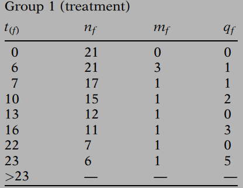
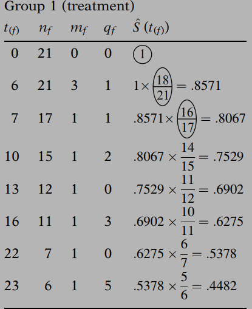

# Kaplan-Meier Survival Curves and the Log-Rank Test


> To estimate the survival probability at a given time, we make use of the risk set at that time to include the information we have on a censored person up to the time of censorship, rather than simply throw away all the information on a censored person. The actual computation of such a survival probability can be carried out using the Kaplan-Meier (KM) method. 

## 1. Formula of KM Estimator

The general formula for a KM survival probability at failure time $$t_{(f)}$$ is:

$\hat S(t_{(f)})=\hat S(t_{(f-1)}) \times \hat Pr(T>t_{(f)}|T \ge t_{(f)})$ 

The above KM formula can also be expressed as a **product limit** if we substitute for the survival probability $\hat S(t_{(f-1)})$, the product of all fractions that estimate the conditional probabilities for failure times $t_{(f-1)}$ and earlier:

$\hat S(t_{(f)})=\displaystyle \prod_{i=1}^f \hat Pr(T>t_{(i)}|T \ge t_{(i)})$    

We will give an example in next section to demonstrate how to compute $\hat Pr(T>t_{(f)}|T \ge t_{(f)})$.

## 2. An Example Using KM method

**<u>Example Data</u>**


1. Order survival times in ascending order within each group, and generate summary tables like following:




- $t_{(f)}$: survival time
- $n_f$: the number of subjects in the risk set at the start of the interval 
- $m_f$: number of failures
- $q_f$: number of censoring

2. $\hat Pr(T>t_{(f)}|T \ge t_{(f)}) = 1-m_f/n_f$, and number of subjects at risk $n_f=n_{f-1}-m_{f-1}-q_{f-1}$, compute $\hat S(t_{(f)})$ as following:




3. Plot estimated survival probabilities corresponding to each ordered failure time as a step function that starts with a horizontal line at a survival probability of 1 and then steps down to the other survival probabilities as we move from one ordered failure time to another.


**<u>SAS Sample Code for KM Analysis</u>**

```SAS
proc lifetest data=<mydata> plots=S;
	time <time>*<censor(0)>;
	strata <group>;
run;
```

## 3. The Log-Rank Test for Two Groups

The most popular testing method  of evaluating **whether or not KM curves for two or more groups are statistically equivalent** is called the log-rank test.

>When we state that two KM curves are “statistically equivalent,” we mean that, based on a testing procedure that compares the two curves in some “overall sense,” we do not have evidence to indicate that the true (population) survival curves are different. 

The log–rank test is a large-sample **chi-square test** that :

- Provides an overall comparison of KM curves
- Makes use of observed versus expected cell counts
- Categories are defined by each of the ordered failure times

**<u>Example of the information required for the log-rank test</u>**


Expected cell counts can be calculated as:


$$
e_{1f}=\left(\frac{n_{1f}}{n_{1f}+n_{2f}}\right) \times (m_{1f}+m_{2f})
$$

$$
e_{2f}=\left(\frac{n_{2f}}{n_{1f}+n_{2f}}\right) \times (m_{1f}+m_{2f})
$$

Next step, we need to calculate $O_i-E_i$ as follows:
$$
O_i-E_i=\sum_{f=1}^k(m_{if}-e_{if})
$$
where $k$ is the number of ordered failure time, and $i$ identified groups.


For the two group case, the log-rank statistic is:
$$
\frac{(O_i-E_i)^2}{Var(O_i-E_i)} \sim \chi^2(1) \quad under \quad H_0
$$
$i$ can be 1 or 2, and the choice of these two will always gives the same result. $Var(O_i-E_i)$ is the estimated variance whose expression is:
$$
Var(O_i-E_i)=\sum_f \frac{n_{1f}n_{2f}(m_{1f}+m_{2f})(n_{1f}+n_{2f}-m_{1f}-m_{2f})}{(n_{1f}+n_{2f})^2(n_{1f}+n_{2f}-1)}
$$
The null hypothesis is: **$H_0:$ *no difference between the two survival curves***.

An approximation to the log-rank statistic can be used to quickly perform a test:
$$
\chi^2 \approx \sum_i^{number\ of\ groups}\frac{(O_i-E_i)^2}{E_i}
$$
